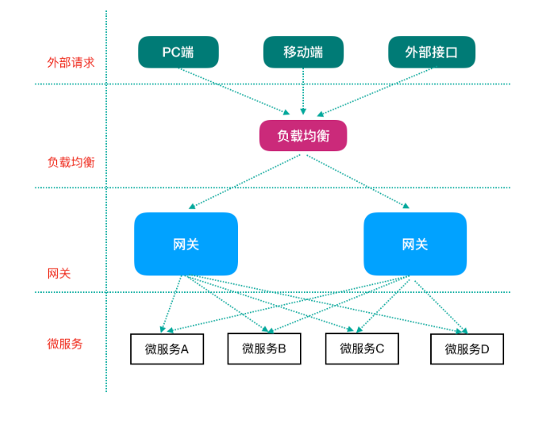
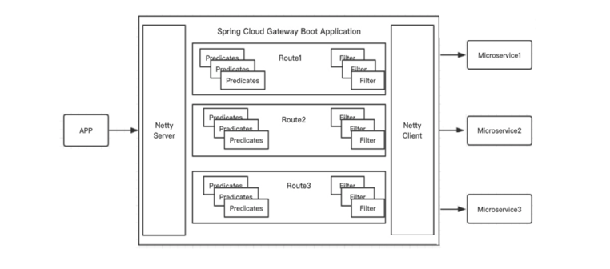
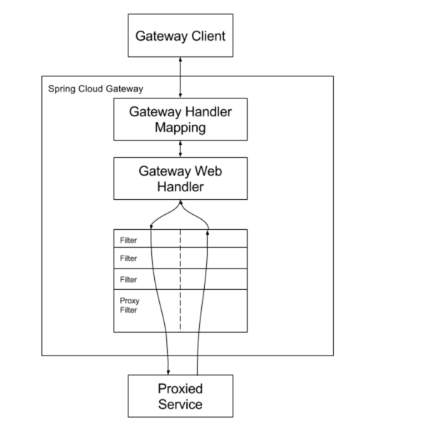
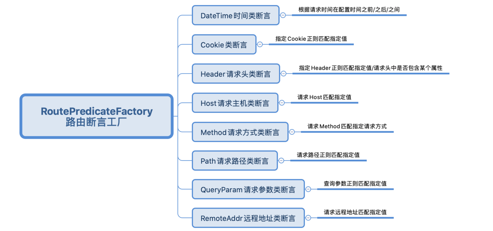

# Gateway 网关组件

网关: 微服务架构中的重要组成部分

## 简介

Spring Cloud GateWay 是Spring Cloud的一个全新项目，目标是取代Netflix Zuul，
它基于Spring5.0 + SpringBoot2.0 + WebFlux(基于高性能的Reactor模式响应式通信框架Netty，异步非阻塞模型)等技术开发，性能高于Zuul。
官方测试，GateWay是 Zuul的1.6倍，旨在为微服务架构提供一种简单有效的统一的API路由管理方式。

Spring Cloud GateWay 不仅提供统一的路由方式(反向代理)并且基于 Filter链(定义过滤器对请求过滤，完成一些功能)的方式提供了网关基本的功能，
例如:鉴权、 流量控制、熔断、路径重写、日志监控等。



## Gateway 网关核心概念

- 路由(route) 

网关最基础的部分，也是网关比较基础的工作单元。路由由一个ID、一个目标URL(最终路由到的地址)、一系列的断言(匹配条件判断)和 Filter过滤器(精细化控制)组成。
如果断言为true，则匹配该路由。

- 断言(predicates)

参考了Java8中的断言 `java.util.function.Predicate`，开发人员可以匹配Http请求中的所有内容
(包括请求头、请求参数等)(类似于nginx中的location匹配一样)，如果断言与请求相匹配则路由。

- 过滤器(filter)

一个标准的 Spring webFilter，使用过滤器，可以在请求之前或者之后执行业务逻辑。



其中，Predicates断言就是我们的匹配条件，而Filter就可以理解为一个无所不能的拦截器。
有了这两个元素，结合目标URL，就可以实现一个具体的路由转发。

## Gateway 工作过程



客户端向Spring Cloud GateWay发出请求，然后在GateWay Handler Mapping中找到与请求相匹配的路由，将其发送到GateWay Web Handler;
Handler再通过指定的过滤器链来将请求发送到我们实际的服务执行业务逻辑，然后返回。

过滤器之间用虚线分开是因为过滤器可能会在发送代理请求之前(pre)或者之后(post)执行业务逻辑。

Filter在“pre”类型过滤器中可以做参数校验、权限校验、流量监控、日志输出、协议转换等，
在“post”类型的过滤器中可以做响应内容、响应头的修改、日志的输出、流量监控等。

> GateWay核心逻辑: 路由转发 + 执行过滤器链

## Gateway 应用

使用网关对自动投递微服务进行代理(添加在它的上游，相当于隐藏了具体微服务的信息，对外暴露的是网关)

### 编码案例

1. 创建工程cloud-gateway-server-9002导入依赖

> GateWay不需要使用web模块，它引入的是WebFlux

```xml
<dependencies>
    <!--GateWay 网关-->
    <dependency>
        <groupId>org.springframework.cloud</groupId>
        <artifactId>spring-cloud-starter-gateway</artifactId>
    </dependency>
    <!--引入webflux-->
    <dependency>
        <groupId>org.springframework.boot</groupId>
        <artifactId>spring-boot-starter-webflux</artifactId>
    </dependency>
</dependencies>
```

2. 添加路由规则

```properties
spring.cloud.gateway.routes[0].id=service-base-auto-deliver-router
spring.cloud.gateway.routes[0].uri=http://127.0.0.1:8090
spring.cloud.gateway.routes[0].predicates[0]=Path=/auto/deliver/**

spring.cloud.gateway.routes[1].id=service-base-resume-router
spring.cloud.gateway.routes[1].uri=http://127.0.0.1:8080
spring.cloud.gateway.routes[1].predicates[0]=Path=/resume/**
```

3. 添加主启动类

```java
@SpringBootApplication
@EnableDiscoveryClient
public class GatewayApplication9002 {
    public static void main(String[] args) {
        SpringApplication.run(GatewayApplication9002.class, args);
    }
}
```

上面这段配置的意思是，配置了一个 id 为 service-base-auto-deliver-router 的路由规则，当向网关发起请求 http://localhost:9002/auto/deliver/checkAndBegin/1545132，请求会被分发路由到对应的微服务上

## Gateway 路由规则详解

Spring Cloud GateWay 帮我们内置了很多Predicates功能，实现了各种路由匹配规则(通过Header、请求参数等作为条件)匹配到对应的路由。



- 时间点后匹配

```yaml
spring:
  cloud:
    gateway:
      routes:
      - id: after_route
        uri: https://example.org
        predicates:
        - After=2017-01-20T17:42:47.789-07:00[America/Denver]
```

- 时间点前匹配

```yaml
spring:
  cloud:
    gateway:
      routes:
      - id: before_route
        uri: https://example.org
        predicates:
        - Before=2017-01-20T17:42:47.789-07:00[America/Denver]
```

- 时间区间断言

```yaml
spring:
  cloud:
    gateway:
      routes:
      - id: between_route
        uri: https://example.org
        predicates:
        - Between=2017-01-20T17:42:47.789-07:00[America/Denver], 2017-01-21T17:42:47.789-07:00[America/Denver]
```

> 详细见官网： https://docs.spring.io/spring-cloud-gateway/docs/2.2.9.RELEASE/reference/html/#gateway-request-predicates-factories

## Gateway 动态路由详解

GateWay支持自动从注册中心中获取服务列表并访问，即所谓的动态路由。

> 在前面的配置中，router 的 URI 写了固定的IP和端口，这是不合理的。
> 因为目标微服务可能部署多台。因此，URI的配置应该是一个服务名称而不应该是一个具体的微服务实例的地址，这就是所谓的动态路由。
> 
> Gateway网关从服务注册中心获取服务实例信息，然后负载均衡后再路由。

1. pom.xml 中添加注册中心客户端依赖(因为要获取注册中心服务列表，eureka 客户端已经引入)
2. 动态路由配置

```properties
spring.cloud.gateway.routes[0].id=service-base-auto-deliver-router
spring.cloud.gateway.routes[0].uri=lb://service-base-auto-deliver
spring.cloud.gateway.routes[0].predicates[0]=Path=/auto/deliver/**

spring.cloud.gateway.routes[1].id=service-base-resume-router
spring.cloud.gateway.routes[1].uri=lb://service-base-resume
spring.cloud.gateway.routes[1].predicates[0]=Path=/resume/**
```

> 注意: 动态路由设置时，uri以 lb:// 开头(lb代表从注册中心获取服务)，后面是需要转发到的服务名称

## GateWay过滤器

### GateWay过滤器简介

从过滤器生命周期(影响时机点)的⻆度说，主要有两个: pre和post

生命周期时机点 | 作用
---|---
pre | 这种过滤器在请求被路由之前调用。我们可利用这种过滤器实现身份验证、在集群中选择请求的微服务、记录调试信息等。
post | 这种过滤器在路由到微服务以后执行。这种过滤器可用来为响应添加标准的 HTTP Header、收集统计信息和指标、将响应从微服务发送给客户端等。

从过滤器类型的⻆度，Spring Cloud GateWay的过滤器分为 GateWayFilter和 GlobalFilter 两种

过滤器类型 | 影响范围
---|---
GateWayFilter | 应用到单个路由路由上
GlobalFilter | 应用到所有的路由上

比如，Gateway Filter可以去掉url中的占位后转发路由，比如

```yaml
predicates:
  - Path=/resume/**
filters:
  - StripPrefix=1 # 可以去掉resume之后转发
```

> 注意: GlobalFilter全局过滤器是程序员使用比较多的过滤器，我们主要讲解这种类型

### 自定义全局过滤器实现IP访问限制(黑白名单) 

请求过来时，判断发送请求的客户端的IP，如果在黑名单中，拒绝访问。

自定义GateWay全局过滤器时，我们实现Global Filter接口即可，通过全局过滤器可以实现黑白名单、限流等功能。

```java
/**
 * 类描述：定义全局过滤器，对所有路由生效
 *
 * @author mujunlin
 * @since 2021/09/07 09:13
 */
@Component  // 让容器扫描到，就等同于注册了
public class BlackListFilter implements GlobalFilter, Ordered {

    /* 模拟黑名单，实际可以从数据库中获取 */
    private static List<String> blackList = new ArrayList<>();

    static {
        blackList.add("0:0:0:0:0:0:0:1");   // 模拟本机地址
    }

    /**
     * 过滤器核心方法
     *
     * @param exchange 封装了 Request 和 Response 对象的上下文
     * @param chain    网关过滤器链，包含全局过滤器和单路由过滤器
     */
    @Override
    public Mono<Void> filter(ServerWebExchange exchange, GatewayFilterChain chain) {
        // 获取客户端IP，判断是否在黑名单中，如果在的话就拒绝访问；不在的话就放行
        // 1.从上下文中取出 Request 和 Response 对象
        ServerHttpRequest request = exchange.getRequest();
        ServerHttpResponse response = exchange.getResponse();
        // 2.从Request对象中获取客户端IP
        String clientIp = request.getRemoteAddress().getHostString();
        // 3.查询 clientIp 是否存在于黑名单中，如果存在的话就拒绝访问
        if (blackList.contains(clientIp)) {
            // 拒绝访问，返回
            response.setStatusCode(HttpStatus.UNAUTHORIZED); // 状态码
            DataBuffer wrap = response.bufferFactory().wrap("Request be denied!".getBytes(StandardCharsets.UTF_8));
            return response.writeWith(Mono.just(wrap));
        }
        // 合法请求，放行。继续执行过滤器链
        return chain.filter(exchange);
    }

    /**
     * 当前过滤器的顺序(优先级，数值越小优先级越高)
     */
    @Override
    public int getOrder() {
        return 0;
    }
}
```

## GateWay高可用 

网关作为非常核心的一个部件，如果挂掉，所有请求可能都无法路由处理，因此我们需要做GateWay的高可用。

GateWay的高可用很简单: 可以启动多个GateWay实例来实现高可用。

在GateWay的上游使用Nginx等负载均衡设备进行负载转发以达到高可用的目的。 

启动多个GateWay实例(假如说两个，一个端口9002，一个端口9003)，剩下的就是使用Nginx等完成负载代理即可。示例如下:

```shell
#配置多个GateWay实例 
upstream gateway {
  server 127.0.0.1:9002;
  server 127.0.0.1:9003;
}
location / {
  proxy_pass http://gateway;
}
```


