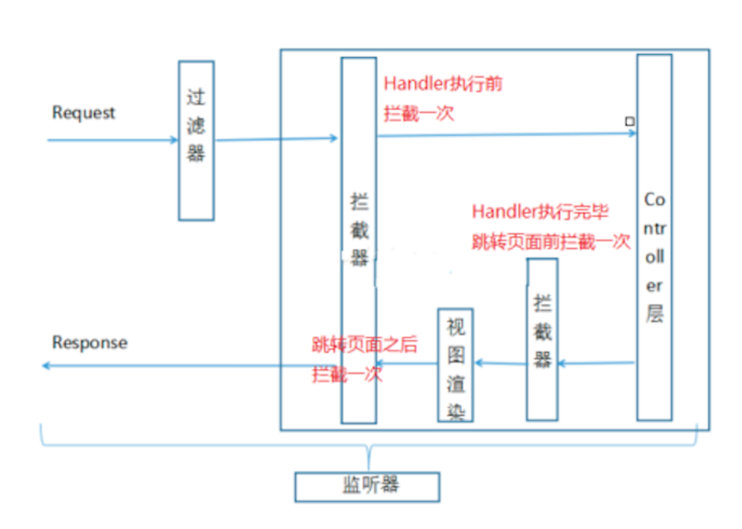
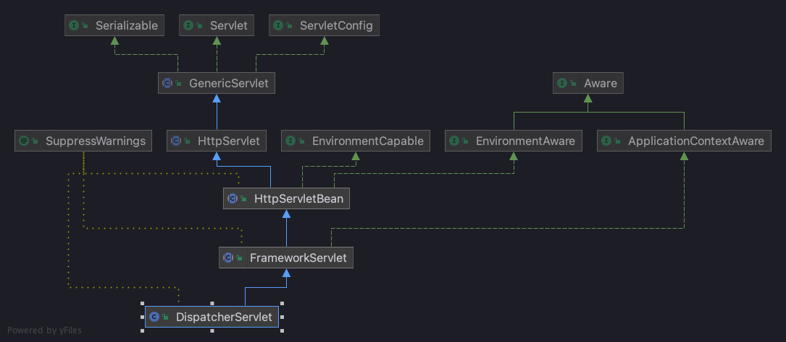

# Spring MVC

> Spring MVC 是 Spring 给我们提供的一个用于简化 Web 开发的框架。

## 第一部分 Spring MVC 基础

### 第 1 节 Spring MVC 简介

#### 1.1 MVC 体系结构

**三层架构**

在 JavaEE 开发中，几乎全都是基于 B/S 架构的开发。那么在 B/S 架构中，系统标准的三层架构包括: 
表现层、业务层、持久层。三层架构在我们的实际开发中使用的非常多，所以我们的案例也都是基于三层架构设计的。

三层架构中，每一层各司其职，接下来我们就说说每层都负责哪些方面:

- 表现层：包括展示层和控制层:控制层负责接收请求，展示层负责结果的展示。表现层依赖业务层，接收到客户端请求一般会调用业务层进行业务处理，并将处理结果响应给客户端。
- 业务层：负责业务逻辑处理，和我们开发项目的需求息息相关。web 层依赖业务层，但是业务层不依赖 web 层。业务层在业务处理时可能会依赖持久层，如果要对数据持久化需要保证事务一致性。
- 持久层：负责数据持久化，包括数据层(即数据库)和数据访问层，数据库是对数据进行持久化的载体，数据访问层是业务层和数据层交互的接口，业务层需要通过数据访问层将数据持久化到数据库中。通俗的讲，持久层就是和数据库交互，对数据库表进行增删改查的。

**MVC设计模式**

MVC 全名是 Model View Controller，是模型(model)-视图(view)-控制器(controller) 的缩写， 
是一种用于设计创建 Web 应用程序表现层的模式。

MVC 中每个部分各司其职: 

- Model(模型):模型包含业务模型和数据模型，数据模型用于封装数据，业务模型用于处理业务。
- View(视图): 通常指的就是我们的 jsp 或者 html。作用一般就是展示数据的。通常视图是依据模型数据创建的。
- Controller(控制器): 是应用程序中处理用户交互的部分。作用一般就是处理程序逻辑的。 
  
MVC提倡:每一层只编写自己的东⻄，不编写任何其他的代码;分层是为了解耦，解耦是为了维护方便和分工协作。

Spring MVC 是应用于表现层的框架。

#### 1.2 Spring MVC

SpringMVC 全名叫 Spring Web MVC，是一种基于 Java 的实现 MVC 设计模型的请求驱动类型的轻量级 Web 框架，属于 SpringFrameWork 的后续产品。

SpringMVC 已经成为目前最主流的 MVC 框架 之一，并且随着 Spring3.0 的发布，全面超越 Struts2， 成为最优秀的 MVC 框架。

它通过一套注解，让一个简单的 Java 类成为处理请求的控制器，而无须实现任何接口。同时它还支持 RESTful 编程⻛格的请求。

> Spring MVC和 Struts2 一样，都是为了解决表现层问题的web框架，它们都是基于 MVC 设计模式的。而这些表现层框架的主要职责就是处理前端HTTP请求。
> Spring MVC 本质可以认为是对servlet的封装，简化了我们 servlet 的开发。
> 作用：接收请求 + 返回响应/跳转页面

**原生 Servlet 开发与 Spring MVC 比较**

原生 Servlet ：每一个业务都是一个 servlet

Spring MVC ：全局只有一个 servlet (`DispatcherServlet`)接收所有请求

### 第 2 节 Spring Web MVC 工作流程

**简单回顾**

web.xml

```xml
<!DOCTYPE web-app PUBLIC
        "-//Sun Microsystems, Inc.//DTD Web Application 2.3//EN"
        "http://java.sun.com/dtd/web-app_2_3.dtd" >

<web-app>

    <display-name>Archetype Created Web Application</display-name>

    <servlet>
        <servlet-name>springmvc</servlet-name>
        <servlet-class>org.springframework.web.servlet.DispatcherServlet</servlet-class>
        <init-param>
            <param-name>contextConfigLocation</param-name>
            <param-value>classpath:springmvc.xml</param-value>
        </init-param>
    </servlet>

    <servlet-mapping>
        <servlet-name>springmvc</servlet-name>
        <url-pattern>/</url-pattern>
    </servlet-mapping>

</web-app>
```

springmvc.xml

```xml
<?xml version="1.0" encoding="UTF-8"?>
<beans xmlns="http://www.springframework.org/schema/beans"
       xmlns:context="http://www.springframework.org/schema/context"
       xmlns:mvc="http://www.springframework.org/schema/mvc"
       xmlns:xsi="http://www.w3.org/2001/XMLSchema-instance"
       xsi:schemaLocation="http://www.springframework.org/schema/beans
       http://www.springframework.org/schema/beans/spring-beans.xsd
       http://www.springframework.org/schema/context
       http://www.springframework.org/schema/context/spring-context.xsd
       http://www.springframework.org/schema/mvc
       http://www.springframework.org/schema/mvc/spring-mvc.xsd">

    <context:component-scan base-package="com.mujunlin.controller"/>

    <!--  视图解析器  -->
    <bean class="org.springframework.web.servlet.view.InternalResourceViewResolver">
        <property name="prefix" value="/WEB-INF/jsp/"/>
        <property name="suffix" value=".jsp"/>
    </bean>

    <!--  自动注册最合适的处理器映射器、处理器适配器  -->
    <mvc:annotation-driven/>

</beans>
```

#### 2.1 Spring MVC 请求处理流程

**流程说明**

- 第一步: 用户发送请求至前端控制器 `DispatcherServlet` 
- 第二步: `DispatcherServlet` 收到请求调用 `HandlerMapping` 处理器映射器
- 第三步: 处理器映射器根据请求 Url 找到具体的 Handler(后端控制器)，生成处理器对象及处理器拦截器(如果有则生成)一并返回 `DispatcherServlet`
- 第四步: `DispatcherServlet` 调用 `HandlerAdapter` 处理器适配器去调用 `Handler`
- 第五步: 处理器适配器执行 `Handler`
- 第六步: `Handler` 执行完成给处理器适配器返回 `ModelAndView`
- 第七步: 处理器适配器向前端控制器返回 `ModelAndView`，`ModelAndView` 是SpringMVC 框架的一个底层对象，包括 Model 和 View
- 第八步: 前端控制器请求视图解析器去进行视图解析，根据逻辑视图名来解析真正的视图。 
- 第九步: 视图解析器向前端控制器返回 `View`
- 第十步: 前端控制器进行视图渲染，就是将模型数据(在 `ModelAndView` 对象中)填充到 request 域 
- 第十一步: 前端控制器向用户响应结果


#### 2.2 Spring MVC 九大组件

- HandlerMapping(处理器映射器)

HandlerMapping 是用来查找 Handler (也就是处理器)的，具体的表现形式可以是类，也可以是 方法。
比如，标注了 `@RequestMapping` 的每个方法都可以看成是一个 Handler。Handler 负责具体实际的请求处理，在请求到达后，HandlerMapping 的作用便是找到请求相应的处理器 Handler 和 Interceptor.

- HandlerAdapter(处理器适配器)

HandlerAdapter 是一个适配器。因为 Spring MVC 中 Handler 可以是任意形式的，只要能处理请求即可。
但是把请求交给 Servlet 的时候，由于 Servlet 的方法结构都是 `doService(HttpServletRequest req,HttpServletResponse resp)` 形式的，
要让固定的 Servlet 处理方法调用 Handler 来进行处理，便是 HandlerAdapter 的职责。

- HandlerExceptionResolver

HandlerExceptionResolver 用于处理 Handler 产生的异常情况。它的作用是根据异常设置 `ModelAndView`，之后交给渲染方法进行渲染，渲染方法会将 ModelAndView 渲染成⻚面。 
  
- ViewResolver

ViewResolver即视图解析器，用于将String类型的视图名和Locale解析为View类型的视图，只有一 个resolveViewName()方法。 
从方法的定义可以看出，Controller层返回的String类型视图名 viewName 最终会在这里被解析成为View。View是用来渲染⻚面的，也就是说，它会将程序返回的参数和数据填入模板中，生成html文件。
ViewResolver 在这个过程主要完成两件事情: ViewResolver 找到渲染所用的模板(第一件大事)和所用的技术(第二件大事，其实也就是找到视图的类型，如JSP)并填入参数。
默认情况下，Spring MVC会自动为我们配置一个 `InternalResourceViewResolver`, 是针对 JSP 类型视图的。

- RequestToViewNameTranslator

RequestToViewNameTranslator 组件的作用是从请求中获取 ViewName. 因为 ViewResolver 根据 ViewName 查找 View，但有的 Handler 处理完成之后,没有设置 View，也没有设置 ViewName， 便要通过这个组件从请求中查找 ViewName。

- LocaleResolver

ViewResolver 组件的 resolveViewName 方法需要两个参数，一个是视图名，一个是 Locale。 LocaleResolver 用于从请求中解析出 Locale，
比如中国 Locale 是 zh-CN，用来表示一个区域。这 个组件也是 i18n 的基础。

- ThemeResolver

ThemeResolver 组件是用来解析主题的。主题是样式、图片及它们所形成的显示效果的集合。 Spring MVC 中一套主题对应一个 properties文件，里面存放着与当前主题相关的所有资源，如图 片、CSS样式等。
创建主题非常简单，只需准备好资源，然后新建一个“主题名.properties”并将资源设置进去，放在classpath下，之后便可以在⻚面中使用了。
SpringMVC 中与主题相关的类有 ThemeResolver、ThemeSource和Theme。ThemeResolver负责从请求中解析出主题名， ThemeSource根据主题名找到具体的主题，其抽象也就是Theme，可以通过Theme来获取主题和具体的资源。

- MultipartResolver

MultipartResolver 用于上传请求，通过将普通的请求包装成 `MultipartHttpServletRequest` 来实现。
MultipartHttpServletRequest 可以通过 getFile() 方法直接获得文件。如果上传多个文件，还可以调用 getFileMap() 方法得到Map<FileName，File>这样的结构，MultipartResolver 的作用就是封装普通的请求，使其拥有文件上传的功能。

- FlashMapManager

FlashMap 用于重定向时的参数传递，比如在处理用户订单时候，为了避免重复提交，可以处理完 post请求之后重定向到一个get请求，这个get请求可以用来显示订单详情之类的信息。
这样做虽然 可以规避用户重新提交订单的问题，但是在这个⻚面上要显示订单的信息，这些数据从哪里来获得呢? 因为重定向时么有传递参数这一功能的，如果不想把参数写进URL(不推荐)，那么就可以通 过FlashMap来传递。
只需要在重定向之前将要传递的数据写入请求(可以通过 ServletRequestAttributes.getRequest()方法获得)的属性 OUTPUT_FLASH_MAP_ATTRIBUTE 中，这样在重定向之后的Handler中Spring就会自动将其设置到Model中，
在显示订单信息的⻚面上就可以直接从Model中获取数据。FlashMapManager 就是用来管理 FlashMap 的。

---

**Spring MVC 的 url-pattern 配置及原理剖析**

url-pattern 的作用： 拦截匹配规则的 URL 请求，进入 Spring MVC 框架处理。

配置方式：

1. 带后缀。如： *.action, *.do。此种方式比较精确、方便，使用比例较大。
2. / 。 不会拦截 `.jsp`。 但是会拦截 .html 等静态资源。
3. /* 。 拦截所有，包括 `.jsp`。

> 拦截 `.jsp` 是什么意思？
> 
> handler 处理完业务请求后，需要页面跳转；此时的页面跳转也会被 Spring MVC 所拦截，当成是一个需要处理的请求，去找相应的 handler。
> 实际上此时的请求不应该由 Spring MVC 处理，应该让 Web 容器来处理页面跳转的请求。


> 为什么配置为 `/` 时，会拦截静态资源呢？
> 
> 因为 Tomcat 容器中有一个 `web.xml`，项目中也有一个 `web.xml`, 而他们是父子关系。  
> 在父 xml 中存在一个 DefaultServlet, 他的作用是处理静态资源，他的 url-pattern 配置的是 `/`;  
> 此时自己的 xml 中也配置为 `/`, 会覆盖父 xml 的配置。
> 
> 因为父 xml 中有专门用于处理 .jsp 请求的 JspServlet，所以不会拦截 .jsp。

---

**如何解决 `url-pattern` 配置为 `/` 时拦截静态资源?**

```xml
<!--  方案一  -->
<mvc:default-servlet-handler/>
```

原理： 添加此标签后，会在 Spring MVC 上下文中定一个 DefaultServletHttpRequestHandler 对象。这个对象会对进入 DispatcherServlet 的请求进行过滤。  
如果发现是一个静态资源请求，则会把请求转由 Web 应用服务器(如 Tomcat)的默认 DefaultServlet 来处理。
如果不是静态资源请求，则继续由 Spring MVC 框架进行处理。

> 此种方案存在不足：只能处理静态资源文件位于 webapp 目录下的情况，不能处理静态资源位于 WEB-INF 下的情况。

```xml
<!--  方案二  -->
<mvc:resources mapping="/resources/**" location="classpath:/"/>
```

Spring MVC 框架自己处理静态资源。

- mapping : 约定的静态资源 URL 规则
- location: 指定静态资源文件的存放位置

---

Spring MVC 在方法上添加型参 Map、Model 和 ModelMap，并向这些参数中保存数据(放入请求域中)，都可以在页面获取到。

那么他们之间是什么关系呢？

通过打印参数可知：运行时的具体类型都是 BindingAwareModelMap, 相当于给 BindingAwareModelMap 中保存的数据最终都会放到请求域中。

他们的关系：

- `org.springframework.ui.ModelMap` 类实现了 `java.util.Map` 接口；
- `org.springframework.validation.support.BindingAwareModelMap` 继承了 `org.springframework.ui.ExtendedModelMap`；
- `org.springframework.ui.ExtendedModelMap` 继承了 `org.springframework.ui.ModelMap` 类，同时实现了 `org.springframework.ui.Model` 接口；

***

### 第 3 节 请求参数绑定

> SpringMVC如何接收请求参数。

#### 3.1 参数绑定简介

**原生 Servlet 接收参数**

```java
String ageStr = requst.getParameter("age");
Integer age = Integer.parseInt(ageStr);
```

> 为什么要先获取到字符串类型呢？
> 因为浏览器向后台发送请求使用的是 HTTP 协议，传输的就是文本。

**Spring MVC 接收参数**

Spring MVC 本质上就是对 Servlet 进行了封装，简化了 Servlet 的操作。在接收整型参数的时候，直接在Handler方法中声明形参即可。

```java
@RequestMapping("xxx")
public String handle(Integer age) {
    System.out.println(age);
}
```

> 参数绑定:取出参数值绑定到handler方法的形参上

#### 3.2 常见参数类型封装

- 默认支持 Servlet API 作为方法参数

当需要使用 `HttpServletRequest`、`HttpServletResponse`、`HttpSession` 等原生servlet对象时，直接在handler方法中形参声明使用即可。

- 简单类型参数

> 简单数据类型:八种基本数据类型及其包装类型

参数类型推荐使用包装数据类型，因为基础数据类型不可以为null

对于布尔类型的参数，请求的参数值为true或false, 或者1或0

> 绑定简单数据类型参数，只需要直接声明形参即可 
> 
> 形参参数名和传递的参数名要保持一致，当形参参数名和传递参数名不一致时可以使用 `@RequestParam` 注解进行手动映射

- Pojo类型参数

接收 POJO 类型参数，直接形参声明即可，类型就是 POJO 的类型. 形参名无所谓, 但是要求传递的参数名必须和 POJO 的属性名保持一致

- POJO 包装对象参数

> POJO 包装对象: 对象的属性属性也是对象

不管是否包装 POJO，它首先是一个 POJO，那么就可以按照上述pojo的要求来:

  1. 绑定时候直接形参声明即可
  2. 传参参数名和 POJO 属性保持一致，如果不能够定位数据项，那么通过 `属性名 + "."` 的方式(如:`user.name`)进一步锁定数据

- 日期类型参数(需要配置自定义类型转换器)

自定义类型转换器

```java
public class DateConverter implements Converter<String, Date> {
    @Override
    public Date convert(String source) {
        SimpleDateFormat dateFormat = new SimpleDateFormat("yyyy/MM/dd");
        try {
            return dateFormat.parse(source);
        } catch (ParseException e) {
            e.printStackTrace();
        }
        return null;
    }
}
```

注册自定义类型转换器

```xml
<!--  注册自定义类型转换器  -->
<bean id="conversionServiceBean" class="org.springframework.format.support.FormattingConversionServiceFactoryBean">
    <property name="converters">
        <set>
            <bean class="com.mujunlin.converter.DateConverter"/>
        </set>
    </property>
</bean>

<!--  关联自定义类型转换器  -->
<mvc:annotation-driven conversion-service="conversionServiceBean"/>
```

### 第 4 节 对 Restful ⻛格请求支持


#### 4.1 REST 简介

**RESTful 示例**

REST 是一个 url 请求的⻛格，基于这种⻛格设计请求的 url 

- 没有 REST 时，原有的url设计  
  `http://localhost:8080/user/queryUserById.action?id=3`  
  url中定义了动作(操作)，参数具体锁定到操作的是谁

- 有了 REST ⻛格之后  
  REST 认为互联网中的所有东⻄都是资源，既然是资源就会有一个唯一的uri标识它
  `http://localhost:8080/user/3`  
  代表的是id为3的那个用户记录(资源)


锁定资源之后如何操作它呢?

常规操作就是增删改查 根据请求方式不同，代表要做不同的操作

> REST ⻛格带来的直观体现就是: 传递参数方式的变化，参数可以存在于 URL 中了. *核心区别*

---

Restful 是一种 web 软件架构⻛格，它不是标准也不是协议，它倡导的是一个资源定位及资源操作的⻛格。

REST(英文:Representational State Transfer，简称 REST)描述了一个架构样式的网络系统，比如 web 应用程序。
它本身并没有什么实用性，其核心价值在于如何设计出符合 REST ⻛格的网络接口。

> 资源表现层状态转移
> 
> 资源(Resources):网络上的一个实体，或者说是网络上的一个具体信息。
> 
> 表现层(Representation):把资源具体呈现出来的形式，叫做它的表现层 (Representation)。
> 比如，文本可以用 txt 格式表现，也可以用 HTML 格式、XML 格式、JSON 格式表现，甚至可以采用二进制格式。
> 
> 状态转化(State Transfer):每发出一个请求，就代表了客户端和服务器的一次交互过程。

HTTP 协议，是一个无状态协议，即所有的状态都保存在服务器端。因此，如果客户端想要操作服务器，必须通过某种手段，让服务器端发生“状态转化”(State Transfer)。
而这种转化是建立在表现层之上的，所以就是 “表现层状态转化”。具体说，就是 HTTP 协议里面，四个表示操作方式的动词: GET 、POST 、PUT 、DELETE。
它们分别对应四种基本操作: GET 用来获取资源，POST 用来新建资 源，PUT 用来更新资源，DELETE 用来删除资源。

> URL:资源定位符，通过URL地址去定位互联网中的资源(抽象的概念，比如图片、视频、app服务 等)。
> 
> RESTful ⻛格 URL: 互联网所有的事物都是资源，要求URL中只有表示资源的名称，没有动词。  
> RESTful ⻛格资源操作: 使用HTTP请求中的method方法put、delete、post、get来操作资源。分别对应添加、删除、修改、查询。不过一般使用时还是 post 和 get。put 和 delete几乎不使用。  
> RESTful ⻛格资源表述: 可以根据需求对URL定位的资源返回不同的表述(也就是返回数据类型，比如 XML、JSON等数据格式)。  

#### 4.2 Spring MVC 对 RESTful 的支持

1. Spring MVC 支持 RESTful ⻛格请求，具体讲的就是使用 @PathVariable 注解获取 RESTful ⻛格的请求中的参数

2. GET 方法和 DELETE 方法的 URL 一样, 可以通过 `@RequestMapping()` 注解的 `method` 属性指定不同的请求方式

3. 由于 form 表单的 method 属性仅有 post 和 get, 如果需要使用 put 或 delete, 则需要:

- 在表单中添加隐藏域, 并使用 name 为 _method, value 为请求方式的元素指明请求方式

```html
<input type="hidden" name="_method" value="put" />
```

> 其中, name 是固定的, 使用 `_method`

- 配置请求方式过滤器(将特定的post请求转换为put和delete请求)

```xml
<filter>
    <filter-name>hiddenHttpMethodFilter</filter-name>
    <filter-class>org.springframework.web.filter.HiddenHttpMethodFilter</filter-class>
</filter>

<filter-mapping>
    <filter-name>hiddenHttpMethodFilter</filter-name>
    <url-pattern>/*</url-pattern>
</filter-mapping>
```

### 第 5 节 Ajax Json交互

> 交互:两个方向 
> 
> 1)前端到后台: 前端ajax发送json格式字符串，后台直接接收为pojo参数，使用注解 `@RequestBody`
> 
> 2)后台到前端: 后台直接返回pojo对象，前端直接接收为json对象或者字符串，使用注解 `@ResponseBody`

#### 5.1 JSON

Json是一种与语言无关的数据交互格式，就是一种字符串，只是用特殊符号{}内表示对象、[]内表示数组、""内是属性或值、:表示后者是前者的值

{"name": "Michael"}可以理解为是一个包含name为Michael的对象 `[{"name": "Michael"},{"name": "Jerry"}]` 就表示包含两个对象的数组

#### 5.2 @RequestBody 注解

`@RequestBody` 注解的 Controller 方法, 需要使用 `POST` 的请求提交方式. 因为只有 POST 请求才有请求体

#### 5.3 @ResponseBody 注解

`@ResponseBody` 注解的作用是将 controller 的方法返回的对象通过适当的转换器转换为指定的格式之后，写入到response对象的body区，通常用来返回JSON数据或者是XML数据。 

> 注意: 在使用此注解之后不会再走视图处理器，而是直接将数据写入到输入流中，他的效果等同于通过 response 对象输出指定格式的数据。


## 第二部分 Spring MVC 高级


### 第 1 节 拦截器(Interceptor)使用

#### 1.1 监听器、过滤器和拦截器对比

- Servlet:处理Request请求和Response响应

- 过滤器(Filter):对Request请求起到过滤的作用，作用在Servlet之前，如果配置为 `/*` 可以对所有的资源访问(servlet、js/css静态资源等)进行过滤处理

- 监听器(Listener):实现了javax.servlet.ServletContextListener 接口的服务器端组件，它随 `Web` 应用的启动而启动，只初始化一次，然后会一直运行监视，随Web应用的停止而销毁

> 作用一:做一些初始化工作，web应用中spring容器启动ContextLoaderListener
> 
> 作用二:监听web中的特定事件，比如 `HttpSession`, `ServletRequest` 的创建和销毁;变量的创建、销毁和修改等。可以在某些动作前后增加处理，实现监控，比如统计在线人数，利用 HttpSessionListener等。

- 拦截器(Interceptor):是SpringMVC、Struts等表现层框架自己的，不会拦截 jsp/html/css/image的访问等，只会拦截访问的控制器方法(Handler)。

> 从配置的⻆度也能够总结发现: servlet、filter、listener是配置在web.xml中的，
> 而interceptor是 配置在表现层框架自己的配置文件中的

> 拦截器的拦截时机
> 
> 在Handler业务逻辑执行之前拦截一次
> 
> 在Handler逻辑执行完毕但未跳转⻚面之前拦截一次
> 
> 在跳转⻚面之后拦截一次


#### 1.2 自定义拦截器

自定义拦截器十分简单, 只需要实现 `org.springframework.web.servlet.HandlerInterceptor` 接口即可

```java
public class MyInterceptor01 implements HandlerInterceptor {

    // 该方法会在 handler 方法业务逻辑执行前执行
    // 返回值 boolean 代表是否放行: true 代表放行, false 代表终止
    // 最常见的应用: 在此处完成权限校验工作
    @Override
    public boolean preHandle(HttpServletRequest request, HttpServletResponse response, Object handler) throws Exception {
        return HandlerInterceptor.super.preHandle(request, response, handler);
    }

    // 该方法会在 handler 方法业务逻辑执行之后,尚未跳转页面时执行
    // 封装了视图和数据,尚未跳转页面. 可以在此处针对返回的数据和视图信息进行修改. [应用较少]
    @Override
    public void postHandle(HttpServletRequest request, HttpServletResponse response, Object handler, ModelAndView modelAndView) throws Exception {
        HandlerInterceptor.super.postHandle(request, response, handler, modelAndView);
    }

    // 页面已经跳转渲染完毕之后执行
    // 可以在此处捕获出现的异常
    @Override
    public void afterCompletion(HttpServletRequest request, HttpServletResponse response, Object handler, Exception ex) throws Exception {
        HandlerInterceptor.super.afterCompletion(request, response, handler, ex);
    }
}
```

通过 Spring 配置文件注册拦截器

```xml
<mvc:interceptors>
    <bean class="com.mujunlin.intereceptor.MyInterceptor01"/>
</mvc:interceptors>
```

此种拦截器配置方式, 会拦截所有请求; 如果需要指定拦截规则, 需要采用如下配置方式:

```xml
<mvc:interceptors>
    <mvc:interceptor>
        <mvc:mapping path="/**"/>
        <mvc:exclude-mapping path="/demo/**"/>
        <bean class="com.mujunlin.interceptor.MyInterceptor01"/>
    </mvc:interceptor>
</mvc:interceptors>
```


#### 1.3 拦截器的执行流程

在运行程序时，拦截器的执行是有一定顺序的，该顺序与配置文件中所定义的拦截器的顺序相关。 单个
拦截器，在程序中的执行流程如下所示:

1) 程序先执行 `preHandle()` 方法，如果该方法的返回值为true，则程序会继续向下执行处理器中的方法，否则将不再向下执行。

2) 在业务处理器(即控制器Controller类)处理完请求后，会执行 `postHandle()` 方法，然后会通过 `DispatcherServlet` 向客户端返回响应。

3) 在 `DispatcherServlet` 处理完请求后，才会执行 `afterCompletion()` 方法。

#### 1.4 多个拦截器的执行流程

多个拦截器(假设有两个拦截器Interceptor1和Interceptor2，并且在配置文件中， Interceptor1拦截器配置在前)，在程序中的执行流程:

当有多个拦截器同时工作时，它们的 `preHandle()` 方法会按照配置文件中拦截器的配置*顺序执行*，
而它们的 `postHandle()` 方法和 `afterCompletion()` 方法则会按照配置顺序的*反序执行*





### 第 2 节 处理 multipart 形式的数据

> 文件上传处理

原生 Servlet 支持上传文件处理, Spring MVC 是对原生 Servlet 的封装, 自然也支持, 而且使用更加方便


引入所需依赖

```xml
<dependency>
    <groupId>commons-fileupload</groupId>
    <artifactId>commons-fileupload</artifactId>
    <version>1.3.1</version>
</dependency>
```

配置文件上传解析器

```xml
<bean id="multipartResolver" class="org.springframework.web.multipart.commons.CommonsMultipartResolver">
    <!--    设置文件上传大小上限,单位:字节; -1 代表没有限制, 也是默认的    -->
    <property name="maxUploadSize" value="102400"/>
</bean>
```

> 配置时需要注意: bean 的 id 是固定的 `multipartResolver`

Handler 处理方法

```java
@RequestMapping("/upload")
public String upload(MultipartFile uploadFile, HttpSession session) throws IOException {
    // 处理上传文件
    // 重命名: xx.jpb -> uuid.jpg
    String originalFilename = uploadFile.getOriginalFilename();
    String extName = originalFilename.substring(originalFilename.lastIndexOf(".") + 1);
    String newFileName = UUID.randomUUID() + "." + extName;
    // 存储文件到指定文件夹
    String realPath = session.getServletContext().getRealPath("/uploads");
    String datePath = new SimpleDateFormat("yyyy-MM-dd").format(new Date());
    File folder = new File(realPath + datePath);
    if (!folder.exists()) {
        folder.mkdir();
    }
    uploadFile.transferTo(new File(folder, newFileName));
    // TODO 更新数据库文件路径字段
    return "success";
}
```

### 第 3 节 Spring MVC 的异常处理机制

异常处理器

在 Controller 中添加异常处理器

```java
@ExceptionHandler(ArithmeticException.class)
public void handleException(ArithmeticException exception, HttpServletResponse response) {
    
    try {
        response.getWriter().write(exception.getMessage());
    } catch (IOException e) {
        e.printStackTrace();
    }

}
```

此种方法可以处理 Controller 中出现的异常, 但也仅限于此 Controller 类; 如果需要全局的异常处理器 :

```java
@ControllerAdvice
public class GlobalExceptionResolver {
    @ExceptionHandler(ArithmeticException.class)
    public ModelAndView handleException(ArithmeticException exception) {
        ModelAndView modelAndView = new ModelAndView();
        modelAndView.addObject("msg", exception.getMessage());
        modelAndView.setViewName("error");
        return modelAndView;
    }
}
```

> `@ControllerAdvice` 可以捕获所有 Controller 对象 handler 方法抛出的异常


### 第 4 节 基于Flash属性的跨重定向请求数据传递

重定向时请求参数会丢失，我们往往需要重新携带请求参数，我们可以进行手动参数拼接:

```java
@RequestMapping()
public String handleRedirect(String name) {
    return "redirect:handle01?name" + name;
}
```

但是上述拼接参数的方法属于 GET 请求，携带参数⻓度有限制，参数安全性也不高.

我们可以使用 Spring MVC 提供的flash属性机制，向上下文中添加flash属性，框架会在 session 中记录该属性值，当跳转到⻚面之后框架会自动删除 flash 属性，不需要我们手动删除

```java
@RequestMapping()
public String handleRedirect(String name, RedirectAttributes redirectAttributes) {
    // 设置了一个 flash 类型的属性, 该属性会被暂存到 session 中, 在跳转页面后该属性自动下回
    redirectAttributes.addFlashAttribute("name", name);
    return "redirect:handle01";
}
```

通过这种方式进行重定向参数传递，参数⻓度和安全性都得到了保障


## 第三部分 简单自定义 MVC 框架


**Spring MVC 执行大致原理**

- 前段控制器 DispatcherServlet -> 加载执行的配置文件: springmvc.xml

- 包扫描, 扫描注解: @Controller, @Service, @RequestMapping, @Autowired

- IoC 容器进行相应的 Bean 初始化及依赖注入

- Spring MVC 相关组件初始化(建立 URL 与 method 之间的映射关系 -- HandlerMapping 处理器映射器)

- 等待请求进入, 处理请求


## 第四部分 Spring MVC 源码剖析

### 第 1 节 前端控制器 DispatcherServlet 继承结构



请求来临后, 被 doGet/doPost 处理; 依次进入下层, 直到 `FrameworkServlet` 当中重写 Servlet 的这两个方法.

进入 `FrameworkServlet` 的 `doGet/doPost` 方法当中, 发现这两个方法都调用了同类的 `processRequest` 方法当中:

```java
protected final void processRequest(HttpServletRequest request, HttpServletResponse response)
		throws ServletException, IOException {

	long startTime = System.currentTimeMillis();
	Throwable failureCause = null;

	// 获取上一个请求保存的 LocaleContext
	LocaleContext previousLocaleContext = LocaleContextHolder.getLocaleContext();
	// 建立新的 LocaleContext
	LocaleContext localeContext = buildLocaleContext(request);

	// 获取上一个请求保存的 RequestAttributes
	RequestAttributes previousAttributes = RequestContextHolder.getRequestAttributes();
	// 建立新的 RequestAttributes
	ServletRequestAttributes requestAttributes = buildRequestAttributes(request, response, previousAttributes);

	WebAsyncManager asyncManager = WebAsyncUtils.getAsyncManager(request);
	asyncManager.registerCallableInterceptor(FrameworkServlet.class.getName(), new RequestBindingInterceptor());

	// 将新的 RequestAttributes 绑定到 LocalThread 当中
	initContextHolders(request, localeContext, requestAttributes);

	try {
		// 干活儿啦!
		doService(request, response);
	}
	// ... 一堆 catch 方法
	finally {
	    // 处理完请求, 清理资源相关 ...
	}
}
```

发现了真正干活的 `doService` 方法, 进入其中. 这是一个同类的抽象方法, 我们继续进入其真正的实现 `DispatcherServlet#doService` 方法当中.

进入后我们发现, 其实这个方法内部主要做了参数处理, 然后调用了同类的核心方法 `DispatcherServlet#doDispatch` : 

### 第 2 节 重要时机点分析

- Handler方法的执行时机

`DispatcherServlet#doDispatch` 方法中: 

```java
// Actually invoke the handler.
mv = ha.handle(processedRequest, response, mappedHandler.getHandler());
```

- ⻚面渲染时机

`DispatcherServlet#doDispatch` 方法中:

```java
processDispatchResult(processedRequest, response, mappedHandler, mv, dispatchException);
```

两个重要的执行时机都在 `DispatcherServlet#doDispatch` 方法当中, 我们进入此方法一探究竟:

**Spring MVC 处理请求的流程分析**

```java
protected void doDispatch(HttpServletRequest request, HttpServletResponse response) throws Exception {
	HttpServletRequest processedRequest = request;
	// 执行器链: 包含了拦截器, handler 等
	HandlerExecutionChain mappedHandler = null;
	// 可以简单理解为是否是文件上传请求
	boolean multipartRequestParsed = false;

	WebAsyncManager asyncManager = WebAsyncUtils.getAsyncManager(request);

	try {
		ModelAndView mv = null;
		Exception dispatchException = null;

		try {
			// 1. 检查是否文件上传请求
			processedRequest = checkMultipart(request);
			multipartRequestParsed = (processedRequest != request);

			// Determine handler for the current request.
			// 2.获取能够处理当前请求的 handler
			mappedHandler = getHandler(processedRequest);
			if (mappedHandler == null) {
				// 如果 handler 为空, 则返回 404
				noHandlerFound(processedRequest, response);
				return;
			}

			// Determine handler adapter for the current request.
			// 3.确定处理请求的 HandlerAdapter (handler 的定义形式不一, 如可以实现接口, 也可以使用注解; handler 的参数类型也不尽相同)
			HandlerAdapter ha = getHandlerAdapter(mappedHandler.getHandler());

			// Process last-modified header, if supported by the handler.
			// 处理 last-modified 请求头
			String method = request.getMethod();
			boolean isGet = "GET".equals(method);
			if (isGet || "HEAD".equals(method)) {
				long lastModified = ha.getLastModified(request, mappedHandler.getHandler());
				if (new ServletWebRequest(request, response).checkNotModified(lastModified) && isGet) {
					return;
				}
			}

			// 拦截器的第一个拦截时机[1]
			if (!mappedHandler.applyPreHandle(processedRequest, response)) {
				return;
			}

			// Actually invoke the handler.
			// 4.真正调用 handler, 返回 ModelAndView
			mv = ha.handle(processedRequest, response, mappedHandler.getHandler());

			if (asyncManager.isConcurrentHandlingStarted()) {
				return;
			}

			// 结果视图对象处理: 如果没有设置视图名, 则返回默认的视图名
			// 默认视图名为请求路径
			applyDefaultViewName(processedRequest, mv);
			// 拦截器的第二个拦截时机[2]
			mappedHandler.applyPostHandle(processedRequest, response, mv);
		}
		catch (Exception ex) {
			dispatchException = ex;
		}
		catch (Throwable err) {
			// As of 4.3, we're processing Errors thrown from handler methods as well,
			// making them available for @ExceptionHandler methods and other scenarios.
			dispatchException = new NestedServletException("Handler dispatch failed", err);
		}
		// 跳转视图页面, 渲染视图
		processDispatchResult(processedRequest, response, mappedHandler, mv, dispatchException);
	}
	catch (Exception ex) {
		// 拦截器的第三个拦截时机, 最终会调用[3]
		triggerAfterCompletion(processedRequest, response, mappedHandler, ex);
	}
	catch (Throwable err) {
		// 拦截器的第三个拦截时机, 最终会调用[3]
		triggerAfterCompletion(processedRequest, response, mappedHandler,
				new NestedServletException("Handler processing failed", err));
	}
	finally {
		if (asyncManager.isConcurrentHandlingStarted()) {
			// Instead of postHandle and afterCompletion
			if (mappedHandler != null) {
				mappedHandler.applyAfterConcurrentHandlingStarted(processedRequest, response);
			}
		}
		else {
			// Clean up any resources used by a multipart request.
			if (multipartRequestParsed) {
				cleanupMultipart(processedRequest);
			}
		}
	}
}
```

纵观代码, 最主要的流程如下:

1. 调用 `getHandler()` 获取到能够处理当前请求的执行链 `HandlerExecutionChain`(Handler+拦截器)

2. 调用 `getHandlerAdapter()` 获取能够执行上一步中的 `Handler` 的适配器 

3. 适配器调用 `Handler` 执行 `ha.handle` (总会返回一个ModelAndView对象) 

4. 调用 `processDispatchResult()` 方法完成视图渲染跳转

### 第 3 节 核心步骤剖析

#### 3.1 getHandler 细节

遍历两个HandlerMapping，试图获取能够处理当前请求的执行链

> 两个 HandlerMapping: 
> 
> 一个是: BeanNameUrlHandlerMapping, 这是早期版本中, 使用 xml 的方式配置 Bean 和 Controller 的
> 
> 一个是: RequestMappingHandlerMapping, 这个是存储的使用 `@RequestMapping` 注解的 Handler

```java
@Nullable
protected HandlerExecutionChain getHandler(HttpServletRequest request) throws Exception {
	if (this.handlerMappings != null) {
		for (HandlerMapping mapping : this.handlerMappings) {
			HandlerExecutionChain handler = mapping.getHandler(request);
			if (handler != null) {
				return handler;
			}
		}
	}
	return null;
}
```

#### 3.2 getHandlerAdapter 细节

遍历各个HandlerAdapter，看哪个Adapter支持处理当前Handler

> HttpRequestHandlerAdapter: 实现 org.springframework.web.HttpRequestHandler 接口
> 
> SimpleControllerHandlerAdapter: 实现 org.springframework.web.servlet.mvc.Controller 接口
> 
> AbstractHandlerMethodAdapter: 实现 org.springframework.web.method.HandlerMethod 接口 (这个接口在 RequestMappingHandlerMapping 中有封装)

```java
protected HandlerAdapter getHandlerAdapter(Object handler) throws ServletException {
	if (this.handlerAdapters != null) {
		for (HandlerAdapter adapter : this.handlerAdapters) {
			if (adapter.supports(handler)) {
				return adapter;
			}
		}
	}
	throw new ServletException("No adapter for handler [" + handler +
			"]: The DispatcherServlet configuration needs to include a HandlerAdapter that supports this handler");
}
```

前面的 handler 和 handlerAdapter 的获取, 都是从集合中直接获取和当前请求匹配的类型. 那么, 集合是什么时候形成的呢?

我觉得是在组件初始化的时候

#### 3.3 九大组件初始化细节

**九大组件**

在 `DispatcherServlet` 中定义了九个属性, 每个属性分别对应一个组件类型

```java
/** MultipartResolver used by this servlet. */
/** 多部件解析器(文件上传) */
@Nullable
private MultipartResolver multipartResolver;
/** LocaleResolver used by this servlet. */
/** 区域化解析器(国际化) */
@Nullable
private LocaleResolver localeResolver;
/** ThemeResolver used by this servlet. */
/** 主题解析器 */
@Nullable
private ThemeResolver themeResolver;
/** List of HandlerMappings used by this servlet. */
/** 处理器映射器 */
@Nullable
private List<HandlerMapping> handlerMappings;
/** List of HandlerAdapters used by this servlet. */
/** 处理器适配器 */
@Nullable
private List<HandlerAdapter> handlerAdapters;
/** List of HandlerExceptionResolvers used by this servlet. */
/** 异常解析器 */
@Nullable
private List<HandlerExceptionResolver> handlerExceptionResolvers;
/** RequestToViewNameTranslator used by this servlet. */
/** 默认视图名转换器(默认使用请求路径作为视图名) */
@Nullable
private RequestToViewNameTranslator viewNameTranslator;
/** FlashMapManager used by this servlet. */
/** 管理 flash 属性组件 */
@Nullable
private FlashMapManager flashMapManager;
/** List of ViewResolvers used by this servlet. */
/** 视图解析器 */
@Nullable
private List<ViewResolver> viewResolvers;
```

> 九大组件都是定义了接口，接口其实就是定义了该组件的规范，(面向接口开发的好处)
> 
> 比如ViewResolver、HandlerAdapter 等都是接口

**初始化细节**

Spring 容器启动时, 在核心方法 `org.springframework.context.support.AbstractApplicationContext#refresh` 中调用了 `onRefresh()` 方法,
该方法由子类实现.

DispatcherServlet 做了实现(初始化九大组件)

```java
@Override
protected void onRefresh(ApplicationContext context) {
	initStrategies(context);
}

// 初始化策略
protected void initStrategies(ApplicationContext context) {
	initMultipartResolver(context);
	initLocaleResolver(context);
	initThemeResolver(context);
	initHandlerMappings(context);
	initHandlerAdapters(context);
	initHandlerExceptionResolvers(context);
	initRequestToViewNameTranslator(context);
	initViewResolvers(context);
	initFlashMapManager(context);
}
```

在此我们核心关注 `initHandlerMappings` 方法

**initHandlerMappings**

> 这部分内容可以参考: <https://https://blog.csdn.net/qq_38410730/article/details/79507465>

```java
private void initHandlerMappings(ApplicationContext context) {
	this.handlerMappings = null;
	// 默认情况下，Spring MVC会加载在当前系统中所有实现了HandlerMapping接口的bean，再进行按优先级排序。
	// 如果只期望Spring MVC只加载指定的HandlerMapping，可以修改 web.xml 中的DispatcherServlet的初始化参数，将detectAllHandlerMappings的值设置为false。
	// 这样，Spring MVC就只会查找名为“handlerMapping”的bean，并作为当前系统的唯一的HandlerMapping。
	// 所以在DispatcherServlet的initHandlerMappings()方法中，优先判断detectAllHandlerMappings的值，再进行下面内容。
	if (this.detectAllHandlerMappings) {
		// Find all HandlerMappings in the ApplicationContext, including ancestor contexts.
		// 在容器中根据类型查找所有的 HandlerMapping
		Map<String, HandlerMapping> matchingBeans =
				BeanFactoryUtils.beansOfTypeIncludingAncestors(context, HandlerMapping.class, true, false);
		if (!matchingBeans.isEmpty()) {
			this.handlerMappings = new ArrayList<>(matchingBeans.values());
			// We keep HandlerMappings in sorted order.
			AnnotationAwareOrderComparator.sort(this.handlerMappings);
		}
	}
	else {
		// 在 IoC 中按照固定名称去查找
		try {
			HandlerMapping hm = context.getBean(HANDLER_MAPPING_BEAN_NAME, HandlerMapping.class);
			this.handlerMappings = Collections.singletonList(hm);
		}
		catch (NoSuchBeanDefinitionException ex) {
			// Ignore, we'll add a default HandlerMapping later.
		}
	}
	// Ensure we have at least one HandlerMapping, by registering
	// a default HandlerMapping if no other mappings are found.
	if (this.handlerMappings == null) {
		// 最后仍然为空的话, 就按照默认策略生成
		this.handlerMappings = getDefaultStrategies(context, HandlerMapping.class);
		if (logger.isTraceEnabled()) {
			logger.trace("No HandlerMappings declared for servlet '" + getServletName() +
					"': using default strategies from DispatcherServlet.properties");
		}
	}
	for (HandlerMapping mapping : this.handlerMappings) {
		if (mapping.usesPathPatterns()) {
			this.parseRequestPath = true;
			break;
		}
	}
}
```

基本流程就是: 

如果没有指定按名称查找实例就按照类型去容器中查找实例; 如果指定了按照名称查找则按照名称去容器中查找.

如果没有找到, 则按照默认的策略商城实例. 我们进入默认的策略当中:

```java
protected <T> List<T> getDefaultStrategies(ApplicationContext context, Class<T> strategyInterface) {
	// 如果默认策略的 Properties 为空则加载配置文件
	if (defaultStrategies == null) {
		try {
			// Load default strategy implementations from properties file.
			// This is currently strictly internal and not meant to be customized
			// by application developers.
			// 注: DEFAULT_STRATEGIES_PATH = DispatcherServlet.properties
			ClassPathResource resource = new ClassPathResource(DEFAULT_STRATEGIES_PATH, DispatcherServlet.class);
			defaultStrategies = PropertiesLoaderUtils.loadProperties(resource);
		}
		catch (IOException ex) {
			throw new IllegalStateException("Could not load '" + DEFAULT_STRATEGIES_PATH + "': " + ex.getMessage());
		}
	}
	String key = strategyInterface.getName();
	String value = defaultStrategies.getProperty(key);
	if (value != null) {
		String[] classNames = StringUtils.commaDelimitedListToStringArray(value);
		List<T> strategies = new ArrayList<>(classNames.length);
		for (String className : classNames) {
		    // 实例化 Bean 并添加到容器中和 strategies 中 ...
		}
		return strategies;
	}
	else {
		return Collections.emptyList();
	}
}
```

将默认策略的配置信息放在了名为 `DispatcherServlet.properties` 的文件当中:

```properties
org.springframework.web.servlet.LocaleResolver=org.springframework.web.servlet.i18n.AcceptHeaderLocaleResolver

org.springframework.web.servlet.ThemeResolver=org.springframework.web.servlet.theme.FixedThemeResolver

org.springframework.web.servlet.HandlerMapping=org.springframework.web.servlet.handler.BeanNameUrlHandlerMapping,\
	org.springframework.web.servlet.mvc.method.annotation.RequestMappingHandlerMapping,\
	org.springframework.web.servlet.function.support.RouterFunctionMapping

org.springframework.web.servlet.HandlerAdapter=org.springframework.web.servlet.mvc.HttpRequestHandlerAdapter,\
	org.springframework.web.servlet.mvc.SimpleControllerHandlerAdapter,\
	org.springframework.web.servlet.mvc.method.annotation.RequestMappingHandlerAdapter,\
	org.springframework.web.servlet.function.support.HandlerFunctionAdapter


org.springframework.web.servlet.HandlerExceptionResolver=org.springframework.web.servlet.mvc.method.annotation.ExceptionHandlerExceptionResolver,\
	org.springframework.web.servlet.mvc.annotation.ResponseStatusExceptionResolver,\
	org.springframework.web.servlet.mvc.support.DefaultHandlerExceptionResolver

org.springframework.web.servlet.RequestToViewNameTranslator=org.springframework.web.servlet.view.DefaultRequestToViewNameTranslator

org.springframework.web.servlet.ViewResolver=org.springframework.web.servlet.view.InternalResourceViewResolver

org.springframework.web.servlet.FlashMapManager=org.springframework.web.servlet.support.SessionFlashMapManager
```

在此处配置了八大组件的默认实现. 其他八大组件的初始化逻辑也是与此类似: 先通过类型或固定名称从容器中查找, 找不到了再使用默认策略生成.

> 为什么是八大组件? 还有一个组件呢?
> 
> 还有一个组件比较特殊: MultipartResolver
> 
> ```java
> private void initMultipartResolver(ApplicationContext context) {
>	try {
>		this.multipartResolver = context.getBean(MULTIPART_RESOLVER_BEAN_NAME, MultipartResolver.class);
>		if (logger.isTraceEnabled()) {
>			logger.trace("Detected " + this.multipartResolver);
>		}
>		else if (logger.isDebugEnabled()) {
>			logger.debug("Detected " + this.multipartResolver.getClass().getSimpleName());
>		}
>	}
>	catch (NoSuchBeanDefinitionException ex) {
>		// Default is no multipart resolver.
>		this.multipartResolver = null;
>		if (logger.isTraceEnabled()) {
>			logger.trace("No MultipartResolver '" + MULTIPART_RESOLVER_BEAN_NAME + "' declared");
>		}
>	}
> ```
> 
> 这个组件比较特殊, 他并不根据类型查找, 而是直接根据 BeanId 查找; 找不到了也不使用默认策略生成,而是直接抛出异常.
> 
> 这也是为什么配置文件上传解析器的时候要使用固定的 BeanId 的原因


#### 3.4 handle 方法细节

handle 方法是真正处理请求的方法:

```java
// 4.真正调用 handler, 返回 ModelAndView
mv = ha.handle(processedRequest, response, mappedHandler.getHandler());
```

进入方法 `AbstractHandlerMethodAdapter#handle` 当中:

```java
@Override
@Nullable
public final ModelAndView handle(HttpServletRequest request, HttpServletResponse response, Object handler)
		throws Exception {
	return handleInternal(request, response, (HandlerMethod) handler);
}
```

继续进入其内部方法 `RequestMappingHandlerAdapter#handleInternal` :

```java
@Override
protected ModelAndView handleInternal(HttpServletRequest request,
		HttpServletResponse response, HandlerMethod handlerMethod) throws Exception {
	ModelAndView mav;
	checkRequest(request);
	// Execute invokeHandlerMethod in synchronized block if required.
	// 当前是否需要支持在同一个 session 中只能线性的处理请求
	if (this.synchronizeOnSession) {
		// 获取当前请求 session
		HttpSession session = request.getSession(false);
		if (session != null) {
			// 为当前 session 生成一个唯一的可以用于锁定的 key
			Object mutex = WebUtils.getSessionMutex(session);
			synchronized (mutex) {
				// 对 HandlerMethod 进行参数等的适配, 并调用目标方法
				mav = invokeHandlerMethod(request, response, handlerMethod);
			}
		}
		else {
			// No HttpSession available -> no mutex necessary
			// 如果当前不存在 session, 则直接对 HandlerMethod 进行适配
			mav = invokeHandlerMethod(request, response, handlerMethod);
		}
	}
	else {
		// No synchronization on session demanded at all...
		// 如当前不需要对 session 进行同步处理, 则直接对 HandlerMethod 进行适配
		mav = invokeHandlerMethod(request, response, handlerMethod);
	}
	if (!response.containsHeader(HEADER_CACHE_CONTROL)) {
		if (getSessionAttributesHandler(handlerMethod).hasSessionAttributes()) {
			applyCacheSeconds(response, this.cacheSecondsForSessionAttributeHandlers);
		}
		else {
			prepareResponse(response);
		}
	}
	return mav;
}
```

不论 session 是否需要同步处理的支持, 最终都会进入到 `RequestMappingHandlerAdapter#invokeHandlerMethod` 当中:

```java
@Nullable
protected ModelAndView invokeHandlerMethod(HttpServletRequest request,
		HttpServletResponse response, HandlerMethod handlerMethod) throws Exception {
	ServletWebRequest webRequest = new ServletWebRequest(request, response);
	try {
		// 获取容器中全局配置的 InitBinder 和当前 HandlerMethod 所对应的 Controller 中配置的 InitBinder, 用于参数的绑定.
		// InitBinder 可用于参数类型的转换
		WebDataBinderFactory binderFactory = getDataBinderFactory(handlerMethod);
		// 获取容器中全局配置的 ModelAttribute 和当前 HandlerMethod 所对应的 Controller 中配置的 ModelAttribute
		// 这些配置的方法将会在目标方法调用前执行
		ModelFactory modelFactory = getModelFactory(handlerMethod, binderFactory);
		// 将 HandlerMethod 封装成一个 ServletInvocableHandlerMethod 对象
		ServletInvocableHandlerMethod invocableMethod = createInvocableHandlerMethod(handlerMethod);
		if (this.argumentResolvers != null) {
			// 设置当前容器中配置的所有 ArgumentResolver (用于解析不同类型的参数)
			invocableMethod.setHandlerMethodArgumentResolvers(this.argumentResolvers);
		}
		if (this.returnValueHandlers != null) {
			// 设置当前容器中配置的所有 ReturnValueHandler (用于解析不同类型的返回值)
			invocableMethod.setHandlerMethodReturnValueHandlers(this.returnValueHandlers);
		}
		invocableMethod.setDataBinderFactory(binderFactory);
		invocableMethod.setParameterNameDiscoverer(this.parameterNameDiscoverer);
		ModelAndViewContainer mavContainer = new ModelAndViewContainer();
		mavContainer.addAllAttributes(RequestContextUtils.getInputFlashMap(request));
		// 这里 initModel 方法主要作用是调用前面获取到的 @ModelAttribute 标注的方法
		// 从而达到在 handler 调用之前执行的目的
		modelFactory.initModel(webRequest, mavContainer, invocableMethod);
		mavContainer.setIgnoreDefaultModelOnRedirect(this.ignoreDefaultModelOnRedirect);
		
		// 异步请求处理相关
		// ...
		
		// 对请求参数进行处理, 调用目标 HandlerMethod 方法, 并将返回值封装成一个 ModelAndView 对象
		invocableMethod.invokeAndHandle(webRequest, mavContainer);
		if (asyncManager.isConcurrentHandlingStarted()) {
			return null;
		}
		// 对封装的 ModelAndView 进行处理, 主要是判断当前请求是否进行了重定向;
		// 如果进行了重定向, 是否需要将 FlashAttribute 封装到新的请求中
		return getModelAndView(mavContainer, modelFactory, webRequest);
	}
	finally {
		webRequest.requestCompleted();
	}
}
```

继续进入核心方法 `ServletInvocableHandlerMethod#invokeAndHandle` 当中: 

```java
public void invokeAndHandle(ServletWebRequest webRequest, ModelAndViewContainer mavContainer,
		Object... providedArgs) throws Exception {
	// 对目标 handler 的参数进行处理, 并调用目标 handler
	Object returnValue = invokeForRequest(webRequest, mavContainer, providedArgs);
	// 设置相关返回状态
	setResponseStatus(webRequest);
	// 设置 mavContainer 的处理状态
	// ...
}
```

继续进入调用的核心方法 `InvocableHandlerMethod#invokeForRequest` :

```java
@Nullable
public Object invokeForRequest(NativeWebRequest request, @Nullable ModelAndViewContainer mavContainer,
		Object... providedArgs) throws Exception {
	// 将 request 中的参数转换为当前 handler 的参数形式
	Object[] args = getMethodArgumentValues(request, mavContainer, providedArgs);
	if (logger.isTraceEnabled()) {
		logger.trace("Arguments: " + Arrays.toString(args));
	}
	// 结合经过处理后的参数, 使用反射对目标方法进行调用
	return doInvoke(args);
}
```

此处主要有两个步骤: 处理参数 和 调用 handler

我们首先来看对参数如何进行处理, 进入到 `InvocableHandlerMethod#getMethodArgumentValues` 当中:

```java
protected Object[] getMethodArgumentValues(NativeWebRequest request, @Nullable ModelAndViewContainer mavContainer,
		Object... providedArgs) throws Exception {
	// 获取当前 handler 所声明的所有参数, 主要包括: 参数名, 参数类型, 参数位置, 所标注的属性等等...
	MethodParameter[] parameters = getMethodParameters();
	if (ObjectUtils.isEmpty(parameters)) {
		return EMPTY_ARGS;
	}
	Object[] args = new Object[parameters.length];
	for (int i = 0; i < parameters.length; i++) {
		MethodParameter parameter = parameters[i];
		parameter.initParameterNameDiscovery(this.parameterNameDiscoverer);
		// providedArgs 是调用方提供的参数, 主要是判断这些参数中是否有当前提供的类型. 如果有, 则直接使用调用方提供的参数.
		// 对请求而言, 默认情况下, 调用方提供的参数都是长度为 0 的数组
		args[i] = findProvidedArgument(parameter, providedArgs);
		if (args[i] != null) {
			continue;
		}
		//如果在调用方提供的参数中不能找到当前类型的参数值, 则遍历 Spring 容器中所有的 ArgumentResolver 判断哪种类型的 Resolver 支持对当前参数的解析
		// 这里的判断方式其实比较简单, 比如 RequestParamMethodArgumentResolver 就只判断是否使用了 @RequestParam 注解
		if (!this.resolvers.supportsParameter(parameter)) {
			throw new IllegalStateException(formatArgumentError(parameter, "No suitable resolver"));
		}
		try {
			// 如果找到能够对当前参数进行处理的 ArgumentResolver,
			// 则调用其 resolveArgument() 方法从 request 中获取对应的参数值, 并进行转换
			args[i] = this.resolvers.resolveArgument(parameter, mavContainer, request, this.dataBinderFactory);
		}
		catch (Exception ex) {
			// Leave stack trace for later, exception may actually be resolved and handled...
			if (logger.isDebugEnabled()) {
				String exMsg = ex.getMessage();
				if (exMsg != null && !exMsg.contains(parameter.getExecutable().toGenericString())) {
					logger.debug(formatArgumentError(parameter, exMsg));
				}
			}
			throw ex;
		}
	}
	return args;
}
```

接下来再看对方法的具体调用:

```java
@Nullable
protected Object doInvoke(Object... args) throws Exception {
	Method method = getBridgedMethod();
	ReflectionUtils.makeAccessible(method);
	try {
		if (KotlinDetector.isSuspendingFunction(method)) {
			return CoroutinesUtils.invokeSuspendingFunction(method, getBean(), args);
		}
		return method.invoke(getBean(), args);
	}
	// 异常捕获 * n ...
}
```

#### 3.5 processDispatchResult 方法细节

```java
// 跳转视图页面, 渲染视图
processDispatchResult(processedRequest, response, mappedHandler, mv, dispatchException);
```

进入:

```java
private void processDispatchResult(HttpServletRequest request, HttpServletResponse response,
		@Nullable HandlerExecutionChain mappedHandler, @Nullable ModelAndView mv,
		@Nullable Exception exception) throws Exception {
	boolean errorView = false;
	if (exception != null) {
		// 异常处理 ...
	}
	// Did the handler return a view to render?
	if (mv != null && !mv.wasCleared()) {
		// 完成渲染
		render(mv, request, response);
		if (errorView) {
			WebUtils.clearErrorRequestAttributes(request);
		}
	}
	else {
		if (logger.isTraceEnabled()) {
			logger.trace("No view rendering, null ModelAndView returned.");
		}
	}
	if (WebAsyncUtils.getAsyncManager(request).isConcurrentHandlingStarted()) {
		// Concurrent handling started during a forward
		return;
	}
	if (mappedHandler != null) {
		// Exception (if any) is already handled..
		mappedHandler.triggerAfterCompletion(request, response, null);
	}
}
```

进入完成渲染的 render 方法当中:

```java
protected void render(ModelAndView mv, HttpServletRequest request, HttpServletResponse response) throws Exception {
	// Determine locale for request and apply it to the response.
	Locale locale =
			(this.localeResolver != null ? this.localeResolver.resolveLocale(request) : request.getLocale());
	response.setLocale(locale);
	View view;
	String viewName = mv.getViewName();
	if (viewName != null) {
		// We need to resolve the view name.
		// 根据视图名解析封装视图对象
		view = resolveViewName(viewName, mv.getModelInternal(), locale, request);
		if (view == null) {
			throw new ServletException("Could not resolve view with name '" + mv.getViewName() +
					"' in servlet with name '" + getServletName() + "'");
		}
	}
	else {
		// No need to lookup: the ModelAndView object contains the actual View object.
		view = mv.getView();
		if (view == null) {
			throw new ServletException("ModelAndView [" + mv + "] neither contains a view name nor a " +
					"View object in servlet with name '" + getServletName() + "'");
		}
	}
	// Delegate to the View object for rendering.
	if (logger.isTraceEnabled()) {
		logger.trace("Rendering view [" + view + "] ");
	}
	try {
		if (mv.getStatus() != null) {
			response.setStatus(mv.getStatus().value());
		}
		view.render(mv.getModelInternal(), request, response);
	}
	catch (Exception ex) {
		if (logger.isDebugEnabled()) {
			logger.debug("Error rendering view [" + view + "]", ex);
		}
		throw ex;
	}
}
```

继续进入根据视图名解析封装视图对象的 `DispatcherServlet#resolveViewName` 方法当中:

```java
@Nullable
protected View resolveViewName(String viewName, @Nullable Map<String, Object> model,
		Locale locale, HttpServletRequest request) throws Exception {
	if (this.viewResolvers != null) {
		for (ViewResolver viewResolver : this.viewResolvers) {
			// 根据初始化的视图解析器, 解析视图
			View view = viewResolver.resolveViewName(viewName, locale);
			if (view != null) {
				return view;
			}
		}
	}
	return null;
}
```

进入解析视图的方法当中 `AbstractCachingViewResolver#resolveViewName` :

```java
@Override
@Nullable
public View resolveViewName(String viewName, Locale locale) throws Exception {
	if (!isCache()) {
		return createView(viewName, locale);
	}
	else {
		Object cacheKey = getCacheKey(viewName, locale);
		View view = this.viewAccessCache.get(cacheKey);
		if (view == null) {
			synchronized (this.viewCreationCache) {
				view = this.viewCreationCache.get(cacheKey);
				if (view == null) {
					// Ask the subclass to create the View object.
					// 调用父类方法, 创建视图对象
					view = createView(viewName, locale);
					if (view == null && this.cacheUnresolved) {
						view = UNRESOLVED_VIEW;
					}
					if (view != null && this.cacheFilter.filter(view, viewName, locale)) {
						this.viewAccessCache.put(cacheKey, view);
						this.viewCreationCache.put(cacheKey, view);
					}
				}
			}
		}
		else {
			if (logger.isTraceEnabled()) {
				logger.trace(formatKey(cacheKey) + "served from cache");
			}
		}
		return (view != UNRESOLVED_VIEW ? view : null);
	}
}
```

视图生成后,会做缓存. 如果没有缓存则会重新生成, 进入生成方法 `UrlBasedViewResolver#createView` 当中:

```java
@Override
protected View createView(String viewName, Locale locale) throws Exception {
	// If this resolver is not supposed to handle the given view,
	// return null to pass on to the next resolver in the chain.
	if (!canHandle(viewName, locale)) {
		return null;
	}
	// Check for special "redirect:" prefix.
	// 如果是重定向使用: RedirectView
	if (viewName.startsWith(REDIRECT_URL_PREFIX)) {
		String redirectUrl = viewName.substring(REDIRECT_URL_PREFIX.length());
		RedirectView view = new RedirectView(redirectUrl,
				isRedirectContextRelative(), isRedirectHttp10Compatible());
		String[] hosts = getRedirectHosts();
		if (hosts != null) {
			view.setHosts(hosts);
		}
		return applyLifecycleMethods(REDIRECT_URL_PREFIX, view);
	}
	// Check for special "forward:" prefix.
	// 如果是转发使用: InternalResourceView
	if (viewName.startsWith(FORWARD_URL_PREFIX)) {
		String forwardUrl = viewName.substring(FORWARD_URL_PREFIX.length());
		InternalResourceView view = new InternalResourceView(forwardUrl);
		return applyLifecycleMethods(FORWARD_URL_PREFIX, view);
	}
	// Else fall back to superclass implementation: calling loadView.
	// 不同请求调用父类默认的 createView 方法
	return super.createView(viewName, locale);
}
```

继续进入父类的 createView 方法中, 此方法调用了同类的 `loadView` 方法, 这是一个抽象方法, 其具体实现是: `UrlBasedViewResolver#loadView`

```java
@Override
protected View loadView(String viewName, Locale locale) throws Exception {
	AbstractUrlBasedView view = buildView(viewName);
	View result = applyLifecycleMethods(viewName, view);
	return (view.checkResource(locale) ? result : null);
}
```

继续进入核心方法, 同类的 `UrlBasedViewResolver#buildView` 中:

```java
protected AbstractUrlBasedView buildView(String viewName) throws Exception {
	AbstractUrlBasedView view = instantiateView();
	// 将逻辑视图名转换为物理视图名
	view.setUrl(getPrefix() + viewName + getSuffix());
	view.setAttributesMap(getAttributesMap());
	String contentType = getContentType();
	if (contentType != null) {
		view.setContentType(contentType);
	}
	String requestContextAttribute = getRequestContextAttribute();
	if (requestContextAttribute != null) {
		view.setRequestContextAttribute(requestContextAttribute);
	}
	Boolean exposePathVariables = getExposePathVariables();
	if (exposePathVariables != null) {
		view.setExposePathVariables(exposePathVariables);
	}
	Boolean exposeContextBeansAsAttributes = getExposeContextBeansAsAttributes();
	if (exposeContextBeansAsAttributes != null) {
		view.setExposeContextBeansAsAttributes(exposeContextBeansAsAttributes);
	}
	String[] exposedContextBeanNames = getExposedContextBeanNames();
	if (exposedContextBeanNames != null) {
		view.setExposedContextBeanNames(exposedContextBeanNames);
	}
	// 完成生成视图对象
	return view;
}
```

至此, 试图对象生成完成.

视图对象生成完成后, 我们回到 `DispatcherServlet#render` 方法当中, 继续分析视图渲染 `AbstractView#render` 方法:

```java
@Override
public void render(@Nullable Map<String, ?> model, HttpServletRequest request,
		HttpServletResponse response) throws Exception {
	if (logger.isDebugEnabled()) {
		logger.debug("View " + formatViewName() +
				", model " + (model != null ? model : Collections.emptyMap()) +
				(this.staticAttributes.isEmpty() ? "" : ", static attributes " + this.staticAttributes));
	}
	// 获取合并后的 ModelMap
	Map<String, Object> mergedModel = createMergedOutputModel(model, request, response);
	// 设置响应头信息
	prepareResponse(request, response);
	// 渲染视图
	renderMergedOutputModel(mergedModel, getRequestToExpose(request), response);
}
```

进入渲染视图的方法 `InternalResourceView#renderMergedOutputModel` 中: 

```java
@Override
protected void renderMergedOutputModel(
		Map<String, Object> model, HttpServletRequest request, HttpServletResponse response) throws Exception {
	// Expose the model object as request attributes.
	// 把 ModelMap 中的数据暴露到 request 域中
	// 这也是为什么在后台 model.add() 添加的数据可以在 jsp 中取出来的根本原因
	exposeModelAsRequestAttributes(model, request);
	// Expose helpers as request attributes, if any.
	exposeHelpers(request);
	// Determine the path for the request dispatcher.
	// 物理视图路径
	String dispatcherPath = prepareForRendering(request, response);
	// Obtain a RequestDispatcher for the target resource (typically a JSP).
	// 获取原生的请求分发器
	RequestDispatcher rd = getRequestDispatcher(request, dispatcherPath);
	if (rd == null) {
		throw new ServletException("Could not get RequestDispatcher for [" + getUrl() +
				"]: Check that the corresponding file exists within your web application archive!");
	}
	// If already included or response already committed, perform include, else forward.
	if (useInclude(request, response)) {
		response.setContentType(getContentType());
		if (logger.isDebugEnabled()) {
			logger.debug("Including [" + getUrl() + "]");
		}
		rd.include(request, response);
	}
	else {
		// Note: The forwarded resource is supposed to determine the content type itself.
		if (logger.isDebugEnabled()) {
			logger.debug("Forwarding to [" + getUrl() + "]");
		}
		rd.forward(request, response);
	}
}
```

至此视图渲染完成, 由 `Servlet` 原生的 `RequestDispatcher` 完成页面跳转

## 第五部分 SSM 框架整合

### 第 1 节 整合策略

SSM = Spring + SpringMVC + Mybatis = (Spring + Mybatis)+ SpringMVC 

先整合 Spring + Mybatis

然后再整合 SpringMVC

基于的需求:查询 Account 表的全部数据显示到⻚面

### 第 2 节 Mybatis 整合 Spring

**整合目标**

- 数据库连接池以及事务管理都交给 Spring 容器来完成 

- SqlSessionFactory 对象应该放到 Spring 容器中作为单例对象管理 
  
- Mapper 动态代理对象交给 Spring 管理，我们从 Spring 容器中直接获得 Mapper 的代理对象

**整合所需 Jar 分析**

- Junit测试jar
- Mybatis的jar
- Spring相关jar(spring-context、spring-test、spring-jdbc、spring-tx、spring-aop、 aspectjweaver)
- Mybatis/Spring整合包jar(mybatis-spring-xx.jar)
- Mysql数据库驱动jar
- Druid数据库连接池的jar

**配置文件**

```xml
<?xml version="1.0" encoding="UTF-8"?>
<beans xmlns="http://www.springframework.org/schema/beans"
       xmlns:context="http://www.springframework.org/schema/context"
       xmlns:tx="http://www.springframework.org/schema/tx"
       xmlns:xsi="http://www.w3.org/2001/XMLSchema-instance"
       xsi:schemaLocation="http://www.springframework.org/schema/beans
        http://www.springframework.org/schema/beans/spring-beans.xsd
        http://www.springframework.org/schema/context
        http://www.springframework.org/schema/context/spring-context.xsd
        http://www.springframework.org/schema/tx
        http://www.springframework.org/schema/tx/spring-tx.xsd">

    <context:component-scan base-package="com.mujunlin"/>

    <!--  数据库连接池和事务管理  -->
    <context:property-placeholder location="classpath:jdbc.properties"/>

    <bean id="dataSource" class="com.alibaba.druid.pool.DruidDataSource">
        <property name="driverClassName" value="${jdbc.driverClass}"/>
        <property name="url" value="${jdbc.jdbcUrl}"/>
        <property name="username" value="${jdbc.user}"/>
        <property name="password" value="${jdbc.password}"/>
    </bean>

    <bean id="transactionManager" class="org.springframework.jdbc.datasource.DataSourceTransactionManager">
        <property name="dataSource" ref="dataSource"/>
    </bean>

    <tx:annotation-driven transaction-manager="transactionManager"/>

    <!--  sqlSessionFactory 对象放到容器中作为单例对象管理  -->
    <bean id="sqlSessionFactory" class="org.mybatis.spring.SqlSessionFactoryBean">
        <property name="typeAliasesPackage" value="com.mujunlin.entity"/>
        <property name="dataSource" ref="dataSource"/>
    </bean>

    <!--  Mapper 动态代理对象交给 Spring 管理  -->
    <bean class="org.mybatis.spring.mapper.MapperScannerConfigurer">
        <property name="basePackage" value="com.mujunlin.mapper"/>
        <property name="sqlSessionFactoryBeanName" value="sqlSessionFactory"/>
    </bean>

</beans>
```

### 第 3 节 整合 SpringMVC

相关依赖

```xml
<!--SpringMVC-->
<dependency>
    <groupId>org.springframework</groupId>
    <artifactId>spring-webmvc</artifactId>
    <version>5.1.12.RELEASE</version>
</dependency>
<!--jsp-api&servlet-api-->
<dependency>
    <groupId>javax.servlet</groupId>
    <artifactId>jsp-api</artifactId>
    <version>2.0</version>
    <scope>provided</scope>
</dependency>
<dependency>
    <groupId>javax.servlet</groupId>
    <artifactId>javax.servlet-api</artifactId>
    <version>3.1.0</version>
    <scope>provided</scope>
</dependency>
<!--⻚面使用jstl表达式-->
<dependency>
    <groupId>jstl</groupId>
    <artifactId>jstl</artifactId>
    <version>1.2</version>
</dependency>

<dependency>
    <groupId>taglibs</groupId>
    <artifactId>standard</artifactId>
    <version>1.1.2</version>
</dependency>
<!--json数据交互所需jar，start-->
<dependency>
    <groupId>com.fasterxml.jackson.core</groupId>
    <artifactId>jackson-core</artifactId>
    <version>2.9.0</version>
</dependency>
<dependency>
    <groupId>com.fasterxml.jackson.core</groupId>
    <artifactId>jackson-databind</artifactId>
    <version>2.9.0</version>
</dependency>
<dependency>
    <groupId>com.fasterxml.jackson.core</groupId>
    <artifactId>jackson-annotations</artifactId>
    <version>2.9.0</version>
</dependency>
<!--json数据交互所需jar，end-->
```

web.xml

```xml
<!DOCTYPE web-app PUBLIC
        "-//Sun Microsystems, Inc.//DTD Web Application 2.3//EN"
        "http://java.sun.com/dtd/web-app_2_3.dtd" >

<web-app>
    <display-name>Archetype Created Web Application</display-name>

    <context-param>
        <param-name>contextConfigLocation</param-name>
        <param-value>classpath*:applicationContext.xml</param-value>
    </context-param>

    <!--  启动 Spring 容器  -->
    <listener>
        <listener-class>org.springframework.web.context.ContextLoaderListener</listener-class>
    </listener>

    <!--  启动 SpringMVC  -->
    <servlet>
        <servlet-name>springmvc</servlet-name>
        <servlet-class>org.springframework.web.servlet.DispatcherServlet</servlet-class>
        <init-param>
            <param-name>contextConfigLocation</param-name>
            <param-value>classpath*:springmvc.xml</param-value>
        </init-param>
        <load-on-startup>1</load-on-startup>
    </servlet>

    <servlet-mapping>
        <servlet-name>springmvc</servlet-name>
        <url-pattern>/</url-pattern>
    </servlet-mapping>

</web-app>
```

springmvc.xml

```xml
<?xml version="1.0" encoding="UTF-8"?>
<beans xmlns="http://www.springframework.org/schema/beans"
       xmlns:context="http://www.springframework.org/schema/context"
       xmlns:mvc="http://www.springframework.org/schema/mvc"
       xmlns:xsi="http://www.w3.org/2001/XMLSchema-instance"
       xsi:schemaLocation="http://www.springframework.org/schema/beans
        http://www.springframework.org/schema/beans/spring-beans.xsd
        http://www.springframework.org/schema/context
        http://www.springframework.org/schema/context/spring-context.xsd
        http://www.springframework.org/schema/mvc
        http://www.springframework.org/schema/mvc/spring-mvc.xsd">

    <!--  扫描 controller  -->
    <context:component-scan base-package="com.mujunlin.controller"/>

    <!-- 配置 SpringMVC 注解驱动, 自动注册合适的 handlerMapping 和 handlerAdapter -->
    <mvc:annotation-driven/>

</beans>
```

> Spring容器和SpringMVC容器是有层次的（可以简单理解为父子容器）
> 
> Spring容器：service对象+dao对象
> 
> SpringMVC容器：controller对象, 可以引用到Spring容器中的对象