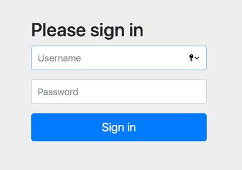
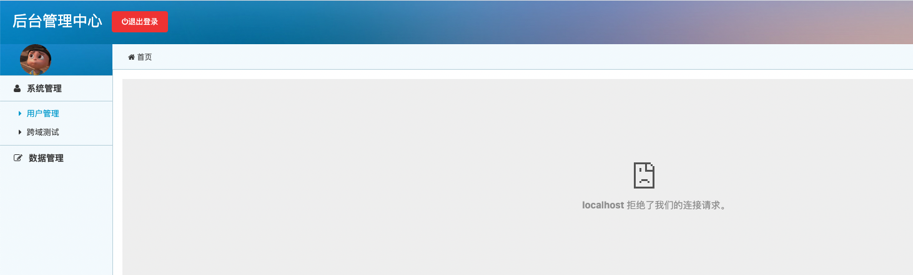
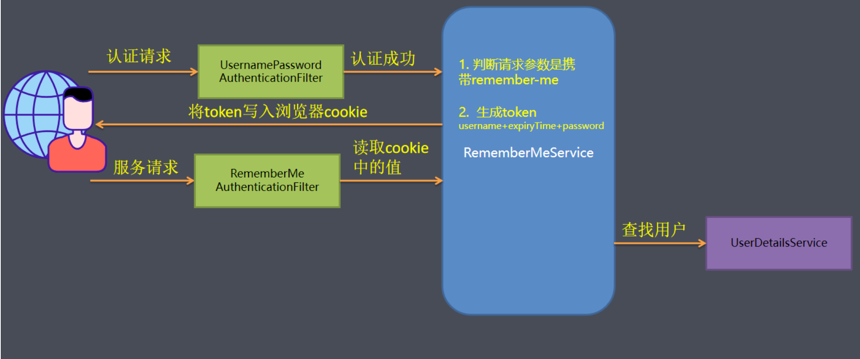
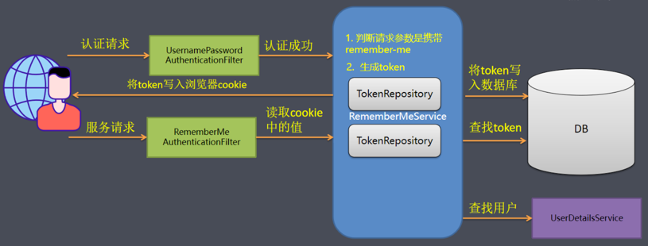
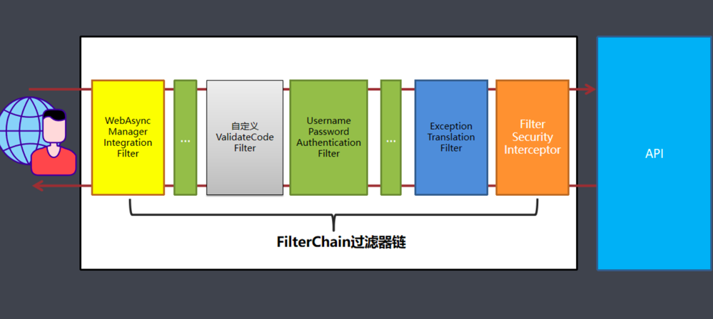
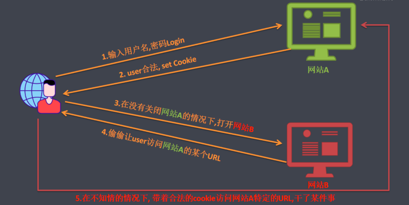
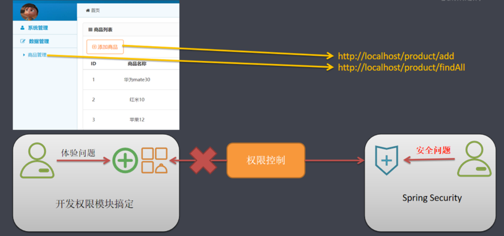
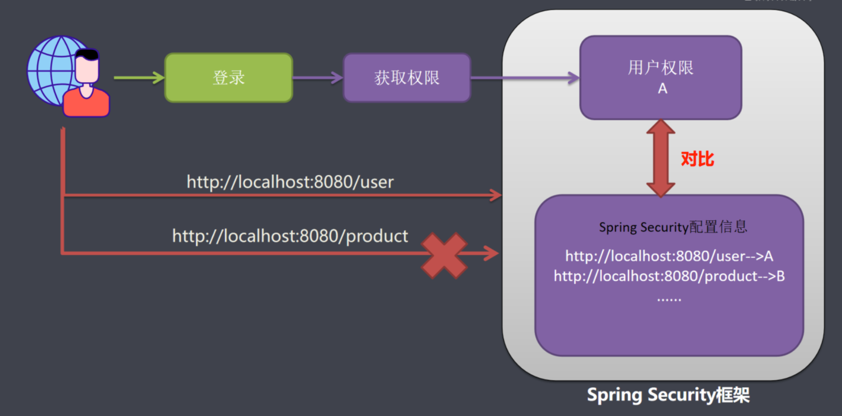
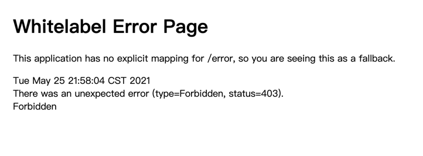

# Spring Security

## 第一部分 Spring Security 入门

### Spring Security框架功能简介

1. 认证: 用户登录, 解决的是"你是谁?"
2. 授权: 判断用户拥有什么权限，可以访问什么资源. 解决的是"你能干什么?"
3. 安全防护，防止跨站请求，session 攻击等

### SpringSecurity应用场景

1. 用户登录。传统基于web开发的项目的登录功能.
2. 用户授权。在系统中判断用户拥有哪些操作权限
3. 单一登录。一个账号只能在同一时间只能在一个地方进行登录, 如果在其他地方进行第二次登录,则剔除之前登录操作。
4. 集成CAS,做单点登录。即多个系统只需登录一次，无需重复登录。
5. 集成oauth2，做登录授权, 可以用于app登录和第三方登录(QQ,微信等), 也可以实现CAS的功能。

### 入门案例

添加依赖启动器

```xml

<dependency>
    <groupId>org.springframework.boot</groupId>
    <artifactId>spring-boot-starter-security</artifactId>
</dependency>
```

直接访问URL会进入如下表单页



其源代码如下：

```html
<body>
<div class="container">
    <form class="form-signin" method="post" action="/login">
        <h2 class="form-signin-heading">Please sign in</h2>
        <p>
            <label for="username" class="sr-only">Username</label>
            <input type="text" id="username" name="username" class="form-control" placeholder="Username" required
                   autofocus>
        </p>
        <p>
            <label for="password" class="sr-only">Password</label>
            <input type="password" id="password" name="password" class="form-control" placeholder="Password" required>
        </p>
        <input name="_csrf" type="hidden" value="c0ce8b4b-d2eb-4309-b67e-4a63f200b6cd"/>
        <button class="btn btn-lg btn-primary btn-block" type="submit">Sign in</button>
    </form>
</div>
</body>
```

这里有三点需要注意:

- 表单的提交方式和路径: `post` `/login`
- input输入项的name值: `password`
- 隐藏域input的name为:`_csrf`, value为`c0ce8b4b-d2eb-4309-b67e-4a63f200b6cd`

SpringBoot已经为SpringSecurity提供了默认配置，默认所有资源都必须认证通过才能访问。
那么问题来了! 此刻并没有连接数据库，也并未在内存中指定认证用户，如何认证呢?

其实SpringBoot已经提供了默认用户名`user`，密码在项目启动时随机生成。

认证通过后可以继续访问处理器资源。

## 第二部分 SpringSecurity 认证

### 认证基本原理与两种认证方式

在使用SpringSecurity框架，该框架会默认自动地替我们将系统中的资源进行保护。
每次访问资源的时候都必须经过一层身份的校验，如果通过了则重定向到我们输入的url中，否则访问是要被拒绝的。

那么SpringSecurity框架是如何实现的呢? Spring Security功能的实现主要是由一系列过滤器相互配合完成。也称之为过滤器链。

**过滤器链介绍**

过滤器是一种典型的AOP思想，下面简单了解下这些过滤器链，后续再源码剖析中在涉及到过滤器链再详细讲解.

1. `org.springframework.security.web.context.request.async.WebAsyncManagerIntegrationFilter`
   
   根据请求封装获取WebAsyncManager，从WebAsyncManager获取/注册的安全上下文可调 用处理拦截器

2. `org.springframework.security.web.context.SecurityContextPersistenceFilter`
   
   SecurityContextPersistenceFilter主要是使用SecurityContextRepository在session中保存或更新一个SecurityContext，
   并将SecurityContext给以后的过滤器使用，来为后续`filter`建立所需的上下文。
   
> SecurityContext中存储了当前用户的认证以及权限信息。
   
3. org.springframework.security.web.header.HeaderWriterFilter
   
   向请求的Header中添加相应的信息,可在http标签内部使用security:headers来控制 
    
4. org.springframework.security.web.csrf.CsrfFilter
   
   `csrf`又称跨域请求伪造，SpringSecurity会对所有post请求验证是否包含系统生成的csrf的token信息。
   如果不包含，则报错。起到防止csrf攻击的效果。

5. org.springframework.security.web.authentication.logout.LogoutFilter 
   
   匹配URL为/logout的请求，实现用户退出,清除认证信息。
   
6. org.springframework.security.web.authentication.UsernamePasswordAuthenticationFilter
   
   表单认证操作全靠这个过滤器，默认匹配URL为`/login`且必须为`POST`请求。
   
7. org.springframework.security.web.authentication.ui.DefaultLoginPageGeneratingFilter
   
   如果没有在配置文件中指定认证页面，则由该过滤器生成一个默认认证页面。
   
8. org.springframework.security.web.authentication.ui.DefaultLogoutPageGeneratingFilter
   
   由此过滤器可以生产一个默认的退出登录页面
   
9. org.springframework.security.web.authentication.www.BasicAuthenticationFilter
   
   此过滤器会自动解析HTTP请求中头部名字为Authentication，且以Basic开头的头信息。
   
10. org.springframework.security.web.savedrequest.RequestCacheAwareFilter
    
    通过HttpSessionRequestCache内部维护了一个RequestCache，用于缓存HttpServletRequest
    
11. org.springframework.security.web.servletapi.SecurityContextHolderAwareRequestFilter
    
    针对ServletRequest进行了一次包装，使得request具有更加丰富的API
    
12. org.springframework.security.web.authentication.AnonymousAuthenticationFilter
    
    当SecurityContextHolder中认证信息为空,则会创建一个匿名用户存入到SecurityContextHolder中。
    Spring Security为了兼容未登录的访问，也走了一套认证流程，只不过是一个匿名的身份。
    
13. org.springframework.security.web.session.SessionManagementFilter
    
    securityContextRepository限制同一用户开启多个会话的数量
    
14. org.springframework.security.web.access.ExceptionTranslationFilter
    
    异常转换过滤器位于整个springSecurityFilterChain的后方，用来转换整个链路中出现的异常
    
15. org.springframework.security.web.access.intercept.FilterSecurityInterceptor
    
    获取所配置资源访问的授权信息，根据SecurityContextHolder中存储的用户信息来决定其是否有权限。
    
> SpringSecurity 默认加载15个过滤器, 但是随着配置可以增加或者删除一些过滤器.

**认证方式**

1. HttpBasic认证
   
   HttpBasic登录验证模式是Spring Security实现登录验证最简单的一种方式，也可以说是最简陋的一种方式。
   它的目的并不是保障登录验证的绝对安全，而是提供一种“防君子不防小人”的登录验证。
   
   在使用的Spring Boot早期版本为1.X版本,依赖的Security 4.X版本，那么就无需任何配置，启动项目访问则会弹出默认的HttpBasic认证。
   现在使用的是SpringBoot2.0以上版本(依赖Security 5.X版本)，HttpBasic不再是默认的验证模式，在spring security 5.x默认的验证模式已经是表单模式。
   
   HttpBasic模式要求传输的用户名密码使用Base64模式进行加密。如果用户名是"admin"，密码是"admin"，
   则将字符串"admin:admin"使用Base64编码算法加密。加密结果可能是:YWtaW46YWRtaW4=。 
   HttpBasic模式真的是非常简单又简陋的验证模式，Base64的加密算法是可逆的,想要破解并不难。
   
    使用 HttpBasic 认证，只需要在配置类上重载如下方法
    
```java
@Override
protected void configure(HttpSecurity http) throws Exception {
    // 选择 http basic 认证
    http.httpBasic()
            // 所有请求都需要认证才能访问
            .and().authorizeRequests().anyRequest().authenticated();
}
```

2. formLogin登录认证模式
   
   SpringSecurity的HttpBasic模式比较简单，只是进行了通过携带Http的Header进行简单的登录验证，
   而且没有定制的登录页面，所以使用场景比较窄。对于一个完整的应用系统，与登录验证相关的页面都是高度定制化的，
   非常美观而且提供多种登录方式。这就需要SpringSecurity支持我们自己定制登录页面, 
   SpringBoot2.0以上版本(依赖Security 5.X版本)默认会生 成一个登录页面。

### 表单认证

#### 自定义表单登录页面

自定义表单认证，需要添加实现了`WebSecurityConfigurerAdapter`接口的配置类

```java
@Configuration
public class SecurityConfig extends WebSecurityConfigurerAdapter {

    @Override
    protected void configure(AuthenticationManagerBuilder auth) throws Exception {
        super.configure(auth);
    }

    @Override
    public void configure(WebSecurity web) throws Exception {
        // 解决静态资源被拦截问题
        web.ignoring().antMatchers("/css/**", "/images/**", "/js/**");
    }

    /**
     * 处理 HTTP 请求方法
     */
    @Override
    protected void configure(HttpSecurity http) throws Exception {
        // 使用表单认证
        http.formLogin()
                // 开启表单认证
                .loginPage("/toLoginPage").and().authorizeRequests()
                // 放行登陆页面
                .antMatchers("/toLoginPage").permitAll()
                // 所有请求都需要认证才能访问
                .anyRequest().authenticated();
    }
}
```

**SpringSecurity 中，安全构建器`HttpSecurity`和`WebSecurity`的区别**

1. WebSecurity 不仅通过 HttpSecurity 定义某些请求的安全控制，也通过其他方式定义其他某些请求可以忽略安全控制;
2. HttpSecurity 仅用于定义需要安全控制的请求(当然 HttpSecurity 也可以指定某些请求不需要安全控制);
3. 可以认为 HttpSecurity 是 WebSecurity 的一部分， WebSecurity 是包含 HttpSecurity 的更大的一个概念;
4. 构建目标不同。WebSecurity构建目标是整个SpringSecurity安全过滤器`FilterChainProxy`；HttpSecurity的构建目标仅仅是`FilterChainProxy`中的一个`SecurityFilterChain`。

####  表单登录

通过过滤器的学习，我们知道有个过滤器`UsernamePasswordAuthenticationFilter`是处理表单登录的。
那么下面我们来通过源码观察下这个过滤器.

```java
public class UsernamePasswordAuthenticationFilter extends AbstractAuthenticationProcessingFilter {

    public static final String SPRING_SECURITY_FORM_USERNAME_KEY = "username";

    public static final String SPRING_SECURITY_FORM_PASSWORD_KEY = "password";

    private static final AntPathRequestMatcher DEFAULT_ANT_PATH_REQUEST_MATCHER = new AntPathRequestMatcher("/login",
            "POST");
    
    // ...

}
```

在源码中可以观察到, 表单中的`input`的name值是`username`和`password`, 并且表单提交的路径为`/login`, 表单提交方式`method`为`post`, 这些可以修改为自定义的值.

```java
http.formLogin()
    // 开启表单认证，自定义登陆页面
    .loginPage("/toLoginPage")
    // 自定义表单提交路径
    .loginProcessingUrl("/login")
    // 自定义连个input的name
    .usernameParameter("username")
    .passwordParameter("password")
    // 登陆成功后的跳转页面
    .successForwardUrl("/")
    .and().authorizeRequests()
    // 放行登陆页面
    .antMatchers("/toLoginPage").permitAll()
    // 所有请求都需要认证才能访问
    .anyRequest().authenticated();
```

同时注意登陆页面表单的name和action要和当前设置保持一致。

```html
<form id="formLogin" action="/login" method="post">
    <div class="panel loginbox">
        <div class="text-center margin-big padding-big-top"><h1>后台管理中心</h1></div>
        <div class="panel-body" style="padding:30px; padding-bottom:10px; padding-top:10px;">
            <div class="form-group">
                <div class="field field-icon-right">
                    <input type="text" class="input input-big" name="username" placeholder="登录账号" autocomplete="off"
                           data-validate="required:请填写账号"/>
                    <span class="icon icon-user margin-small"></span>
                </div>
            </div>
            <div class="form-group">
                <div class="field field-icon-right">
                    <input type="password" class="input input-big" name="password" placeholder="登录密码" autocomplete="off"
                           data-validate="required:请填写密码"/>
                    <span class="icon icon-key margin-small"></span>
                </div>
            </div>
            <div class="form-group">
                <div class="field">
                    <input type="text" class="input input-big" name="imageCode" placeholder="填写右侧的验证码" autocomplete="off"
                           data-validate="required:请填写右侧的验证码"/>
                    

                </div>
            </div>
            <div class="form-group">
                <div>
                    <!--记住我 name为remember-me value值可选true  yes 1 on 都行-->
                    <input type="checkbox" name="" value="true"/>记住我
                </div>
            </div>
        </div>
        <div style="padding:30px;">
            <input type="submit"
                   class="button button-block bg-main text-big input-big" value="登录">
        </div>
    </div>
</form>
```

此时直接提交登陆表单后，又回跳转到登陆页面。我们可以先禁用 `csrf` 防护。在HttpSecurity配置方法内添加如下配置：

```java
// 关闭CSRF防护
http.csrf().disable();
```



重启后可以登陆成功。这个时候又出现新的问题，右侧的窗体中的数据加载不出来。这个是什么原因呢? 我们来看出现问题的具体是哪里?

SpringSecurity下，X-Frame-Options默认为DENY（非Spring Security环境下，X-Frame-Options的默认大多也是DENY）
这种情况下，浏览器拒绝当前页面加载任何Frame页面，设置含义如下:

- DENY:浏览器拒绝当前页面加载任何Frame页面 此选择是默认的. 
  
- SAMEORIGIN:frame页面的地址只能为同源域名下的页面。

可以在HttpSecurity配置方法内添加如下配置：

```java
// 加载同源域名下iframe页面
http.headers().frameOptions().sameOrigin();
```

至此，自定义登陆页面登陆完成。

#### 基于数据库实现认证功能

之前我们所使用的用户名和密码是来源于框架自动生成的, 那么我们如何实现基于数据库中的用户名和密码功能呢? 

要实现这个得需要实现security的一个`UserDetailsService`接口, 重写这个接口里面`loadUserByUsername`即可

```java
@Service
public class MyUserDetailService implements UserDetailsService {

    @Autowired
    private UserService userService;

    // 根据用户名查询用户
    @Override
    public UserDetails loadUserByUsername(String username) throws UsernameNotFoundException {
        User user = userService.findByUsername(username);
        if (Objects.isNull(user)) throw new UsernameNotFoundException("用户找不到：" + username);
        return new org.springframework.security.core.userdetails.User(
                username,
                // 密码直接使用明文
                "{noop}"+user.getPassword(),
                // 用户是否启用。（启用）
                true,
                // 用户是否未过期（未过期）
                true,
                // 用户凭证是否未过期（未过期）
                true,
                // 用户是否未锁定（未锁定）
                true,
                // 权限列表
                new ArrayList<>());
    }

}
```

编写完自定义service后，在SecurityConfiguration配置类中注册并使用自定义的用户认证方法

```java
@Autowired
private MyUserDetailService myUserDetailService;

// 身份安全管理器
@Override
protected void configure(AuthenticationManagerBuilder auth) throws Exception {
    auth.userDetailsService(myUserDetailService);
}
```

#### 密码加密认证

在基于数据库完成用户登录的过程中,我们所是使用的密码是明文的，规则是通过对密码明文添加`{noop}`前缀。那么下面 Spring Security 中的密码编码进行一些探讨。

SpringSecurity 中`PasswordEncoder`就是我们对密码进行编码的工具接口。

该接口只有两个功能: 一个是*匹配验证*; 另一个是*密码编码*。

```java
public interface PasswordEncoder {

	String encode(CharSequence rawPassword);

	boolean matches(CharSequence rawPassword, String encodedPassword);

	default boolean upgradeEncoding(String encodedPassword) {
		return false;
	}

}
```

默认提供了众多实现类，其中比较安全的，也是最常用的就是`BCryptPasswordEncoder`，他使用的 BCrypt 算法。


> 任何应用考虑到安全，绝不能明文的方式保存密码。密码应该通过哈希算法进行加密。有很多标准的算法比如SHA或者MD5，结合salt(盐)是一个不错的选择。 
 
 Spring Security 提供了`BCryptPasswordEncoder`类,实现Spring的PasswordEncoder接口使用BCrypt强哈希方法来加密密码。BCrypt强哈希方法每次加密的结果都不一样,所以更加的安全。
 
 BCrypt算法相对来说是运算比较慢的算法，在密码学界有句常话: 越慢的算法越安全,黑客破解成本越高。
 通过salt和const这两个值来减缓加密过程，它的加密时间(百ms级)远远超过 md5(大概1ms左右)。
 对于计算机来说，Bcrypt 的计算速度很慢，但是对于用户来说，这个过程不算慢。
 
BCrypt是单向的，而且经过salt和cost的处理，使其受攻击破解的概率大大降低，同时破解的难度也提升不少，相对于MD5等加密方式更加安全，而且使用也比较简单。

BCrypt加密后的字符串形如: `$2a$10$wouq9P/HNgvYj2jKtUN8rOJJNRVCWvn1XoWy55N3sCkEHZPo3lyWq`

> `$` 是分割符，无意义;
> 
> `2a` 是bcrypt加密版本号;
> 
> `10` 是const的值;(这里的const值即生成salt的迭代次数，默认值是10，推荐值12。)
> 
> 而后的前22位是salt值;
> 
> 再然后的字符串就是密码的密文了;


**在项目中使用BCrypt**

在SpringSecurity中，提供了`PasswordEncoderFactories`密码器工厂

```java
public final class PasswordEncoderFactories {

	private PasswordEncoderFactories() {}

	@SuppressWarnings("deprecation")
	public static PasswordEncoder createDelegatingPasswordEncoder() {
		String encodingId = "bcrypt";
		Map<String, PasswordEncoder> encoders = new HashMap<>();
		encoders.put(encodingId, new BCryptPasswordEncoder());
		encoders.put("ldap", new org.springframework.security.crypto.password.LdapShaPasswordEncoder());
		encoders.put("MD4", new org.springframework.security.crypto.password.Md4PasswordEncoder());
		encoders.put("MD5", new org.springframework.security.crypto.password.MessageDigestPasswordEncoder("MD5"));
		encoders.put("noop", org.springframework.security.crypto.password.NoOpPasswordEncoder.getInstance());
		encoders.put("pbkdf2", new Pbkdf2PasswordEncoder());
		encoders.put("scrypt", new SCryptPasswordEncoder());
		encoders.put("SHA-1", new org.springframework.security.crypto.password.MessageDigestPasswordEncoder("SHA-1"));
		encoders.put("SHA-256",
				new org.springframework.security.crypto.password.MessageDigestPasswordEncoder("SHA-256"));
		encoders.put("sha256", new org.springframework.security.crypto.password.StandardPasswordEncoder());
		encoders.put("argon2", new Argon2PasswordEncoder());
		return new DelegatingPasswordEncoder(encodingId, encoders);
	}

}
```

之前我们在项目中密码使用的是明文的是`noop`, 代表不加密使用明文密码, 现在用BCrypt只需要将`noop`换成`bcrypt`即可。

> 如果测试时，数据库中的密码是明文，可以用如下代码添加测试数据。

```java
public static void main(String[] args) {
    BCryptPasswordEncoder bCryptPasswordEncoder = new BCryptPasswordEncoder();
    String encode = bCryptPasswordEncoder.encode("123456");
    String encode2 = bCryptPasswordEncoder.encode("123456");
    System.out.println(encode);
    System.out.println(encode2);
}
```

> 因为BCrypt使用的是强哈希，所以多次加密的结果不一样，随便取一个结果即可。

#### 获取当前登录用户

在传统web系统中, 我们将登录成功的用户放入session中, 在需要的时候可以从session中获取用户。
那么Spring Security中我们如何获取当前已经登录的用户呢?

- SecurityContextHolder 
  
持有系统当前的安全上下文SecurityContext，其中包含着当前使用系统的用户的信息。 
  
- SecurityContext 
  
安全上下文。可以获取当前通过身份验证的主体或身份验证请求令牌。

```java
@RequestMapping("/loginUser")
@ResponseBody
public UserDetails getCurrentUser() {
    return (UserDetails) SecurityContextHolder.getContext()
            .getAuthentication().getPrincipal();
}
```

访问结果如下：

```json
{"password":null,"username":"admin","authorities":[],"accountNonExpired":true,"accountNonLocked":true,"credentialsNonExpired":true,"enabled":true}
```

此外，还可以通过直接声明的方式获取：

```java
@RequestMapping("/loginUser1")
@ResponseBody
public UserDetails getCurrentUser1(Authentication authentication) {
    return (UserDetails) authentication.getPrincipal();
}

@RequestMapping("/loginUser2")
@ResponseBody
public UserDetails getCurrentUser2(@AuthenticationPrincipal UserDetails userDetails) {
    return userDetails;
}
```

#### Remember me

在大多数网站中，都会实现RememberMe这个功能，方便用户在下一次登录时直接登录，避免再次输入用户名以及密码去登录。
Spring Security针对这个功能已经帮助我们实现, 我们首先看下他的原理图.

**简单的Token生成方法**



> Token=MD5(username+分隔符+expiryTime+分隔符+password)

注意: 这种方式不推荐使用, 有严重的安全问题. 就是密码信息在前端浏览器cookie中存放. 如果cookie被盗取很容易破解.

页面添加复选框

```html
<div class="form-group">
    <div>
        <!--记住我 name为remember-me value值可选true  yes 1 on 都行-->
        <input type="checkbox" name="remember-me" value="true"/>记住我
    </div>
</div>
```

后台HttpSecurity配置代码开启`remember-me`功能（位于`successForwardUrl`后面）

```java
// 开启记住我功能
.and().rememberMe()
// token 失效时间，默认两周 1209600
.tokenValiditySeconds(1209600)
// 记住我表单name, 默认 remember-me
.rememberMeParameter("remember-me")
```

登陆成功后，可以在浏览器查看保存的Cookie信息

**持久化的Token生成方法**




存入数据库Token包含:

- token: 随机生成策略,每次访问都会重新生成。
- series: 登录序列号，随机生成策略。用户输入用户名和密码登录时，该值重新生成;使用`remember-me`功能，该值保持不变
- expiryTime: token过期时间。 
  
> CookieValue=encode(series+token)

首先需要向容器中添加PersistentTokenRepository

```java
@Autowired
private DataSource dataSource;

@Bean
public PersistentTokenRepository getPersistentTokenRepository() {
    JdbcTokenRepositoryImpl jdbcTokenRepository = new JdbcTokenRepositoryImpl();
    jdbcTokenRepository.setDataSource(dataSource);
    // 启动时自动创建表(首次启动可以设置为true，以后需要注释)
    jdbcTokenRepository.setCreateTableOnStartup(true);
    return jdbcTokenRepository;
}
```

在HttpSecurity配置代码中，在开启RememberMe功能后添加配置使用当前PersistentTokenRepository

```java
.rememberMeParameter("remember-me")
// 使用配置好的PersistentTokenRepository
.tokenRepository(getPersistentTokenRepository())
```

> 每次勾选记住我，而且是输入用户名密码登录的，都会添加一条数据；
> 
> 如果使用记住我的Cookie登陆，username和series保持不变，token和last_used更新；
> 
> 如果token被篡改，则需要重新使用用户名密码登陆。


**Cookie窃取伪造**

使用网页登录系统,记录remember-me的值。

使用postman发送请求，在请求中添加key为remember-me的Cookie值来伪造cookie。

是可以正常访问的，如果这个接口十分重要，需要使用表单登陆才能继续访问，可以将接口改造为如下形式：

```java
@GetMapping("/{id}")
@ResponseBody
public User getById(@PathVariable Integer id) {
    // 获取认证信息
    Authentication authentication = SecurityContextHolder.getContext().getAuthentication();
    // 判断认证信息是否来源于RememberMe
    if (RememberMeAuthenticationToken.class.isAssignableFrom(authentication.getClass())) {
        throw new RememberMeAuthenticationException("认证信息来源于 RememberMe,请重新登录");
    }
    User user = userService.getById(id);
    return user;
}
```

> 在重要操作步骤可以加以验证, true代表自动登录,则引导用户重新表单登录, false正常进行。

#### 自定义登录成功处理和失败处理

在某些场景下,用户登录成功或失败的情况下用户需要执行一些后续操作。比如登录日志的搜集。
或者在前后端分离的情况下用户登录成功或失败后，需要给前台页面返回对应的错误信息, 由前台主导登录成功或者失败的页面跳转。

这个时候需要要到用到`AuthenticationSuccessHandler`与`AuthenticationFailureHandler`。

- 自定义成功处理

实现`AuthenticationSuccessHandler`接口，并重写`onAuthenticationSuccess()`方法

- 自定义失败处理

实现`AuthenticationFailureHandler`接口，并重写`onAuthenticationFailure()`方法

我们可以首先通过前面配置的登陆成功跳转页面URL方法`.successForwardUrl("/")`，查看默认登陆成功处理。

进入此方法，我们可以发现方法中构建了一个`ForwardAuthenticationSuccessHandler`对象；
继续进入这个类中，我们可以发现最终做了一个断言和跳转操作。

同样地，我们可以通过查看`.loginPage("/toLoginPage")`方法，找到登陆失败的默认处理。
进入方法中，最终来到`AbstractAuthenticationFilterConfigurer#updateAuthenticationDefaults`方法

```java
protected final void updateAuthenticationDefaults() {
    if (this.loginProcessingUrl == null) {
        // 默认表单提交地址
        this.loginProcessingUrl(this.loginPage);
    }

    if (this.failureHandler == null) {
        // 指定登陆失败URL
        this.failureUrl(this.loginPage + "?error");
    }

    LogoutConfigurer<B> logoutConfigurer = (LogoutConfigurer)((HttpSecurityBuilder)this.getBuilder()).getConfigurer(LogoutConfigurer.class);
    if (logoutConfigurer != null && !logoutConfigurer.isCustomLogoutSuccess()) {
        logoutConfigurer.logoutSuccessUrl(this.loginPage + "?logout");
    }

}
```

继续进入`failureUrl`方法当中，最终无非就是构建了一个`SimpleUrlAuthenticationFailureHandler`对象。

**自定义登录结果处理实现**


添加自定义登录结果处理器

```java
@Service
public class MyAuthenticationService implements AuthenticationSuccessHandler, AuthenticationFailureHandler {

    private final RedirectStrategy redirectStrategy = new DefaultRedirectStrategy();

    @Override
    public void onAuthenticationSuccess(HttpServletRequest request, HttpServletResponse response,
                                        Authentication authentication) throws IOException, ServletException {
        System.out.println("登录成功后续处理....");
        // 重定向到index页
        redirectStrategy.sendRedirect(request, response, "/");

    }

    @Override
    public void onAuthenticationFailure(HttpServletRequest request, HttpServletResponse response,
                                        AuthenticationException exception) throws IOException, ServletException {
        System.out.println("登录失败后续处理....");
        // 重定向到login页
        redirectStrategy.sendRedirect(request, response, "/toLoginPage");
    }
}
```

在配置文件中添加自定义登陆结果处理器（在successForwardUrl后面添加）

```java
@Autowired
private MyAuthenticationService myAuthenticationService;
```

```java
.successForwardUrl("/")
// 登陆成功或失败的处理器
.successHandler(myAuthenticationService)
.failureHandler(myAuthenticationService)
```


**异步用户登录实现**

改造前端页面，不使用表单提交方式

```html
<div style="padding:30px;">
    <input type="button" onclick="login()" class="button button-block bg-main text-big input-big" value="登录">
</div>
```

```html
<script>
    function login() {
        $.ajax({
            type: "POST",
            dataType: "json",
            url: "/login",
            data: $("#formLogin").serialize(),
            success: (data) => {
                if (data.code === 200) {
                    window.location.href = "/";
                } else {
                    alert(data.message);
                }
            }
        });
    }
</script>
```

修改登陆成功和失败处理器

```java
@Service
public class MyAuthenticationService implements AuthenticationSuccessHandler, AuthenticationFailureHandler {
    // 对象转json工具
    @Autowired
    private ObjectMapper objectMapper;

    @Override
    public void onAuthenticationSuccess(HttpServletRequest request, HttpServletResponse response,
                                        Authentication authentication) throws IOException, ServletException {
        Map<Object, Object> result = new HashMap<>();
        result.put("code", HttpStatus.OK.value());
        result.put("message", "登陆成功");
        response.setContentType("application/json;charset=UTF-8");
        response.getWriter().write(objectMapper.writeValueAsString(result));
    }

    @Override
    public void onAuthenticationFailure(HttpServletRequest request, HttpServletResponse response,
                                        AuthenticationException exception) throws IOException, ServletException {
        Map<Object, Object> result = new HashMap<>();
        result.put("code", HttpStatus.UNAUTHORIZED.value());
        result.put("message", "登陆失败");
        response.setContentType("application/json;charset=UTF-8");
        response.getWriter().write(objectMapper.writeValueAsString(result));
    }
}
```

#### 退出登录

在SpringSecurity中专门处理退出登录的过滤器`LogoutFilter`，匹配URL为`/logout`的请求，实现用户退出,清除认证信息。

只需要发送请求,请求路径为`/logout`即可。当然这个路径也可以自行在配置类中自行指定。
退出操作也有对应的自定义处理`LogoutSuccessHandler`,退出登录成功后执行。退出的同时如果有remember-me的数据,也会一并删除。

退出登陆后的默认页面，和登陆失败类似都在`updateAuthenticationDefaults`方法中写着

```java
protected final void updateAuthenticationDefaults() {
	if (this.loginProcessingUrl == null) {
		loginProcessingUrl(this.loginPage);
	}
	if (this.failureHandler == null) {
		failureUrl(this.loginPage + "?error");
	}
	LogoutConfigurer<B> logoutConfigurer = getBuilder().getConfigurer(LogoutConfigurer.class);
	if (logoutConfigurer != null && !logoutConfigurer.isCustomLogoutSuccess()) {
		logoutConfigurer.logoutSuccessUrl(this.loginPage + "?logout");
	}
}
```

从源代码中可以看出，退出登录的默认URL是loginPage

**代码简单实现**

```html
<div class="head-l">
    <a class="button button-little bg-red" href="/logout"><span class="icon-power-off"></span>退出登录</a>
</div>
```

如果想要自定义配置，需要在HttpSecurity配置代码中(failureHandler后面)添加如下配置

```java
.and().logout()
// 自定义logoutUrl
.logoutUrl("/logout")
// 自定义退出登录处理器
.logoutSuccessHandler(myAuthenticationService)
```

> 自定义退出登陆处理器的定义和前面类似，需要实现`LogoutSuccessHandler`接口，然后重写`onLogoutSuccess`方法即可。

### 图形验证码验证

图形验证码一般是防止恶意，人眼看起来都费劲，何况是机器。
不少网站为了防止用户利用机器人 自动注册、登录、灌水，都采用了验证码技术。

所谓验证码，就是将一串随机产生的数字或符号，生成一幅图片，图片里加上一些干扰。
目前也有需要手动滑动的图形验证码，这种可以有专门去做的第三方平台. 比如极验(https://www.geetest.com/)。
那么本次课程讲解主要针对图形验证码。

spring security添加验证码大致可以分为三个步骤: 

1. 根据随机数生成验证码图片;

2. 将验证码图片显示到登录页面; 

3. 认证流程中加入验证码校验。

SpringSecurity的认证校验是由`UsernamePasswordAuthenticationFilter`过滤器完成的，
所以我们的验证码校验逻辑应该在这个过滤器之前，验证码通过后才能到后续的操作。流程如下



**代码实现**

首先在前端页面上通过调用URL获取验证码图片

```html
<input type="text" class="input input-big" name="imageCode" placeholder="填写右侧的验证码" autocomplete="off" data-validate="required:请填写右侧的验证码"/>

```

自定义验证码过滤器ValidateCodeFilter。需要继承`OncePerRequestFilter`确保在一次请求只通过一次Filter，而不需要重复执行

```java
@Component
public class ValidateCodeFilter extends OncePerRequestFilter {

    @Autowired
    private MyAuthenticationService myAuthenticationService;
    @Autowired
    private StringRedisTemplate stringRedisTemplate;

    @Override
    protected void doFilterInternal(HttpServletRequest httpServletRequest, HttpServletResponse httpServletResponse,
                                    FilterChain filterChain) throws ServletException, IOException {
        // 判断是否是登录请求,只有登录请求才去校验验证码
        if (httpServletRequest.getRequestURI().equals("/login")
                && httpServletRequest.getMethod().equalsIgnoreCase("POST")) {
            try {
                validate(httpServletRequest);
            } catch (ValidateCodeException e) {
                // 如果验证码验证未通过，做登陆失败处理
                myAuthenticationService.onAuthenticationFailure(httpServletRequest, httpServletResponse, e);
                return; }
        }

        // 如果不是登录请求，直接调用后面的过滤器链
        filterChain.doFilter(httpServletRequest, httpServletResponse);
    }

    private void validate(HttpServletRequest request) throws ValidateCodeException {
        //获取ip
        String remoteAddr = request.getRemoteAddr();
        // 拼接redis的key
        //从redis中获取imageCode
        String redisKey = ValidateCodeController.REDIS_KEY_IMAGE_CODE + "-" + remoteAddr;
        String redisImageCode = stringRedisTemplate.boundValueOps(redisKey).get();
        String imageCode = request.getParameter("imageCode");
        if (!StringUtils.hasText(imageCode)) {
            throw new ValidateCodeException("验证码的值不能为空!"); }
        if (redisImageCode == null) {
            throw new ValidateCodeException("验证码已过期!");
        }
        if (!redisImageCode.equals(imageCode)) {
            throw new ValidateCodeException("验证码不正确!");
        }
        // 从redis中删除imageCode
        stringRedisTemplate.delete(redisKey);
    }

}
```

```java
public class ValidateCodeException extends AuthenticationException {
    public ValidateCodeException(String msg) {
        super(msg);
    }
}
```

在HttpSecurity配置代码中添加如下代码，将自定义Filter添加到``前面

```java
// 将自定义验证码Filter添加到UsernamePasswordAuthenticationFilter前面
http.addFilterBefore(validateCodeFilter, UsernamePasswordAuthenticationFilter.class);
```

### session管理

SpringSecurity 可以与Spring Session库配合使用，只需要做一些简单的配置就可以实现一些功能，
如(会话过期、一个账号只能同时在线一个、集群session等)。

#### 会话超时

配置session会话超时时间，默认为30分钟，SpringBoot中的会话超时时间至少为60秒

```properties
server.servlet.session.timeout=60
```

> 当session超时后, 默认跳转到登录页面

自定义设置session超时后地址

```java
// 设置session管理和失效后跳转地址
http.sessionManagement().invalidSessionUrl("/toLoginPage");
```

#### 并发控制

并发控制,即同一个账号同时在线个数。
同一个账号同时在线个数如果设置为1，表示该账号在同一时间内只能有一个有效的登录。
如果同一个账号又在其它地方登录，那么就将上次登录的会话过期，即后面的登录会踢掉前面的登录。


**代码实现**

设置最大会话数量

```java
// 设置session管理和失效后跳转地址
http.sessionManagement()
    .invalidSessionUrl("/toLoginPage")
    // 设置session最大会话数量
    .maximumSessions(1)
    // 谁session过期后跳转路径
    .expiredUrl("/toLoginPage");
```

阻止用户第二次登录

sessionManagement也可以配置`maxSessionsPreventsLogin`:boolean值，当达到maximumSessions设置的最大会话个数时阻止登录。

```java
// 设置session管理和失效后跳转地址
http.sessionManagement()
    .invalidSessionUrl("/toLoginPage")
    // 设置session最大会话数量
    .maximumSessions(1)
    // 当达到最大会话个数，阻止登陆
    .maxSessionsPreventsLogin(true)
    // 谁session过期后跳转路径
    .expiredUrl("/toLoginPage");
```

> 第二次登陆则会直接 alert 弹出错误信息

#### 集群session

实际场景中一个服务会至少有两台服务器在提供服务，在服务器前面会有一个nginx做负载均衡，用户访问nginx，nginx再决定去访问哪一台服务器。
当一台服务宕机了之后，另一台服务器也可以继续提供服务，保证服务不中断。

如果我们将session保存在Web容器(比如tomcat)中，一个用户第一次访问被分配到服务器1上面需要登录，
当某些访问突然被分配到服务器二上，因为服务器2上没有用户在服务器1上登录的会话session信息，服务器2还会再次让用户登录，
用户已经登录了还让登录就感觉不正常了。

解决这个问题的思路是用户登录的会话信息不能再保存到Web服务器中，而是保存到一个单独的库(redis、mongodb、jdbc等)中。
所有服务器都访问同一个库，都从同一个库来获取用户的session信息。
如用户在服务器1上登录，将会话信息保存到库中，用户的下次请求被分配到服务器2，服务器2从库中检查session是否已经存在，
如果存在就不用再登录了，可以直接访问服务了。

**代码实现**

1. 添加依赖

```xml
<!-- 基于redis实现session共享 -->
<dependency>
    <groupId>org.springframework.session</groupId>
    <artifactId>spring-session-data-redis</artifactId>
</dependency>
```

2. 设置session存储类型

```properties
spring.session.store-type=redis
```

### csrf防护机制

**什么是csrf?**

CSRF(Cross-site request forgery)，中文名称:跨站请求伪造。

你这可以这么理解CSRF攻击:攻击者盗用了你的身份，以你的名义发送恶意请求。

CSRF能够做的事情包括: 以你名义发送邮件，发消息，盗取你的账号，甚至于购买商品，虚拟货币转账......
造成的问题包括:个人隐私泄露以及财产安全。

CSRF这种攻击方式在2000年已经被国外的安全人员提出，但在国内，直到06年才开始被关注。
08年，国内外的多个大型社区和交互网站分别爆出CSRF漏洞，如:NYTimes.com(纽约时报)、 Metafilter(一个大型的BLOG网站)，YouTube和百度 ......
而现在，互联网上的许多站点仍对此毫无防备，以至于安全业界称CSRF为“沉睡的巨人”。

**CSRF的原理**



从上图可以看出，要完成一次CSRF攻击，受害者必须依次完成三个步骤: 

1. 登录受信任网站A，并在本地生成Cookie。 
2. 在不登出A的情况下，访问危险网站B。
3. 触发网站B中的一些元素

**CSRF的防御策略**

在业界目前防御CSRF攻击主要有三种策略:

- 验证 HTTP Referer 字段;
- 在请求地址中添加 token
- 并验证;在 HTTP 头中自定义属性并验证。 

1. 验证 HTTP Referer 字段

根据HTTP协议，在HTTP头中有一个字段叫`Referer`，它记录了该HTTP请求的来源地址。
在通常情况下，访问一个安全受限页面的请求来自同一个网站，在后台请求验证其Referer值。
如果是以自身安全网站开头的域名，则说明该请求是是合法的。如果Referer是其他网站的话，则有可能是黑客的 CSRF 攻击，拒绝该请求。

2. 在请求地址中添加 token 并验证

CSRF 攻击之所以能够成功，是因为黑客可以完全伪造用户的请求，该请求中所有的用户验证信息都是存在于 cookie 中。
因此黑客可以在不知道这些验证信息的情况下直接利用用户自己的 cookie 来通过安全验证。
要抵御 CSRF，关键在于在请求中放入黑客所不能伪造的信息，并且该信息不存在于 cookie 之中。
可以在 HTTP 请求中以参数的形式加入一个随机产生的`token`，并在服务器端建立一个拦截器来验证这个`token`，
如果请求中没有 token 或者 token 内容不正确，则认为可能是 CSRF 攻击而拒绝该请求。

3. 在 HTTP 头中自定义属性并验证
   
这种方法也是使用 token 并进行验证， 和上一种方法不同的是，
这里并不是把 token 以参数的形式置于 HTTP 请求之中，而是把它放到 HTTP 头中自定义的属性里。

**SpringSecurity中的csrf防御机制**

`org.springframework.security.web.csrf.CsrfFilter`

csrf又称跨站请求伪造，SpringSecurity会对所有post请求验证是否包含系统生成的csrf的token 信息，
如果不包含则报错。起到防止csrf攻击的效果。(1. 生成token 2.验证token)

1. 开启csrf防护

```java
// 开启 CSRF 防护；设置不需要防护的 URL
http.csrf().ignoringAntMatchers("/user/save");
```

2. 前端页面需要添加token值

```html
<input type="hidden" th:name="${_csrf.parameterName}" th:value="${_csrf.token}"/>
```


### 跨域与CORS

#### 跨域

跨域，实质上是浏览器的一种保护处理。如果产生了跨域，服务器在返回结果时就会被浏览器拦截 (注意:此时请求是可以正常发起的，只是浏览器对其进行了拦截)，
导致响应的内容不可用。

产生跨域的几种情况:

当前页面URL|被请求页面URL|是否跨域|原因 
---|---|---|---
http://www.mujulin.com|http://www.mujulin.com/index.html|否|同源（协议、域名、端口相同）
http://www.mujulin.com|https://www.mujulin.com/index.html|是|协议不同(HTTP/HTTPS)
http://www.mujulin.com|http://www.baidu.com/|是|主域名不同
http://www.mujulin.com|http://blog.mujulin.com/|是|子域名不同(www/blog)
http://www.mujulin.com:8080|http://blog.mujulin.com:8090|是|端口号不同


#### 解决跨域

1. JSONP
   
浏览器允许一些带src属性的标签跨域，也就是在某些标签的src属性上写url地址是不会产生跨域问题

2. CORS解决跨域
   
CORS是一个W3C标准，全称是"跨域资源共享"(Cross-origin resource sharing)。
CORS需要浏览器和服务器同时支持。目前，所有浏览器都支持该功能，IE浏览器不能低于IE10。

浏览器在发起真正地请求之前，会发起一个`OPTIONS`类型的预检请求，用于请求服务器是否允许跨域，在得到许可的情况下才会发起请求。

#### 基于Spring Security的CORS支持 

1. 声明跨域配置源
   
```java
public CorsConfigurationSource corsConfigurationSource() {

    CorsConfiguration corsConfiguration = new CorsConfiguration();
    // 允许所有站点跨域
    corsConfiguration.addAllowedOrigin("*");
    // 允许跨域的HTTP方法
    corsConfiguration.addAllowedMethod("*");
    // 允许跨域的请求头
    corsConfiguration.addAllowedHeader("*");
    // 允许携带凭证
    corsConfiguration.setAllowCredentials(true);

    UrlBasedCorsConfigurationSource urlBasedCorsConfigurationSource = new UrlBasedCorsConfigurationSource();
    // 对所有URL都生效
    urlBasedCorsConfigurationSource.registerCorsConfiguration("/**", corsConfiguration);

    return urlBasedCorsConfigurationSource;
}
```

> 从SpringBoot 2.4.0 开始
> 
> When allowCredentials is true, allowedOrigins cannot contain the special value "*"。
> 
> 需要将`addAllowedOrigin`方法替换为`addAllowedOriginPattern`

2. 开启跨域支持
   
```java
//允许跨域 
http.cors().configurationSource(corsConfigurationSource());
```

3. 前端跨域测试代码
   
```javascript
function toCors() {
    $.ajax({
        //  默认情况下，标准的跨域请求是不会发送cookie的
        xhrFields: {
            withCredentials: true
        },
        // 根据ID查询用户
        url: "http://localhost:8090/user/1",   
        success: function (data) {
            alert("请求成功." + data)
        }
    });
}
```


## 第三部分 SpringSecurity 授权

### 授权简介

在第二部分中我们讲解的都是用户认证, 不管是用户名密码,还是图形验证码等,最终的目的都是一个: 让系统知道你到底是谁在访问你的系统。解决的问题是, 你是谁? 

这部分主要讲解你能在系统中做什么事情, 针对这个有的叫做: 授权。有的叫做:鉴权, 还有叫权限控制。最终的目的就是你能在系统中能过做什么?

#### Spring Security 对授权的定义



> 安全权限控制问题其实就是控制能否访问URL

#### Spring Security 授权原理



在我们应用系统里面,如果想要控制用户权限,需要有2部分数据。

1. 系统配置信息数据: 写着系统里面有哪些URL,每一个url拥有哪些权限才允许被访问。

2. 另一份数据就是用户权限信息:请求用户拥有权限
   
系统用户发送一个请求:系统配置信息和用户权限信息作比对，如果比对成功则允许访问。

当一个系统授权规则比较简单,基本不变时候，系统的权限配置信息可以写在我们的代码里面去的。
比如前台门户网站等权限比较单一,可以使用简单的授权配置即可完成,如果权限复杂, 
例如办公OA, 电商后台管理系统等就不能使用写在代码里面了, 需要RBAC权限模型设计.

### Spring Security 授权

#### 内置权限表达式

SpringSecurity 使用Spring EL来支持，主要用于Web访问和方法安全上, 可以通过表达式来判断是否具有访问权限。
下面是Spring Security常用的内置表达式。(`ExpressionUrlAuthorizationConfigurer`定义了所有的表达式)

表达式|说明
---|---
`permitAll`|任何人都允许访问
`denyAll`|任何人都不允许访问
`anonymous`|匿名用户允许访问
`rememberMe`|已记住的用户允许访问
`authenticated`|任何经过身份验证的用户都允许访问,不包含 anonymous
`hasRole(role)`|拥有特定的角色的用户允许访问, 会自动在角色前面插入`'ROLE_'`
`fullyAuthenticated`|指定由经过身份验证的用户允许访问,不包含`anonymous`和`rememberMe`
`hasAnyRole([role1,role2])`|拥有任一角色的用户允许访问, 会自动在角色前面插入`'ROLE_'`
`hasAuthority(authority)`|拥有特定的权限的用户允许访问
`hasAnyAuthiority([authority,authority])`|拥有任意一个权限的用户允许访问
`hasIpAddress(ip)`|特定IP地址可以访问

#### URL安全表达式

基于web访问使用表达式保护url请求路径

在HttpSecurity的配置代码中添加如下代码即可添加权限控制

```java
// 设置访问'/user/**' 需要ADMIN角色 
http.authorizeRequests().antMatchers("/user/**").hasRole("ADMIN");
```

添加完权限控制代码后，我们需要添加授权代码。添加授权的代码可以写在`loadUserByUsername`方法当中：

```java
// 先声明一个权限集合, 因为构造方法里面不能传入null
Collection<GrantedAuthority> authorities = new ArrayList<>();
if ("admin".equalsIgnoreCase(user.getUsername())) {
    authorities.add(new SimpleGrantedAuthority("ROLE_ADMIN"));
} else {
    authorities.add(new SimpleGrantedAuthority("ROLE_PRODUCT"));
}
```

如果用户名为`"admin"`，则会拥有`ROLE_ADMIN`角色，即可访问`/user/**`。否则会报错：



如果嫌弃默认的错误信息，可以自定义权限不足错误信息。

首先添加自定义的权限不足对象

```java
@Component
public class MyAccessDeniedHandler implements AccessDeniedHandler {

    @Override
    public void handle(HttpServletRequest request, HttpServletResponse response,
                       AccessDeniedException accessDeniedException) throws IOException, ServletException {
        response.setStatus(HttpServletResponse.SC_FORBIDDEN);
        response.setContentType("text/html;charset=UTF-8");
        response.getWriter().write("权限不足，请联系管理员!");
    }

}
```

向HttpSecurity的配置代码中添加自定义权限不足处理器

```java
// 设置自定义权限不足信息. 
http.exceptionHandling().accessDeniedHandler(myAccessDeniedHandler);
```

> 还可以添加复杂的权限条件：
> 
> `http.authorizeRequests().antMatchers("/product/**").access("hasAnyRole('ADMIN,PRODUCT') and hasIpAddress('127.0.0.1')");`

#### Method安全表达式

针对方法级别的访问控制比较复杂，SpringSecurity 提供了4种注解分别是

- @PreAuthorize: 适合进入方法前的权限验证

- @PostAuthorize: 方法执行后再进行权限验证，适合验证带有返回值的权限。
  返回对象能够在SpringEL表达式中通过`returnObject`获取返回的对象
  
- @PreFilter: 可以用来对集合类型的 *参数* 进行过滤, 将不符合条件的元素剔除集合
  
- @PostFilter: 可以用来对集合类型的 *返回值* 进行过滤, 将不符合条件的元素剔除集合


开启方法级别的注解配置，首先要在security配置类中添加如下注解：

```java
@EnableGlobalMethodSecurity(prePostEnabled = true)
public class SecurityConfig extends WebSecurityConfigurerAdapter{}
```

使用范例：

```java
public class UserController {
    
    @RequestMapping("/findAll")
    @PreAuthorize("hasRole('ADMIN')")
    public String findAll(Model model) {
        // 略...
    }

    @RequestMapping("/update/{id}")
    // 针对参数权限限定，id < 10的可以访问
    @PreAuthorize("#id<10")
    public String update(@PathVariable Integer id, Model model) {
        // 略...
    }

    @GetMapping("/{id}")
    @ResponseBody
    @PostAuthorize("returnObject.username == authentication.principal.username")
    public User getById(@PathVariable Integer id) {
        // 略...
    }

    @GetMapping("/delByIds")
    @PreFilter(filterTarget = "ids", value = "filterObject%2 == 0")
    public String delByIds(@RequestParam(value = "id") List<Integer> ids) {
        // 略...
    }
    
    @RequestMapping("/findAllTOJson")
    @ResponseBody
    @PostFilter("filterObject.id%2 == 0")
    public List<User> findAllTOJson() {
        // 略...
    }

}
```

#### 自定义Bean授权

所谓自定义Bean授权，就是自定义一个SpringBean，然后在安全表达式中引用这个Bean定义，并调用这个Bean中返回值为 boolean 的方法。
如果返回值为 true 则表示拥有权限，如果返回值为 false 则表示没有权限。

首先添加自定义授权Bean定义

```java
@Component
public class MyAuthorizationService {
    public boolean check(Authentication authentication, HttpServletRequest request) {
        // 通过User获取用户拥有的权限列表
        User user = (User) authentication.getPrincipal();
        Collection<GrantedAuthority> authorities = user.getAuthorities();
        // "admin"拥有全部权限
        String username = user.getUsername();
        if (Objects.equals("admin", username)) {
            return true;
        } else {
            for (GrantedAuthority authority : authorities) {
                String role = authority.getAuthority();
                if (Objects.equals(role, "ROLE_ADMIN")) return true;
            }
        }
        return false;
    }
}
```

在HttpSecurity配置代码中引用自定义Bean和方法

```java
// 通过Bean定义授权，设置访问 '/user/**' 需要ADMIN角色
http.authorizeRequests().antMatchers("/user/**")
    .access("@myAuthorizationService.check(authentication, request)");
```

在自定义授权方法中，还可以添加路径变量作为参数

```java
public boolean check(Authentication authentication, HttpServletRequest request, Integer id) {
    if (id > 10) {
        return false;
    }
    return true;
}
```

```java
http.authorizeRequests().antMatchers("/user/{id}")
        .access("@myAuthorizationService.check(authentication, request, #id)");
```

> 使用自定义Bean授权的最强大之处在于，在`check`方法中可以读取数据库，也可以读取配置文件。简直是为所欲为。

### 基于数据库的RBAC数据模型的权限控制

我们开发一个系统，必然面临权限控制的问题，不同的用户具有不同的访问、操作、数据权限。 
形成理论的权限控制模型有:自主访问控制(DAC: Discretionary Access Control)、强制访问控制 (MAC: Mandatory Access Control)、
基于属性的权限验证(ABAC: Attribute-Based Access Control)等。`

最常被开发者使用也是相对易用、通用的就是RBAC权限模型(Role-Based Access Control)

#### RBAC权限模型简介

RBAC权限模型(Role-Based Access Control)即:基于角色的权限控制。

模型中有几个关键的术语:

- 用户:系统接口及访问的操作者
- 权限:能够访问某接口或者做某操作的授权资格
- 角色:具有一类相同操作权限的总称

RBAC权限模型核心授权逻辑如下:

- 某用户是什么角色?
- 某角色具有什么权限?
- 通过角色对应的权限推导出用户的权限

#### 基于RBAC设计权限表结构

- 一个用户有一个或多个角色
- 一个角色包含多个用户
- 一个角色有多种权限
- 一个权限属于多个角色

> 用户通过角色和权限关联。相互都是多对多的关系，因此必然使用中间表。


#### 基于Spring Security 实现RBAC权限管理

1. 动态查询数据库中用户对应的权限

```java
public interface PermissionMapper extends BaseMapper<Permission> {

    @Select("SELECT p.*  FROM t_permission p,t_role_permission rp,t_role r,t_user_role ur,t_user u " +
            "WHERE p.id = rp.PID AND rp.RID = r.id AND r.id = ur.RID AND ur.UID = u.id AND u.id =#{id}")
    List<Permission> findByUserId(Integer id);
}
```

2. 给登录用户授权

```java
// 先声明一个权限集合, 因为构造方法里面不能传入null
Collection<GrantedAuthority> authorities = new ArrayList<>();
// 查询用户对应所有权限
List<Permission> permissions = permissionService.findByUserId(user.getId());
for (Permission permission : permissions) {
    authorities.add(new SimpleGrantedAuthority(permission.getPermissionTag()));
}
```

3. 将所有权限配置到SpringSecurity系统中

```java
// 查询数据库所有权限列表
List<Permission> permissions = permissionService.list(); 
for (Permission permission : permissions) {
    // 
    http.authorizeRequests().antMatchers(permission.getPermissionUrl())
            .hasAuthority(permission.getPermissionTag());
}
```

### 基于页面端标签的权限控制

在jsp页面或者Thymeleaf模板页面中我们可以使用SpringSecurity提供的权限标签来进行权限控制。
要想使用thymeleaf为SpringSecurity提供的标签属性，首先需要引入`thymeleaf-extras-springsecurity`依赖支持。


1. 在pom 文件中的引入SpringSecurity的标签依赖`thymeleaf-extras-springsecurity5`。

```xml
<!--添加thymeleaf为SpringSecurity提供的标签依赖 -->
<dependency>
    <groupId>org.thymeleaf.extras</groupId>
    <artifactId>thymeleaf-extras-springsecurity5</artifactId>
    <version>3.0.4.RELEASE</version>
</dependency>
```

2. 在html文件里面声明使用

```html
<!DOCTYPE html>
<html lang="en" xmlns:th="http://www.thymeleaf.org" xmlns:sec="http://www.thymeleaf.org/extras/spring-security">
```

#### 常用SpringSecurity的标签属性

- 判断用户是否已经登陆认证。引号内的参数必须是`isAuthenticated()`。 
  
  `sec:authorize="isAuthenticated()"`
  
- 获得当前用户的用户名。引号内的参数必须是name。 
  
  `sec:authentication="name"`
  
- 判断当前用户是否拥有指定的权限。引号内的参数为权限的名称。

  `sec:authorize=“hasRole(‘role’)”`

示例：

判断用户是否登陆，并获取登陆用户的用户名

```html
<div sec:authorize="isAuthenticated()">
    <span sec:authentication="name"></span>
    
</div>
```

如果拥有TAG为`'user:findAll'`的权限才显示。

```html
<li sec:authorize="hasAuthority('user:findAll')">
    <a href="/user/findAll" target="right">
        <span class="icon-caret-right"></span>用户管理
    </a>
</li>
```

> 这里的校验方式应该和授权时候的方法和内容保持一致。
> 
> 如：授权时使用的是`hasRole`方法，此处权限校验也应该使用`hasRole`方法。


