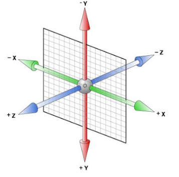
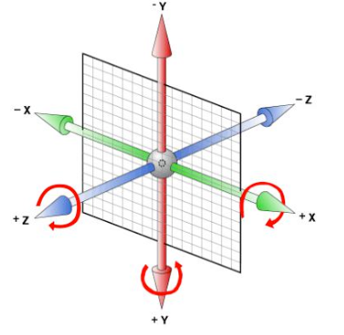
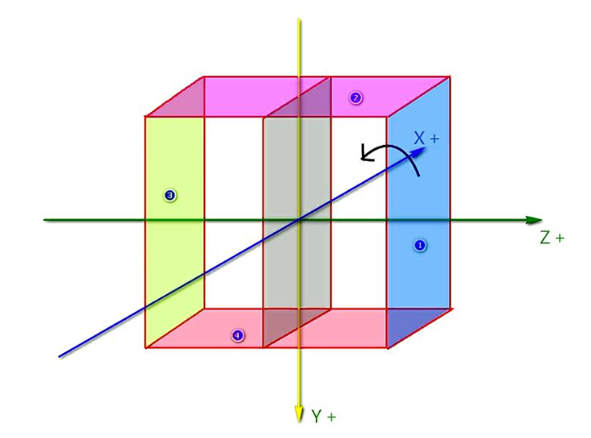

# CSS3 新增样式

## 3D 转换

`transform` 属性不止能实现 2D 转换，也可以制作 3D 立体转换效果，比普通的 x、y 轴组成的平面效果多了一条 z 轴，如下图:



### 透视

电脑显示屏是一个 2D 平面，图像之所以具有立体感(3D效果)，其实只是一种视觉呈现， 通过透视可以实现此目的。

透视可以将一个 2D 平面，在转换的过程当中，呈现 3D 效果。

透视特点: 近大远小。

**注意**: 并非任何情况下需要透视效果，根据开发需要进行设置，如果需要展示 z 轴的变化， 则设置透视效果。

#### 透视属性 perspective

属性名: perspective

作用: 设置在 z 轴的视线焦点的观察位置，从而实现 3D 查看效果。 

属性值: 像素值，数值越大，观察点距离 z 轴原点越远，图形效果越完整且接近原始尺寸。 

> 实际上这个属性就是设置的我们的观察点。

**注意**: 透视属性需要设置给 3D 变化元素的父级。

### 3D 旋转

3D 旋转比 2D 旋转更复杂，需要分别对三个方向的旋转角度值:

属性值:

| 值              | 说明               |
|----------------|------------------|
| rotateX(angle) | 定义沿着 X 轴的 3D 旋转。 |
| rotateY(angle) | 定义沿着 Y 轴的 3D 旋转。 |
| rotateZ(angle) | 定义沿着 Z 轴的 3D 旋转。 |

*注意*: 属性值的角度区分正负，正数表示沿对应坐标轴顺时针方向旋转，负数表示沿对应坐标轴逆时针方向旋转。



### 3D 位移

类似的，位移也分为三个方向的移动:

属性值:

| 值             | 说明               |
|---------------|------------------|
| translateX(x) | 设置 X 轴的位移值。      |
| translateY(y) | 设置 Y 轴的位移值。      |
| translateZ(z) | 定义3D位移，设置Z轴的位移值。 |

属性值为像素值或百分比，正负表示位移的方向。

正值向对应轴的正方向移动，负值向对应轴的负方向移动。

**旋转和位移可以同时设置，顺序不同，效果也有差异。**

> 先位移后旋转，旋转的原点会发生变化；先旋转后位移，位移的方向会发生变化。

### 3D 正方体案例



#### `transform-style` 属性

用于设置被嵌套的子元素在父元素的 3D 空间中显示，子元素会保留自己的 3D 转换坐标轴。

属性值:

- `flat`: 所有子元素在 2D 平面呈现
- `preserve-3d`: 保留 3D 空间

3D 元素构建是指某个图形是由多个元素构成的，可以给这些元素的父元素设置 `transform-style: preserve-3d`，来使其变成一个真正的 3D 图形。

一般来说，该属性设置给 3D 变换图形的父级元素。

浏览器兼容

- Internet Explorer 10、Firefox 以及 Opera 支持 transform 属性。
- Chrome 和 Safari 需要前缀 `-webkit-`。
- Internet Explorer 9 需要前缀 `-ms-`。

## 动画

CSS3 中提供了自己的动画制作方法，这可以在许多网页中取代动画图片、Flash 动画以及 JavaScript。

CSS3 动画制作分为两步: 创建动画、绑定动画。

### `@keyframes` 规则

`@keyframes` 规则用于创建动画。

在 `@keyframes` 中规定某项 CSS 样式，就能创建由从一种样式逐渐变化为另一种样式的效果。

可以改变任意多的样式任意多的次数。

需要使用百分比来规定变化发生的时间，或用关键词 "from" 和 "to"，等同于 0% 和 100%。 0% 是动画的开始，100% 是动画的完成。

### `@keyframes` 书写方法

```css
@keyframes 动画名称 {
    /* 动画过程，可以添加任意百分比处的动画细节 */
}
```

```css
/*  自定义动画及过程  */
@keyframes move {
    /*  从头开始，最好保持跟默认样式一致  */
    from {
        transform: translateY(0);
    }
    /*  到结束位置  */
    to {
        transform: translateY(150px);
    }
}

/*  百分比方式定义动画细节  */
@keyframes move2 {
    0% {
        transform: translateY(0);
    }
    25% {
        transform: translateY(150px);
    }
    50% {
        transform: translateY(0);
    }
    75% {
        transform: translateY(-150px);
    }
    100% {
        transform: translateY(0px);
    }
}
```

### `animation` 属性

需要将 `@keyframes` 中创建的动画捆绑到某个选择器，否则不会产生动画效果。 `animation` 属性用于对动画进行捆绑。

语法:

```css{}
div {
    animation: 动画名称 过渡时间 速度曲线 动画次数 延时时间;
}
```

其中必须设置动画名称和过渡时间，其他属性值可以根据需求设置。

#### 单一属性列表

| 属性                          | 描述                                   |
|-----------------------------|--------------------------------------|
| `animation-name`            | 规定 `@keyframes` 动画的名称。               |
| `animation-duration`        | 规定动画完成一个周期所花费的秒或毫秒。默认是 0。            |
| `animation-timing-function` | 规定动画的速度曲线。默认是 `"ease"`。              |
| `animation-delay`           | 规定动画何时开始。默认是 0。                      |
| `animation-iteration-count` | 规定动画被播放的次数。默认是 1。`infinite` 表示无限次播放。 |

#### 浏览器兼容

- Internet Explorer 10、Firefox 以及 Opera 支持 `@keyframes` 规则和 `animation` 属性。 
- Chrome 和 Safari 需要前缀 `-webkit-`。
- Internet Explorer 9，以及更早的版本，不支持 `@keyframe` 规则或 `animation` 属性。
