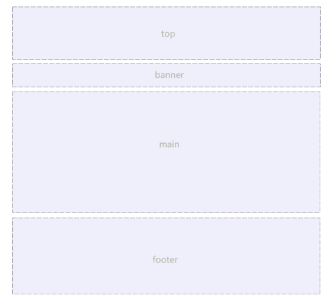
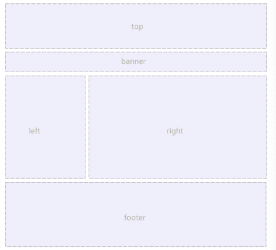
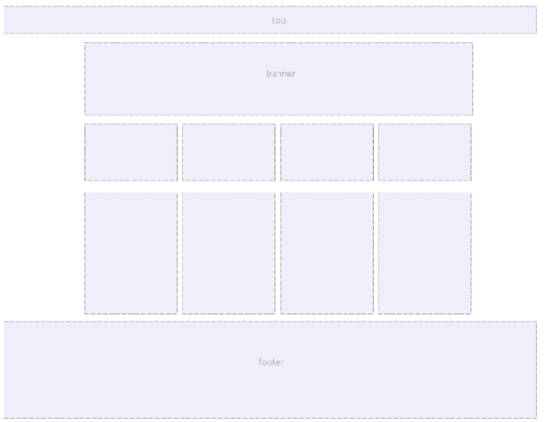

# 项目开发基础

## 静态网页项目开发基础

### 版心

网页中主要内容所在的区域。一般在浏览器窗口中水平居中显示，从而让用户的视线更集中。

常见的版心宽度值包括：960px, 980px, 1000px, 1200px 等。

制作方法：使用标准流中的 `margin` 居中方法。

### 页面布局流程

为了提高网页制作的效率，布局时通常要遵守一定的布局流程，具体如下：

1. 确定页面的版心（可视区域）。
2. 分析页面中的行模块，以及每个行模块中的列模块。
3. 制作 HTML 页面，CSS 文件。
4. CSS 初始化，然后开始运用盒子模型的原理，通过 div + css 布局来控制网页的各个模块。

### 常见的布局类型

#### 一列固定宽度且居中



#### 两列左窄右宽型



#### 通栏平均分布型



> 更多的情况，一个网页中可能同时包括 2 种以上的布局类型。

## 网页项目制作

> 了解网页开发常见技巧和方法

### 文件结构

网站中会包含多个 .html 文件和 .css 文件以及图片等多媒体文件，我们需要使用不同的文件夹分类进行管理。

文件夹最基本的结构包括：

```shell{}
.
.
├── css/
├── images/
└── index.html
```

### `<head>` 内的配置

真正的上线网站中，HTML 文件中的 `<head>` 标签内部需要配置更多的内容。

#### `<title>` 网页标题

#### 标签页 icon 图标

大部分网站在标签页标题位置会添加网站的 icon 图标。

图标的文件名要求以 favicon.ico 命名，文件需要与 index.html 文件统计存储。

使用方法：通过 `<link>` 标签进行引用，设置的属性包括：

```html
<link rel="shortcut icon" href="favicon.ico" type="image/x-icon">
```

#### CSS 分级引入

CSS 文件设置需要根据功能进行分层管理：目的是为了提取多个页面公共的部分，提供多个 HTML 同时引用。公共的部分也可以划分范围，有的是所有网站能用的，有的是某几个网站公共的部分。

CSS 常见的分层组织：清楚默认样式的 CSS，网站的公共样式 CSS，每个页面自己独有的 CSS。

注意书写顺序，引入多层 CSS 时，需要按照后面的层叠前面的 CSS 进行设置，使用页面独有的样式层叠公共的样式。

##### 清楚默认样式

- 使用范围：所有网站都能使用。
- 制作方法：自己工作中进行积累，或者使用网络上已有的资源。
- 命名习惯：`reset.css`
- 引入时必须作为第一层引入，网页中独有的样式可以层叠掉 `reset` 中的样式。
- 注意：`reset.css` 文件写完后不允许再次更改。

##### 公共样式

- 使用范围：单独的一个网站多有的页面、几个页面。
- 制作方法：从设计图中观察，找到所有页面或多个页面公共的部分，划分成不同的模块分别进行 .css 文件的书写。
- 命名习惯：`common.css` 或者 `模块名.css`
- 多个网站页面的公共部分书写完之后，不允许后期更改，一旦更改，多个引用的 HTML 页面都会发生变化。
- 主要注意类名的使用，公共文件中的类名一般不要在其他的 css 文件中再用。
- 引入顺序：一般在 `reset.css` 后面，单独样式文件前面。

##### 页面独有样式

- 使用范围：单独的一个 HTML 页面。
- 制作方法：找到页面独有的、而其他页面没有的样式，单独书写在一个 .css 文件中，只有对应的 HTML 文件能够引用。
- 命名习惯：一般文件名与 HTML 的文件名保持一致，例如：`index.css`，如果拆分的更细致可以使用多个单词的拼写，例如 `index_banner.css` 等。
- 引入顺序：在所有公共样式后面。
- 注意：使用单独样式文件去层叠前面公共样式时，需要注意选择器权重。

##### 整个 css 分层引入的顺序

```html
<link rel="stylesheet" href="css/reset.css" type="text/css">
<link rel="stylesheet" href="css/common.css" type="text/css">
<link rel="stylesheet" href="css/index.css" type="text/css">
```


