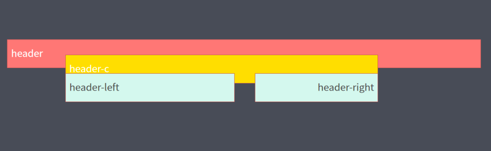
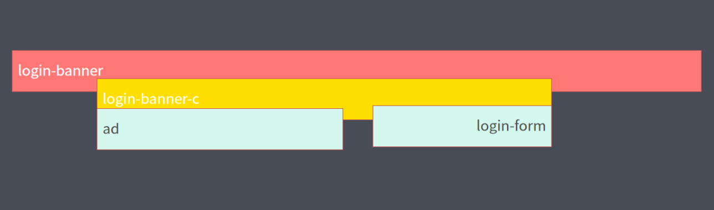
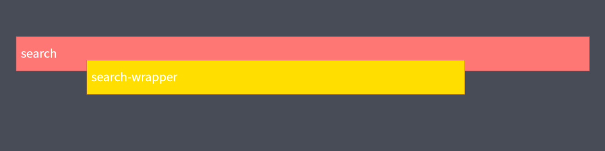
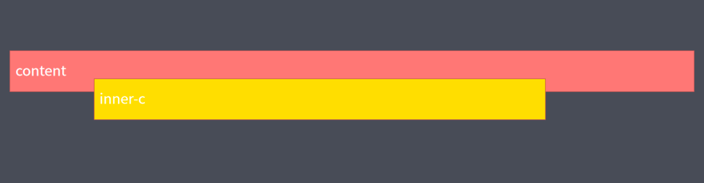
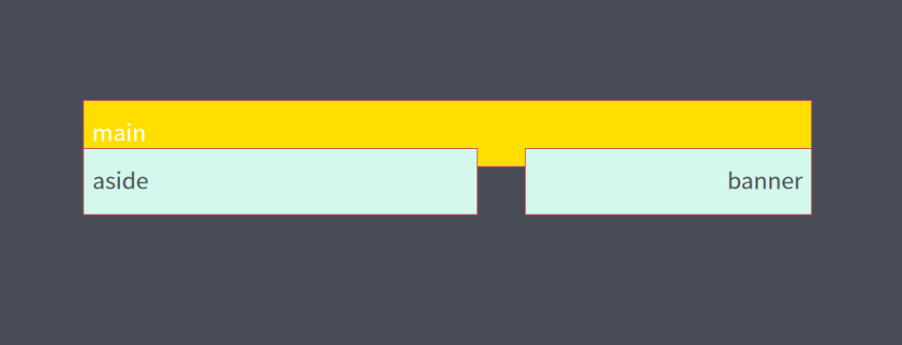
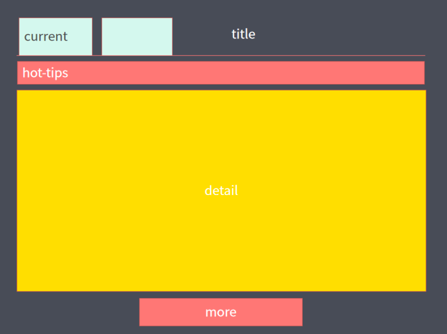
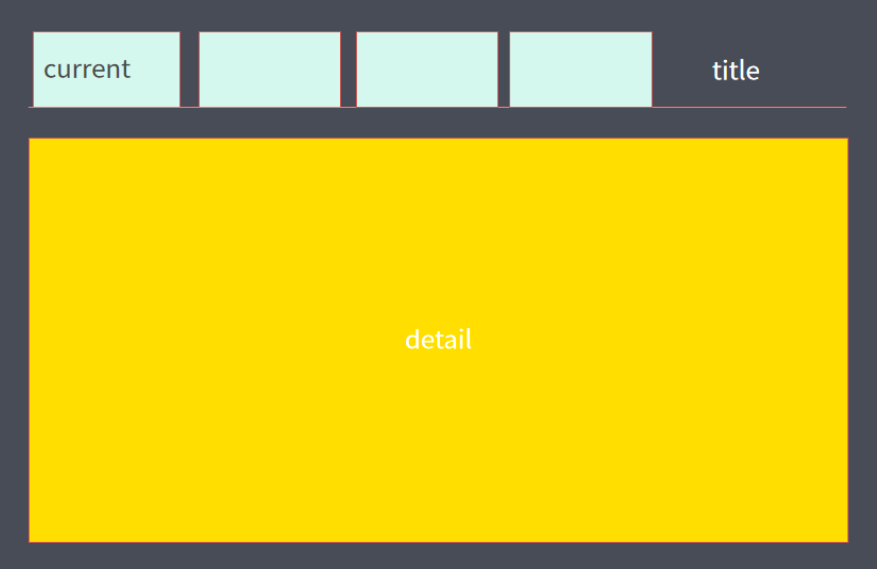
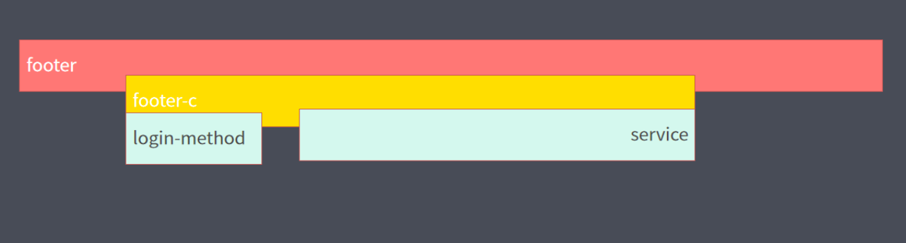
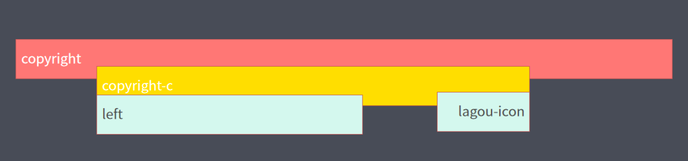

# 项目开发基础

## 静态网页项目开发基础

### 版心

网页中主要内容所在的区域。一般在浏览器窗口中水平居中显示，从而让用户的视线更集中。

常见的版心宽度值包括：960px, 980px, 1000px, 1200px 等。

制作方法：使用标准流中的 `margin` 居中方法。

### 页面布局流程

为了提高网页制作的效率，布局时通常要遵守一定的布局流程，具体如下：

1. 确定页面的版心（可视区域）。
2. 分析页面中的行模块，以及每个行模块中的列模块。
3. 制作 HTML 页面，CSS 文件。
4. CSS 初始化，然后开始运用盒子模型的原理，通过 div + css 布局来控制网页的各个模块。

### 常见的布局类型

#### 一列固定宽度且居中


#### 两列左窄右宽型


#### 通栏平均分布型


> 更多的情况，一个网页中可能同时包括 2 种以上的布局类型。

## 网页项目制作

> 了解网页开发常见技巧和方法

### 文件结构

网站中会包含多个 .html 文件和 .css 文件以及图片等多媒体文件，我们需要使用不同的文件夹分类进行管理。

文件夹最基本的结构包括：

```shell{}
.
├── css/
├── images/
└── index.html
```

### `<head>` 内的配置

真正的上线网站中，HTML 文件中的 `<head>` 标签内部需要配置更多的内容。

#### `<title>` 网页标题

#### 标签页 icon 图标

大部分网站在标签页标题位置会添加网站的 icon 图标。

图标的文件名要求以 favicon.ico 命名，文件需要与 index.html 文件统计存储。

使用方法：通过 `<link>` 标签进行引用，设置的属性包括：

```html
<link rel="shortcut icon" href="favicon.ico" type="image/x-icon">
```

#### CSS 分级引入

CSS 文件设置需要根据功能进行分层管理：目的是为了提取多个页面公共的部分，提供多个 HTML 同时引用。公共的部分也可以划分范围，有的是所有网站能用的，有的是某几个网站公共的部分。

CSS 常见的分层组织：清楚默认样式的 CSS，网站的公共样式 CSS，每个页面自己独有的 CSS。

注意书写顺序，引入多层 CSS 时，需要按照后面的层叠前面的 CSS 进行设置，使用页面独有的样式层叠公共的样式。

##### 清楚默认样式

- 使用范围：所有网站都能使用。
- 制作方法：自己工作中进行积累，或者使用网络上已有的资源。
- 命名习惯：`reset.css`
- 引入时必须作为第一层引入，网页中独有的样式可以层叠掉 `reset` 中的样式。
- 注意：`reset.css` 文件写完后不允许再次更改。

##### 公共样式

- 使用范围：单独的一个网站多有的页面、几个页面。
- 制作方法：从设计图中观察，找到所有页面或多个页面公共的部分，划分成不同的模块分别进行 .css 文件的书写。
- 命名习惯：`common.css` 或者 `模块名.css`
- 多个网站页面的公共部分书写完之后，不允许后期更改，一旦更改，多个引用的 HTML 页面都会发生变化。
- 主要注意类名的使用，公共文件中的类名一般不要在其他的 css 文件中再用。
- 引入顺序：一般在 `reset.css` 后面，单独样式文件前面。

##### 页面独有样式

- 使用范围：单独的一个 HTML 页面。
- 制作方法：找到页面独有的、而其他页面没有的样式，单独书写在一个 .css 文件中，只有对应的 HTML 文件能够引用。
- 命名习惯：一般文件名与 HTML 的文件名保持一致，例如：`index.css`，如果拆分的更细致可以使用多个单词的拼写，例如 `index_banner.css` 等。
- 引入顺序：在所有公共样式后面。
- 注意：使用单独样式文件去层叠前面公共样式时，需要注意选择器权重。

##### 整个 css 分层引入的顺序

```html
<link rel="stylesheet" href="css/reset.css" type="text/css">
<link rel="stylesheet" href="css/common.css" type="text/css">
<link rel="stylesheet" href="css/index.css" type="text/css">
```

### 首页 index.html 结构布局

#### header 区域

- header：网页顶部结构常用命名，通常包含 logo、导航 nav 等内容。
- 布局类型：通栏背景，内部包含版心居中的主要内容，内容包含左、右浮动的两部分。
- 整体结构：`100% 的 div > 版心的 div`

注意：为了避免更改公共的版心样式，`<div>` 需要重新添加一个 `class` 属性值。

- logo：使用 `h1 > a` 结构，可以适当添加 SEO 搜索的关键字。
- nav 导航：常用 `ul > li > a` 列表结构搭建



#### login-banner 区域

- login: 登陆
- 布局类型：通栏背景，内部包含版心居中的主要内容，内容包含左、右浮动的两部分。

注意：实际网页中，部分表单效果通常使用其他标签 + CSS 样式的效果进行模拟，比如按钮、下拉菜单等。



#### search 区域

- search: 搜索框部分。
- 布局类型：通栏背景，内部包含居中的主要内容。

搜索框区域表单：需要添加 `<form>` 标签，保证数据能够提交数据库。

补充：文本框 `<input>` 标签可以通过一个 `placeholder` 属性，设置默认提示文本，点击文本框输入文字后，`placeholder` 属性的内容会自动消失。



#### content 区域

- content: 网页的主要内容区域，用于展示更多的产品、信息等。
- 布局类型：通栏，底部设置边框，内容为版心居中。

content 内容包括四部分： `.main` 胃药区域列表焦点图、`.hot_recruit` 热门职位、`.hot_company` 热门公司、`.hot_links` 热门连接。



##### `.main` 部分

布局类型：左窄右宽的两列布局，通过浮动实现。

aside: 侧边栏常用命名，整体为无序列表结构，表现为一种特殊的下拉菜单效果，鼠标移上 `<li>` 后显示内部的子级元素。下拉菜单的列表中，推荐使用定义列表结构搭建。

注意：侧边栏 aside 这种结构中的数据是可能动态发生变化的，我们需要搭建好 HTML 结构和正确的 CSS 样式，让 HTML 结构足够清晰，方便后期后端开发人员传入数据。

banner: 焦点图部分为滚动轮播效果。
布局方式：整体使用定位制作，与淡入淡出轮播图不同的是图片所在无序列表中，图片需要浮动显示，而不是定位到同一点。特殊的需要添加魔术替换图片，方便后期 JS 制作。



补充： `box-shadow`

- CSS3 中新增的合资阴影属性 `box-shadow`
- `box-shadow`: 水平阴影位置 垂直阴影位置 模糊距离 阴影尺寸 阴影颜色 内/外阴影；

```css
.box {
    box-shadow: 3px 3px 5px 4px rgb(0, 0, 0)
}
```

##### `.hot_recruit` 部分

热门职位部分是一种 tab 选项卡结构，并且与后面的热门公司和热门连接有类似的结果和样式，需要谨慎提取公共样式，通过公共类名设置 CSS，热门职位独有的样式需要使用单独的类名设置，避免影响其他两个部分。

布局类型：tab 栏选项卡结构，整体为上下对齐的版心结构。
标题部分：浮动制作，当前展示的部分标签使用 current 的类名进行标记，设置特殊样式。
详细内容布局类型：平均分步型，使用浮动制作。



补充：多余文字显示成 "..."

```css
.word_cut {
    white-space: nowrap;
    overflow: hidden;
    text-overflow: ellipsis;
}
```

##### `.hot_company` 部分

热门公司部分与热门职位部分结构类似。

本模块需要更改一些公共样式，注意使用新的类名进行覆盖，保证选择器的权重足够。


注意：链接内容部分涉及到 JavaScript 特效，鼠标点击显示和隐藏，需要提前将 HTML 结构和 CSS 样式书写完整，暂时设置为 `display: none`。



#### footer 区域

- footer: 页面底部的常用命名。
- 布局类型：通栏背景，内部包含版心居中的主要内容，内容包含左、右浮动的两部分。
- 其他登录方式部分：左浮动，注意其中的数据移上显示定位元素效果。
- 其他链接服务部分：使用定义列表制作结构。



#### copyright 区域

版权区域一般是一些文字性内容，样式较为简单。

布局类型：通栏背景，内部包含版心居中的主要内容，内容包含左、右浮动的两部分。



#### backtop 区域

返回顶部的设置，通常使用 `<a>` 进行结构搭建。

定位方式：固定定位，位置保持与版心固定的位置，避免由于分辨率不同元素位置差异太大。

### 公司页 company.html 结构布局

## 快速搭建公共结构

首页制作完毕后，分析与其他页面的共同之处，按照模块进行拆分复制选择。

方法：直接赋值 index.html 文件，删除不需要的结构，保留公司页需要的公共结构部分，同时删除不需要的 CSS 文件引入的 `<link>` 标签，保留需要的公共样式文件。

注意：记得更改 nav 导航中的当前选中页的 class。

公共结构搭建完毕后，可以继续书写公司页面独有的结构和样式。


