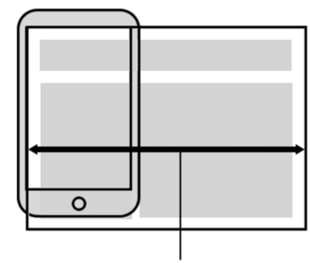
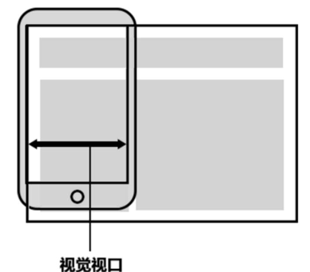
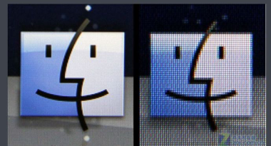

## 视口

::: tip 学习目标
了解视口相关
:::

视口（Viewport）就是浏览器显示页面内容的屏幕区域。 

视口可以分为布局视口、视觉视口和理想视口。

### 布局视口 layout viewport

一般移动设备的浏览器都默认设置了一个布局视口，用于解决早期的PC端页面在手机上显示的问题。

iOS，Android 基本都将这个视口分辨率设置为 980px，所以 PC 上的网页大多都能在手机上呈现，只不过元素看上去很小，一般默认可以通过手动缩放网页。



### 视觉视口 visual viewport

字面意思，它是用户正在看到的==网站的区域==。

> 注意：是网站的区域。

我们可以通过缩放去操作视觉视口，但不会影响布局视口，布局视口仍保持原来的宽度。



### 理想视口 ideal viewport

为了使网站在移动端有最理想的浏览和阅读宽度而设定。

理想视口，对设备来讲，是最理想的视口尺寸。

需要手动添写 `<meta>` 视口标签通知浏览器操作。

`<meta>` 视口标签的主要目的：布局视口的宽度应该与理想视口的宽度一致，简单理解就是设备有多宽，我们布局的视口就多宽。

### `<meta>` 视口标签

```html
<meta name="viewport" content="width=device-width,user-scalable=no, initial-scale=1.0,maximum-scale=1.0, minimum-scale=1.0">
```

| 属性             | 	解释说明                                    |
|----------------|------------------------------------------|
| width	         | 宽度设置的是 viewport 宽度，可以设置 device-width 特殊值 |
| initial-scale	 | 初始缩放比，大于 0 的数字                           |
| maximum-scale	 | 最大缩放比，大于 0 的数字                           |
| minimum-scale	 | 最小缩放比，大于 0 的数字                           |
| user-scalable	 | 用户是否可以缩放，yes 或 no（1或0）                   |

### 标准的 viewport 参数设置

- 视口宽度和设备保持一致
- 视口的默认缩放比例 1.0
- 不允许用户自行缩放
- 最大允许的缩放比例 1.0
- 最小允许的缩放比例 1.0

### 总结

- 视口就是浏览器显示页面内容的屏幕区域。
- 视口分为布局视口、视觉视口和理想视口。
- 我们移动端布局想要的是理想视口就是手机屏幕有多宽，我们的布局视口就有多宽。
- 想要理想视口，我们需要给我们的移动端页面添加 `<meta>` 视口标签。

## 二倍图

::: warning 学习目标
掌握二倍图用法
:::

### 物理像素＆物理像素比

- 物理像素点指的是屏幕显示的最小颗粒，是物理真实存在的。这是厂商在出厂时就设置好了，比如苹果 6＼7＼8 是 750＊1334。
- 我们开发时候的 1px 不是一定等于 1 个物理像素。
- PC端页面，1px 等于 1 个物理像素，但是移动端就不尽相同。
- 1px 能显示的物理像素点的个数，称为物理像素比或屏幕像素比。

| 启动图尺寸	    | 机型	                   | 倍数	               | 开发尺寸     |
|-----------|-----------------------|-------------------|----------|
| 320x480	  | iPhone3GS             | 	@1x	             | 320x480  |
| 640x 960  | iPhone4s	             | Default@2x	       | 320x480  |
| 640x1136  | iPhone5s              | 	Default-568h@2x  | 	320x568 |
| 750x1334  | iPhone6.7.8           | 	Default-667h@2x	 | 375x667  |
| 1242x2208 | iPhonePlus(6+/7+/8+)	 | Default-736h@3x   | 	414x736 |
| 1125x2436 | iPhoneX、XS	           | Default-812h@3x	  | 375x812  |
| 828x1792  | iPhoneXR	             | Default-828h@2x	  | 414x896  |
| 1242x2688 | iPhoneX Max           | 	Default-1242h@3x | 	414x896 |

---

- PC 端和早前的手机屏幕／普通手机屏幕：1 CSS像素 ＝ 1 物理像素
- Retina（视网膜屏幕）是一种显示技术，可以将把更多的物理像素点压缩至一块屏幕里，从而达到更高的分辨率，并提高屏幕显示的细腻程度。



### 多倍图

- 对于一张 50px＊50px 的图片，在手机 Retina 屏中打开，按照刚才的物理像素比会放大倍数，这样会造成图片模糊。
- 在标准的 viewport 设置中，使用倍图来提高图片质量，解决在高清设备中的模糊问题。
- 通常使用二倍图，因为 iPhone 6＼7＼8 的影响，但是现在还存在 3 倍图 4 倍图的情况，这个看实际开发公司需求。
- 背景图片注意缩放问题。

```css{}
／＊ 在 iPhone8 下面＊／
img{ 
    ／＊ 原始图片100＊100px ＊／
    width: 50px;
    height:50px;
}

.box{
    ／＊原始图片 100＊100px ＊／
    background-size: 50px 50px;
}  
```

### 多倍图切图

## 移动端开发选择

::: tip 学习目标
了解移动端开发常见选择方案
:::

### 移动端主流方案

单独制作移动端页面（主流）

- 京东商城手机版
- 淘宝触屏版
- 苏宁易购手机版
- 携程网手机版

响应式页面兼容移动端（其次）

- 三星手机官网

### 单独制作移动端页面（主流）

通常情况下，网址域名前面加 m（mobile）可以打开移动端。通过判断设备，如果是移动设备打开，则跳到移动端页面。

### 响应式兼容 PC 移动端 

响应式网站：即 PC 和移动端共用一套网站，只不过在不同宽度的屏幕下，样式会自动适配。

三星电子官网：www.samsung.com／cn／，通过判断屏幕宽度来改变样式，以适应不同终端。

缺点：制作麻烦，需要花很大精力去调兼容性问题。

### 总结

- 现在市场常见的移动端开发有: 单独制作移动端页面 和 响应式页面 两种方案。
- 现在市场主流的选择还是单独制作移动端页面

## 移动端技术解决方案

::: warning 学习目标
掌握移动端常见问题解决方案
:::

### 浏览器

- 移动端浏览器基本以 webkit 内核为主，因此我们就考虑 webkit 兼容性问题。
- 我们可以放心使用 H5 标签和 CSS3 样式。
- 同时我们浏览器的私有前缀我们只需要考虑添加 `-webkit-` 即可。

### CSS 初始化 normalize.css

移动端CSS 初始化推荐使用 normalize.css。

优点：

- Normalize.css: 保护了有价值的默认值
- Normalize.css: 修复了浏览器的bug
- Normalize.css: 是模块化的
- Normalize.css: 拥有详细的文档

官网地址：<https://necolas.github.io/normalize.css/>

### CSS3 盒子模型 box-sizing

- 传统模式宽度计算：盒子的宽度 ＝ CSS 中设置的 width＋border＋padding
- CSS3 盒子模型： 盒子的宽度 ＝ CSS 中设置的宽度 width(里面包含了 border 和 padding)。也就是说，我们的 CSS3 中的盒子模型，padding 和 border 不会撑大盒子了。

传统 or CSS3 盒子模型 ？

- 移动端可以全部 CSS3 盒子模型
- PC 端如果完全需要兼容，我们就用传统模式，如果不考虑兼容性，我们就选择 CSS3 盒子模型。


### 特殊样式

```css{}
／＊ CSS3 盒子模型 ＊／
box-sizing: border-box;
-webkit-box-sizing:border-box;

／＊ 「点击高亮」我们需要清除清除 设置为 transparent 完成透明 ＊／
-webkit-tap-highlight-color: transparent;

／＊ 在移动端浏览器默认的外观在 iOS 上加上这个属性才能给按钮和输入框自定义样式 ＊／
-webkit-appearance:none;

／＊ 禁用长按页面时的弹出菜单 ＊／
img,a { 
    -webkit-touch-callout: none; 
}
```

## 移动端常见布局方式

::: tip 学习目标
了解移动端布局技术选型
:::

移动端技术选型

单独制作移动端页面（主流）

- 流式布局（百分比布局）
- flex 弹性布局（强烈推荐）
- less＋rem＋媒体查询布局
- 混合布局

响应式页面兼容移动端（其次）

- 媒体查询
- bootstrap
