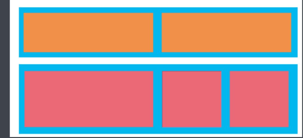

::: tip 目标
了解流式布局方法
:::

## 流式布局（百分比布局）

- 流式布局，就是百分比布局，也称非固定像素布局。
- 通过将盒子的宽度设置成百分比，从而根据屏幕的宽度来进行伸缩，不受固定像素的限制，内容向两侧填充。
- 流式布局方式是移动 web 开发使用的比较常见的布局方式。



注意事项

- 制作过程中，需要定义页面的最大和最小支持宽度。
- max-width 最大宽度（max-height 最大高度）
- min-width 最小宽度（min-height 最小高度）

## 京东移动端首页制作

::: tip 目标
掌握流式布局技巧
:::

技术选型

- 方案：我们采取单独制作移动页面方案
- 技术：布局采取流式布局

### 搭建相关文件结构

```shell{}
.
├── css/
├── images/
└── index.html
```

### 设置视口标签以及引入初始化样式

```html
<meta name="viewport" content="width=device-width, user-scalable=no, initial-scale=1.0,maximum-scale=1.0, minimum-scale=1.0">
<link rel="stylesheet" href="css/normalize.css">
<link rel="stylesheet" href="css/index.css">
```

### 常用初始化样式

```css
body {
    margin: 0 auto;
    min-width: 320px;
    max-width: 540px;
    background: #fff;
    font-size: 14px;
    font-family: -apple-system, Helvetica, sans-serif;
    line-height: 1.5;
    color: #666;
}
```

### 特殊样式

```css{}
／＊ CSS3 盒子模型 ＊／
box-sizing: border-box;
-webkit-box-sizing:border-box;

／＊点击高亮我们需要清除清除 设置为 transparent 完成透明＊／
-webkit-tap-highlight-color: transparent;

／＊在移动端浏览器默认的外观在iOS上加上这个属性才能给按钮和输入框自定义样式＊／
-webkit-appearance:none;

／＊禁用长按页面时的弹出菜单＊／
img, a { 
    -webkit-touch-callout: none; 
}
```

### 二倍精灵图做法

- 在 Firework 里面把精灵图等比例缩放为原来的一半
- 之后根据新的大小 测量坐标
- 注意代码里面 `background-size` 也要写：精灵图原来宽度的一半

### 图片格式

#### DPG 图片压缩技术

京东自主研发推出 DPG 图片压缩技术，经测试该技术，可直接节省用户近 50％ 的浏览流量，极大的提升了用户的网页打开速度。
能够兼容 jpeg，实现全平台、全部浏览器的兼容支持，经过内部和外部上万张图片的人眼浏览测试后发现，压缩后的图片和webp的清晰度对比没有差距。

#### webp 图片格式

谷歌开发的一种旨在加快图片加载速度的图片格式。图片压缩体积大约只有 JPEG 的 2／3，并能节省大量的服务器宽带资源和数据空间。
