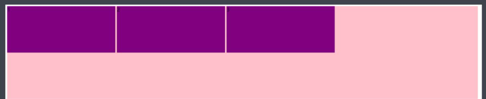
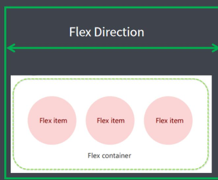
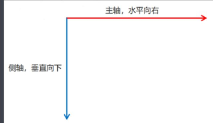
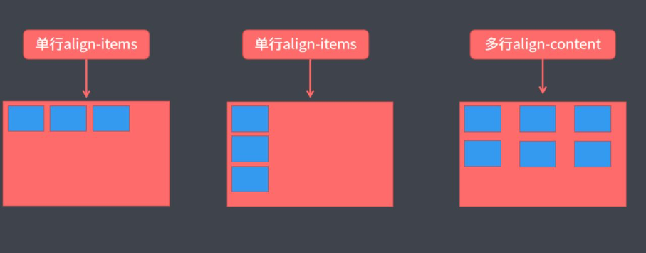

## 传统布局与 flex 布局

### 传统布局

- 兼容性好						
- 布局繁琐						
- 局限性，不能在移动端很好的布局			

### flex 布局

- 操作方便，布局极为简单，移动端应用很广泛
- PC 端浏览器支持情况较差
- IE 11 或更低版本，不支持或仅部分支持

建议：

1. 如果是 PC 端页面布局，我们还是传统布局。
2. 如果是移动端或者不考虑兼容性问题的 PC 端页面布局，我们还是使用 flex 弹性布局

## flex 布局体验



### HTML 结构

```html
<div>
    <span>1</span>
    <span>2</span>
    <span>3</span>
</div>
```

### CSS样式

1. `span` 直接给宽度和高度，背景颜色
2. 给 `div` 只需要添加 `display: flex` 即可

## flex 布局原理

- flex 是 flexible Box的缩写，意为“弹性布局”，用来为盒状模型提供最大的灵活性，任何一个容器都可以 指定为 flex 布局。
- 当我们为父盒子设为 flex 布局以后，子元素的 float、clear 和 vertical-align 属性将失效。
- 伸缩布局 ＝ 弹性布局 ＝ 伸缩盒布局 ＝ 弹性盒布局 ＝ flex布局

采用 Flex 布局的元素，称为 Flex 容器（flex container），简称＂容器＂。它的所有子元素自动成为容器成员，称为 Flex 项目（flex item），简称＂项目”。

- 体验中 div 就是 flex 父容器。
- 体验中 span 就是 子容器 flex 项目。
- 子容器可以横向排列也可以纵向排列。



### 总结

**flex布局原理：就是通过给父盒子添加 flex 属性，来控制子盒子的位置和排列方式。**

## flex 布局常见属性

::: tip 目标
了解 flex 布局常用属性
::: 

### 父项常见属性

以下有 6 个属性是对父元素设置的

- `flex-direction`：设置主轴的方向
- `justify-content`：设置主轴上的子元素排列方式
- `flex-wrap`：设置子元素是否换行
- `align-content`：设置侧轴上的子元素的排列方式（多行）
- `align-items`：设置侧轴上的子元素排列方式（单行）
- `flex-flow`：复合属性，相当于同时设置了 `flex-direction` 和 `flex-wrap`

#### flex-direction 设置主轴的方向 <Badge type="danger" text="重要" vertical="top" />

主轴与侧轴

在 flex 布局中，是分为主轴和侧轴两个方向，同样的叫法有：行和列、x 轴和 y 轴。

- 默认主轴方向就是 x 轴方向，水平向右
- 默认侧轴方向就是 y 轴方向，垂直向下



flex-direction 属性决定主轴的方向（即项目的排列方向）

注意：主轴和侧轴是会变化的，就看 `flex-direction` 设置谁为主轴，剩下的就是侧轴。而我们的子元素是跟着主轴来排列的。

| 属性值	              | 解释说明    |
|-------------------|---------|
| `row`	            | 默认值从左到右 |
| `row-reverse`	    | 从右到左    |
| `column`	         | 从上到下    |
| `column-reverse`	 | 从下到上    |

#### justify-content 主轴上子元素排列方式

`justify-content` 属性定义了项目在主轴上的对齐方式

注意：使用这个属性之前一定要确定好主轴是哪个

| 属性值	             | 解释说明                     |
|------------------|--------------------------|
| `flex-start`     | 	默认值 从头部开始 如果主轴是x轴，则从左到右 |
| `flex-end`	      | 从尾部开始排列                  |
| `center`	        | 在主轴居中对齐（如果主轴是x轴则 水平居中）   |
| `space-around`   | 	平分剩余空间                  |
| `space-between`	 | 先两边贴边，再平分剩余空间（重要）        |

#### flex-wrap 设置子元素是否换行

默认情况下，项目都排在一条线(又称”轴线”)上。

flex-wrap 属性定义，flex 布局中默认是不换行的。

| 属性值	      | 解释说明    |
|-----------|---------|
| `nowrap`	 | 默认值，不换行 |
| `wrap`	   | 换行      |

#### align-items 侧轴上子元素排列方式(单行)

该属性是控制子项在侧轴(默认是 y 轴)上的排列方式。

在子项为单项(单行)的时候使用。

| 属性值	         | 解释说明         |
|--------------|--------------|
| `flex-start` | 	默认值从上到下     |
| `flex-end`	  | 从下到上         |
| `center`	    | 挤在一起居中（垂直居中） |
| `stretch`    | 	拉伸          |

#### align-content 侧轴上子元素排列方式（多行）

设置子项在侧轴上的排列方式并且只能用于子项出现换行的情况（多行），在单行下是没有效果的。

| 属性值	             | 解释说明                |
|------------------|---------------------|
| `flex-start`	    | 在侧轴的头部开始排列          |
| `flex-end`	      | 在侧轴的尾部开始排列          |
| `center`	        | 在侧轴中间显示             |
| `space-around`	  | 子项在侧轴平分剩余空间         |
| `space-between`	 | 子项在侧轴先分布在两头，再平分剩余空间 |
| `stretch`	       | 设置子项元素高度平分父元素高度     |

::: warning 注意
align-content 和 align-items 的区别

- align-items 适用于单行情况下，只有上对齐、下对齐、居中和拉伸。
- align-content 适应于换行（多行）的情况下（单行情况下无效），可以设置上对齐、下对齐、居中、拉伸以及平均分配剩余空间等属性值。

总结就是单行找 align-items 多行找 align-content
:::



####  flex-flow

flex-flow 属性是 flex-direction 和 flex-wrap 属性的复合属性

```css{}
flex-flow:row nowrap;
```

#### 总结

flex布局父项常见属性，以下有 6 个属性是对父元素设置的

- `flex-direction`：设置主轴的方向
- `justify-content`：设置主轴上的子元素排列方式
- `flex-wrap`：设置子元素是否换行
- `align-content`：设置侧轴上的子元素的排列方式（多行）
- `align-items`：设置侧轴上的子元素排列方式（单行）
- `flex-flow`：复合属性，相当于同时设置了 `flex-direction` 和 `flex-wrap`

### 子项常见属性

- `flex` 子项目占的份数
- `align-self` 控制子项自己在侧轴的排列方式
- `order` 属性定义子项的排列顺序（前后顺序）

#### flex 属性

`flex` 属性定义子项目分配父盒子的剩余空间，用 flex 来表示占多少份数。

属性值为数字，数字为1，表示占总份数中的1份。默认值为0。

```css{}
.item {
    flex: <number>; /* default 0 */
}
```

#### align-self

控制子项自己在侧轴上的排列方式

`align-self` 属性允许单个项目有与其他项目不一样的对齐方式，可覆盖 `align-items` 属性。

默认值为 auto，表示继承父元素的 align-items 属性，如果没有父元素，则等同于 stretch。

```css{}
span:nth-child(2) {
    ／＊设置自己在侧轴上的排列方式＊／
    align-self: flex-end;
}
```

#### order属性

定义项目的排列顺序

数值越小，排列越靠前，默认为0。

> 注意：和 `z-index` 不一样。

```css{}
.item {
    order: <number>;
}
```


  


