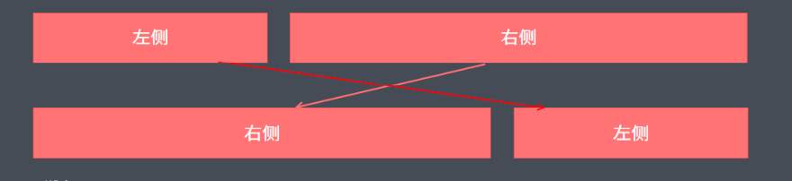

::: tip 目标
- 能够说出响应式原理
- 能够使用媒体查询完成响应式导航
- 能够使用Bootstrap的栅格系统
- 能够使用Bootstrap的响应式工具
- 能够独立完成阿里百秀首页案例
:::

## 响应式开发

### 响应式开发原理

就是使用媒体查询针对不同宽度的设备进行布局和样式的设置，从而适配不同设备的目的。

| 设备划分	        | 尺寸区间              |
|--------------|-------------------|
| 超小屏幕(手机)     | `<768px`          |
| 小屏设备(平板)     | 	`>=768px~<992px` |
| 中等屏幕(桌面显示器)  | `>=992px~<1200px` |
| 宽屏设备(大桌面显示器) | `>=1200px`        |

### 响应式布局容器

响应式需要一个父级做为布局容器，来配合子级元素来实现变化效果。

> 原理就是在不同屏幕下，通过媒体查询来改变这个布局容器的大小，再改变里面子元素的排列方式和大小，从而实现不同屏幕下，看到不同的页面布局和样式变化。

平时我们的响应式尺寸划分

- 超小屏幕(手机，小于768px): 设置宽度为 100％
- 小屏幕(平板，大于等于768px): 设置宽度为 750px
- 中等屏幕(桌面显示器，大于等于992px): 宽度设置为 970px
- 大屏幕(大桌面显示器，大于等于1200px): 宽度设置为 1170px

但是我们也可以根据实际情况自己定义划分。

## Bootstrap

### Bootstrap 简介

Bootstrap 来自 Twitter(推特)，是目前最受欢迎的前端框架。

Bootstrap 是基于 HTML、CSS 和 JavaScript 的，它简洁灵活，使得 Web 开发更加快捷。

> 框架：顾名思义就是一套架构，它有一套比较完整的网页功能解决方案，而且控制权在框架本身，有预制样式库、组件和插件。
> 使用者要按照框架所规定的某种规范进行开发。

### Bootstrap优点

- 标准化的 html＋css 编码规范
- 提供了一套简洁、直观、强悍的组件
- 有自己的生态圈，不断的更新迭代
- 让开发更简单，提高了开发的效率

### Bootstrap 使用

> 在现阶段我们还没有接触 JS 相关课程，所以我们只考虑使用它的样式库。

控制权在框架本身，使用者要按照框架所规定的某种规范进行开发。

Bootstrap 使用四步曲：

1. 创建文件夹结构
2. 创建 html 骨架结构
3. 引入相关样式文件
4. 书写内容

#### 1.创建文件夹结构

```shell{}
.
├── bootstrap
│   ├── css
│   ├── fonts
│   └── js
├── css
├── images
└── index.html
```

#### 2.创建html骨架结构

```html
<!-- 要求当前网页使用IE浏览器最高版本的内核来渲染 -->
<meta http-equiv="X-UA-Compatible" content="IE=edge">
<!--视口的设置：视口的宽度和设备一致，默认的缩放比例和PC端一致，用户不能自行缩放-->
<meta name="viewport" content="width=device-width, initial-scale=1, user-scalable=0"> 
<!--[if lt IE 9]-->
<!--解决ie9以下浏览器对html5新增标签的不识别，并导致CSS不起作用的问题-->
<script src="https://oss.maxcdn.com/html5shiv/3.7.2/html5shiv.min.js"></script>
<!--解决ie9以下浏览器对 css3 Media Query 的不识别-->
<script src="https://oss.maxcdn.com/respond/1.4.2/respond.min.js"></script>
<!--[endif]-->
```

#### 3.引入相关样式文件

```html
<!--Bootstrap 核心样式-->
<link rel="stylesheet" href="bootstrap/css/bootstrap.min.css">
```

#### 4.书写内容

- 直接拿 Bootstrap 预先定义好的样式来使用
- 修改 Bootstrap 原来的样式，注意权重问题
- 学好 Bootstrap 的关键在于知道它定义了哪些样式，以及这些样式能实现什么样的效果

### Bootstrap 布局容器

Bootstrap 需要为页面内容和栅格系统包裹一个 `.container` 容器，它提供了两个作此用处的类。

#### 1.`container` 类

- 响应式布局的容器固定宽度						
- 大屏(＞＝1200px)宽度定为1170px
- 中屏(＞＝992px)宽度定为970px
- 小屏(＞＝768px)宽度定为750px

#### 2.`container-fluid` 类

- 流式布局容器 百分百宽度
- 占据全部视口(viewport)的容器。
- 适合于制作移动端页面开发

### Bootstrap 栅格系统

#### 栅格系统简介

栅格系统英文为“grid systems”，也有人翻译为“网格系统”，它是指将页面布局划分为等宽的列，然后通过列数的定义来模块化页面布局。

Bootstrap 提供了一套响应式、移动设备优先的流式栅格系统，随着屏幕或视口(viewport)尺寸的增加，系统会自动分为最多 12 列。

#### 栅格选项参数

栅格系统用于通过一系列的行（row）与列（column）的组合来创建页面布局，你的内容就可以放入这些创建好的布局中。

| \                 | 超小屏幕（手机）     | 	小屏设备（平板）   | 	中等屏幕（桌面显示器） | 	宽屏设备（大桌面显示器） |
|-------------------|--------------|-------------|--------------|---------------|
| `.container` 最大宽度 | 自动（100％）     | 	750px      | 	970px	      | 1170px        |
| 类前缀               | 	`.col-xs-`	 | `.col-sm-`	 | `.col-md-`	  | `.col-lg-`    |
| 列（column）数        | 			12        | 12          | 12           | 12            |

- 按照不同屏幕划分为 1～12 等份
- 行（row）可以去除父容器左右 15px 的边距
- `xs-extra small`: 超小; `sm-small`;  小；`md-medium`;  中等;  `lg-large`: 大;
- 列（column）大于12，多余的 “列（column”所在的元素将被作为一个整体另起一行排列
- 每一列默认有左右 15px 的 `padding`
- 可以同时为一列指定多个设备的类名，以便划分不同份数 例如 `class="col-md-4 col-sm-6"`

#### 列嵌套

栅格系统内置的栅格系统将内容再次嵌套。简单理解就是一个列内再分成若干份小列。

我们可以通过添加一个新的 `.row` 元素和一系列 `.col-sm-＊` 元素嵌套到已经存在的 `.col-sm-＊` 元素内。

```html
<!--列嵌套-->
<div class="col-sm-4">
    <div class="row">
        <div class＝＂col-sm-6＂>小列</div>
        <div class＝＂col-sm-6＂>小列</div>
    </div>
</div>
```

#### 列偏移

使用 `.col-md-offset-＊` 类可以将列向右侧偏移。这些类实际是通过使用 `＊` 选择器为当前元素增加了左侧的边距(margin)。

```html
<!--列偏移-->
<div class="row">
    <div class="col-lg-4">1</div>
    <div class="col-lg-4 col-lg-offset-4">2</div>
</div>
```

#### 列排序

通过使用 `.col-md-push-＊` 往右推和 `.col-md-pull-＊` 往左拉两个类就可以很容易的改变列（column）的顺序。

```html
<!--列排序-->
<div class="row">
    <div class="col-lg-4-col-lg-push-8">左侧</div>
    <div class="col-lg-8-col-lg-pull-4">右侧</div>
</div>
```




