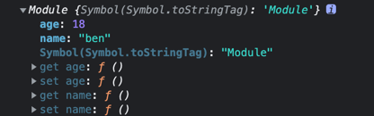

# 模块化开发

当下最重要的前端开发范式

模块化是最主流的代码组织方式，他把复杂代码按照功能的不同划分为不同的模块，单独维护的方式提高了开发效率、降低维护成本。

「模块化」只是思想，并不包含具体的实现。

- 模块化演变过程
- 模块化规范
- 常用的模块化打包工具
- 基于模块化工具构建现代 Web 应用
- 打包工具的优化技巧

## 1. 模块化演变过程

### 1.1 Stage1-文件划分方式

具体做法就是将每个功能，各⾃单独放到不同的⽂件中，约定每个⽂件就是⼀个独⽴的模块，使⽤某个模块就是将这个⽂件引⼊到⻚⾯中，
然后直接调⽤⽂件中的成员(变量/函数)。

缺点：

- 污染全局变量
- 命名冲突问题
- 依赖关系不好管理

早期模块化完全依靠约定

### 1.2 Stage2-命名空间方式

在第一阶段基础上，通过将每个模块包裹成为一个全局对象的方式去实现。

虽然命名空间减少了命名冲突问题，但是这种方式仍然没有私有空间，所以模块成员仍然可以在外部被访问、被修改。

另外模块间的依赖关系问题也没有得到解决。

### 1.3 Stage3-IIFE

具体做法就是将模块中每一个成员，都放在一个函数提供的私有作用域当中。对于需要暴露给外部的成员，通过挂载到全局对象上的方式去实现。

这种方式实现了私有成员的概念。(私有成员只能通过内部成员通过闭包的方式访问，在外部无法使用，这样就确保了私有变量的安全)

还可以通过自调用函数的参数，实现依赖的声明。这样使得模块间的依赖关系更加明显。

---

这就是早期在没有模块化规范的时候，对模块化的落地实现方式。

---

### 1.4 模块化规范出现

模块化标准 + 模块加载器

#### 1.4.1 CommonJS 规范

- 一个文件就是一个模块
- 每个模块都有单独的作用域
- 通过 `module.exports` 导出成员
- 通过 `require` 函数载入模块

CommonJS 是以同步模式加载模块。适合 NodeJS 但是不适合浏览器。

> 为什么浏览器端不适合？ 因为他是同步加载模式的，NodeJS 只在启动的时候加载，运行过程中只是使用；
> 如果用于浏览器的话，每次打开新的页面都会导致大量的同步加载请求出现。

因此，结合浏览器的特点重新设计了一个模块化规范 AMD。

### 1.4.2 AMD

Asynchronous Module Definition(异步模块定义规范)。

同时期还推出了一个非常出名的库：Require.js。它实现了 AMD 规范，同时它又是一个非常强大的模块加载器。

约定的语法：

```js
// 定义一个模块
// 使用 define() 函数去定义。
// define() 函数支持三个参数：1.模块的名字，后期加载模块的时候需要用到；2.数组，用于声明模块的依赖项; 
// 3.函数，函数的参数与前面的依赖项一一对应，每一项分别为依赖项导出的成员
define('模块名字', ['声明模块依赖项', 'jquery'], function (module1, $) {
    return '值' // 通过 return 导出模块成员
});

// 加载一个模块。 require() 函数用于自动加载模块，用法与 define 函数类似；
require(['模块名称'], function (module1) { // module1: 模块变量引⽤
    // 代码 
});
// require 仅用于加载模块，define 用于定义模块的
```

> 目前绝大多数第三方库都支持 AMD 规范。

- 但是 AMD 使用起来相对复杂。
- 模块 JS 文件请求频繁。

> 只能算是前端模块化道路上妥协的实现方式。

---

此外，同期推出的还有 Sea.js 库 + CMD 规范，在使用上和 CommonJS 类似。

## 2. 模块化标准规范

> 模块化的最佳实现

- NodeJS => CommonJS
- 浏览器  => ES Modules

### 2.1 ES Module

#### 2.1.1 基本特性

通过给 `script` 标签添加 `type=module` 的属性，就可以以 ES Module 的标准执行其中的 JS 代码了。

1. ESM ⾃动采⽤严格模式，忽略 `'use strict'`
2. 每个 ES Module 都是运⾏在单独的私有作⽤域中
3. ESM 是通过 CORS 的⽅式请求外部 JS 模块的
4. ESM 的 `script` 标签会延迟执⾏脚本

#### 2.1.2 导入和导出

`export` 导出, `import` 引⼊

```js
// ./module.js
const foo = 'es modules'
export {foo}
```

```js
// ./app.js
import {foo} from './module.js'
console.log(foo) // => es modules
```

```shell
# 监视文件变化热加载的服务器
browser-sync . --files **/*.js
```

##### 导出基本使用

```js
export const name = 'foo module'

// export 还可以修饰函数声明， 导出一个函数
export function hello() {
  console.log('hello')
}

// 类的声明同样适用
export class Person {

}
```

除了修饰成员声明的方式，`export` 还可以单独使用，在底部将成员统一导出

```js
const name = "foo module"

function hello() {
  console.log("hello")
}

class Person {

}

export {name, hello, Person}
```

> 集中导出的方式更为常见, 因为这种导出方式更为直观的展示了模块向外部导出了哪些成员.

导出时, 还可以通过 `as` 关键字对导出的成员进行重命名

```js
// 导出时
export {
    name as fooName
}

// 导入(使用)时
import {fooName} from "./module.js";
console.log(fooName)
```

其他的成员, 如: 函数, 类等都可以导出时重命名.

> 导入时, 名字需要与重命名后的名字保持一致.

特殊情况:

如果重命名的值为 `default` 时, 这个值就是当前这个模块默认导出的成员. 
因为 `default` 是编程语言关键字, 所以导入(使用)的时候必须要对导入的成员进行重命名了.

```js
// 导出时
export {
    name as default,
    hello as fooHello
}

// 导入(使用)时
import {default as newName} from "./module.js";
console.log(newName)
```

此外, 在 ES Module 中还为 `default` 设计了单独的用法

```js
// 导出. 将 name 作为当前模块的默认导出
export default name

// 导入(使用)时. 直接使用变量接收模块默认导出的成员
import newName from "./module.js"; // 此时的变量名可以随自己喜欢命名了
console.log(newName)
```

##### 注意事项

1. `export` 导出的成员并不是一个字面量对象, 只是语法跟字面量对象很像; `import` 导入的时候, 跟 ES6 对象解构的语法很像, 但是不是对象解构. 他们都是固定的语法如此.

如下代码:

```js
const name = 'jack'
const age = 18

export {name, age}
```
```js
import {name, age} from './module.js'

console.log(name, age)
```

语法上看起来好像是导出了一个对象, 导入的时候是对"对象"的解构, 但事实上不是. 语法就是: `export { ... }`.

不能使用 `export 123` 这种方式.

如果确实想要导出一个对象, 可以这样写:

```js
// 此时导出的就是一个对象的字面量
export default {name, age}

// 使用
import obj from './module.js'
console.log(obj.name, obj.age)
```

2. ES Module 的导出, 导出的并不是成员的值, 导出的是引用(也就是存放"值"的内存地址). 所以在使用模块的导出成员的时候, 会受到定义模块内部的影响.

如下代码:

```js
let name = 'jack'
const age = 18
export {name, age}
setTimeout(() => name = 'ben', 1000)
```
```js
import {name, age} from './module.js'
console.log(name, age) // jack 18
setTimeout(() => console.log(name, age), 1500) // ben 18
```

3. 通过 `import` 导入的成员, 是只读的, 不能修改他的值. (强行修改会报错: `Assignment to constant variable`). 可以借此特性定义一些常量模块, 如配置文件.

```js
import {name, age} from './module.js'

name = 'tom' // Uncaught TypeError: Assignment to constant variable.
```

> 综合 2, 3 点可以发现: 在导入(使用)的时候, 不能修改导出的成员; 在导出(声明)时, 修改了值会影响导入(使用)的地方.

##### 导入基本用法

1. `import` 导入的时候 `form` 关键字后面必须是完整的文件名.

> 在 CommonJS 中可以省略 .js

```js
// import {name} from './module' // 这是错误的
import {name} from './module.js' // 这才是正确的
```

如果文件名是 `index.js` 时, 在 CommonJS 中可以直接使用 `index.js` 所在目录的目录名导入;
在原生 ES Module 中也不可以, 必须要使用完整的文件名.

```
.
├── app.js
├── index.html
├── module.js
└── utils
    └── index.js
```

```js
// import {lowercase} from "./utils"; // 不可以导入
import {lowercase} from "./utils/index.js"; // 可以正常导入

console.log(lowercase('HHH'))
```

> 后期使用打包工具的时候, 可以省略文件扩展名(`.js`), 也可以省略 `index.js` 直接写目录名就可以了.

注意: 在引入模块的时候, 如果是相对路径 `./` 不能省略

```js
// import {name} from 'module.js' // 以字母开头，会认为是在引入第三方的模块。
import {name} from './module.js' // 这才是引入相对路径的模块

console.log(name)
```

> 这一点是和 CommonJS 相同的

除了可以使用 `./` 表示使用相对路径, 还可以使用 `/` 开头表示使用绝对路径; 还可以通过 URL 加载模块.

```js
import {name} from '/04_import/module.js' // 绝对路径。从网站的根目录开始数(不是从计算机的根目录开始)

import {name} from 'http:localhost:3000/04_import/module.js' // 从 URL 加载
```

2. 如果只是想执行某个模块, 而不需要提取模块内部的成员时, `import` 关键字后面的 `{}` 内部可以保持为空; 他还有一个简写形式.

```js
// import {} from './module.js' // 只会执行模块，并不会提取模块内部的任何成员
import './module.js' // 上一行代码的简写形式
```

3. 如果一个模块导出的成员特别多, 而且导入时都会使用到, 可以使用 `*` 将导出模块导出的全部成员都提取出来; 同时需要使用 `as` 关键字将提取出来的全部成员放到一个对象中.

```js
// 导出所有成员
import * as mod from './module.js'

console.log(mod.name);
```

4. 如果需要导入的模块的路径, 在开发阶段并不清楚, 在运行阶段才知道; 又或者只有在满足某些条件的时候才导入模块; 此时可以使用 `import()` 函数动态导入模块.

```js
// 在运行时才知道模块路径
let modulePath = './module.js'
import {name} from modulePath // 使用变量名导入, 这是不可行的!
console.log(name)
```
```js
if (true) {
    import {name} from './module.js' // 也不行! 因为 import 的声明必须出现在最顶层(最外侧)的作用域, 不能嵌套在条件分支语句或者函数当中
}
```

ES Module 中提供了一个全局函数, `import()` 专门用于动态导入模块. 因为他是一个函数, 所以可以在任何地方调用, 语法如下:

```js
// 动态导入模块
import('./module.js') // 传入需要动态导入的模块的路径; 函数返回的是一个 Promise 对象
    .then((module) => { // 模块加载完成后，会自动执行 then 中指定的函数; 模块导出的内容会放到 module 对象中
        console.log(module) // 导出的模块对象
    })
```



5. 如果一个模块同时导出了默认成员(`default`)和命名成员, 可以使用如下方式

```js
import {name, age, default as title} from './module.js'
import title, {name, age} from './module.js' // 默认导出使用简写形式

// 上面两种方式都可以, 个人更喜欢第一种, 看起来风格统一.

console.log(name, age, title)
```

##### 直接导入导出

`import` 还可以配合 `export` 使用, 将导入的结果直接作为当前模块的导出成员.

```js
export {name, age} from './module.js'

console.log(name, age) // 在当前作用域中，不能访问 name, age
```

这个特性一般用于写 index.js 文件的时候使用.

```js
// 单个导入组件的方式使用
import {Button} from './components/button.js'
import {Avatar} from './components/avatar.js'

console.log(Button);
console.log(Avatar);
```

通过 index.js 封装后使用

```js
// index.js
export {Button} from './button.js'
export {Avatar} from './avatar.js'
```
```js
// app.js
import {Button, Avatar} from "./components/index.js";

console.log(Button);
console.log(Avatar);
```

注意: 如果在组件中使用了 `default` 的方式导出, 在 index.js 中需要使用重命名的方式导出.

```js
// button.js
let Button = 'Button Component'
export default Button

// index.js
export {default as Button} from './button.js'
```

> 这种情况如果在 index.js 中也直接导出的话, 就会吧 button.js 的 default 当成 index.js 的 default 导出. 后续使用也需要当成 default 的方式使用.

#### 2.1.3 Polyfill 兼容方案

在不兼容 ES Module 的浏览器上可以添加兼容的插件

```html
<body>
<!-- nomodule 属性：只会在不支持 模块化 的浏览器中执行-->
<script nomodule>
  alert('123')
</script>

<!--低版本浏览器兼容 Promise-->
<script nomodule src="https://unpkg.com/promise-polyfill@8.2.3/dist/polyfill.min.js"></script>
<!--低版本浏览器兼容 Module-->
<script nomodule src="https://unpkg.com/browse/browser-es-module-loader@0.4.1/dist/babel-browser-build.js"></script>
<script nomodule src="https://unpkg.com/browse/browser-es-module-loader@0.4.1/dist/browser-es-module-loader.js"></script>

<script type="module">
    import {name} from './module.js'

    console.log(name)
</script>
</body>
```

> 兼容性方案, 不要在生产环境使用. 因为他的原理是: 在运行时动态的解析脚本, 效率非常差.
> 在生产环境中, 应该预先编译成浏览器直接可以工作的代码. 那么如何编译呢? 这就涉及后面的打包工具了.

### 2.2 ES Module in Node.js

#### 2.2.1 支持情况

ES Module 作为 JavaScript 语言层面的模块化标准, 他会逐渐统一所有 JS 应用领域的模块化需求. Node.js 作为 JavaScript 中非常重要的应用领域, 
他已经逐步支持这一个特性了. 自从 Node 8.5 版本过后, 内部已经以实验特性的方式支持 ES Module 了, 也就是说我们可以在 Node.js 中直接使用原生的 ES Module 的方式进行开发了.

> 在 13.2.0 之后, 正式支持了 ES Module.

在 NodeJS 中使用 ES Module 时:

1. 将文件的扩展名由 `.js` 改为 `.mjs`；
2. 启动时需要额外添加 `--experimental-modules` 参数；

```shell
node --experimental-modules index.mjs
# 在现在的版本中, 不加实验性的参数也可以正常执行
node index.mjs
```

在 Node 中, 可以使用 ES Module 导入内置模块

```js
import fs from 'fs'

fs.writeFileSync('./foo.txt', 'es module is working')

// 也可以直接提取模块内的成员，内置模块兼容了 ESM 的提取成员方式
import { writeFileSync } from 'fs'
writeFileSync('./bar.txt', 'es module working')
```

对于第三方的 NPM 模块, 也可以使用 `import` 的方式导入

```shell
# 如果没有安装 yarn 的话, 先全局安装一下 yarn
sudo npm i -g yarn
# 先安装一个常见的 NPM 模块 loadash
yarn add lodash
```

```js
import _ from 'lodash'

console.log(_.camelCase('ES Module'))
```

测试提取模块成员

```js
import {camelCase} from 'lodash'

console.log(camelCase('ES Module')) // 报错: SyntaxError: Named export 'camelCase' not found.
```

找不到这个命名成员, 因为第三方模块都是导出一个对象, 使用默认(`default`)的方式导出, 所以导入的时候也必须使用默认导入的方式导入.

> 总结: NodeJS 中, 内置模块既可以使用命名导入也可以使用默认导入; 三方模块只能使用默认导入, 不能使用命令导入, 因为三方模块都是使用的默认导出.

#### 2.2.2 与 CommonJS 交互

##### ES Module 中导入 CommonJS

```js
// common.js
module.exports = {
    foo: 'commonjs exports value'
}
// es-module.mjs
import mod from './commonjs.js'

console.log(mod)
```

代码能够正常执行, 证明在 ES Module 中可以导入 CommonJS 模块中的成员.

在 CommonJS 模块中, 使用别名的方式导出也可以正常使用

```js
exports.foo = 'commonjs exports value'
```

注意: CommonJS 模块始终只会导出一个默认成员, 所以使用 CommonJS 提供的模块时, 我们只能使用默认导入的方式使用.

如下代码:

```js
// 尝试从 CommonJS 的模块中提取成员
import {foo} from './commonjs.js'

console.log(foo) // 会报错
```

> 再次注意: `import` 不是对导出对象的解构!!!

##### CommonJS 中导入 ES Module 模块

```js
// es-module.js
export const foo = 'es module export value'

// commonjs.js
const mod = require('./es-module.mjs');
console.log(mod) // 报错
```

证明: 不能在 CommonJS 模块中通过 required 载入 ES Module

- ES Module 中可以导入 CommonJS 模块
- CommonJS 中不能导入 ES Module 模块
- CommonJS 始终只会导出一个默认成员
- 注意 `import` 是声明导入模块, 不是解构导出对象

#### 2.2.3 与 CommonJS 模块的差异

```js
// cmj.js
// 加载模块函数
console.log(require)

// 模块对象
console.log(module)

// 导出对象别名
console.log(exports)

// 当前文件的绝对路径
console.log(__filename)

// 当前文件所在目录
console.log(__dirname)
```

```shell
node cmj.js
# 能够正常打印内置对象
```

---

```shell
# 使用 nodemon 命令监听 esm.mjs 文件的变动
nodemon esm.mjs
# nodemon 也无需添加实验性参数
```

在 esm.mjs 中打印 `require`, `module` 等对象.

都会报错, 意味着在使用 ES Module 的时候, 再也不能使用 `require`, `module`, `exports` 等对象了.

> 原因也很简单, 因为 ES Module 中没有 CommonJS 中的那些模块的全局成员了

---

- `require`, `module`, `exports` 自然是通过 `import` 和 `export` 代替
- `__filename` 和 `__dirname` 可以通过 `import` 对象的 `meta` 属性获取

```js
console.log(import.meta.url) // 当前工作的文件的 "文件URL"
// file:///Users/faustine/Code/WebstormProjects/web_learn/03_differences/esm.mjs
```

```js
// 可以借助 url 工具，将 文件 URL 转换成 URL 路径
import {fileURLToPath} from 'url'
// 提取文件夹工具
import {dirname} from 'path'

const __filename = fileURLToPath(import.meta.url);
console.log(__filename)
// /Users/faustine/Code/web_learn/03_differences/esm.mjs

const __dirname = dirname(__filename)
console.log(__dirname)
// /Users/faustine/Code/web_learn/03_differences
```

#### 2.2.4 新版本支持

在 v12+ 版本中, 只需要在 package.json 中设置 `{"type": "module"}`, 就可以不使用 `.mjs` 的后缀名了.

```json
{
  "type": "module"
}
```

此时, 如果要使用 CommonJS 规范的话, 就需要将文件扩展名改为: `.cjs`, 否则不能使用 `node common.js` 正常执行.

```js
const path = require('path')

console.log(path.join(__dirname, 'foo'))
```
```shell
node common.cjs
# /Users/faustine/Code/web_learn/04_new_version/foo
```

#### 2.2.5 Babel 兼容方案(了解)

> 不要测试, 了解一下就行了.

如果使用的是早期的 NodeJS 的版本, 可以使用 Babel 去实现 ES Module 的兼容.

> Babel 是目前最主流的 JavaScript 的编译器, 可以帮我们将使用了新特性的代码, 编译成当前环境支持的代码.
> 有了 Babel 之后, 我们就可以在绝大多数环境下, 使用各种各样的新特性了.

```shell
# 安装所需依赖
yarn add @babel/node @babel/core @babel/preset-env --dev

# 使用
yarn babel-node
yarn babel-node index.js # 不行, 没有转换语法
yarn babel-node index.js --presets=@babel/preset-env # 正常执行
```

如果嫌每次执行命令都要添加 `presets` 参数繁琐的话, 可以添加 `.babelrc` 的配置文件

> 注意配置文件的格式是 JSON, 扩展名并不是 `.json`

```json
{
  "presets": ["@babel/preset-env"]
}
```

此时可以直接使用了

```shell
yarn babel-node index.js # 正常执行
```

---

实际上, 帮我们转换代码的是 babel 中的其中一个插件, `preset` 代表的是一个工具集合, 因此我们可以仅使用转换的插件.

```shell
# 移除 preset
yarn remove @babel/preset-env

# 添加转换的单独插件
yarn add @babel/plugin-transform-modules-commonjs --dev
```

安装了独立的插件后, `.babelrc` 配置文件中的 `preset` 内容需要替换成插件的配置:

```json
{
  "plugins": ["@babel/plugin-transform-modules-commonjs"]
}
```

```shell
yarn babel-node index.js # 也能够正常执行
```

> 一定要理解: preset 就是一组插件; 我们也可以自己需要哪个插件, 就自己安装.

## 3. 常用的模块化打包工具
## 4. 基于模块化工具构建现代 Web 应用
## 5. 打包工具的优化技巧

