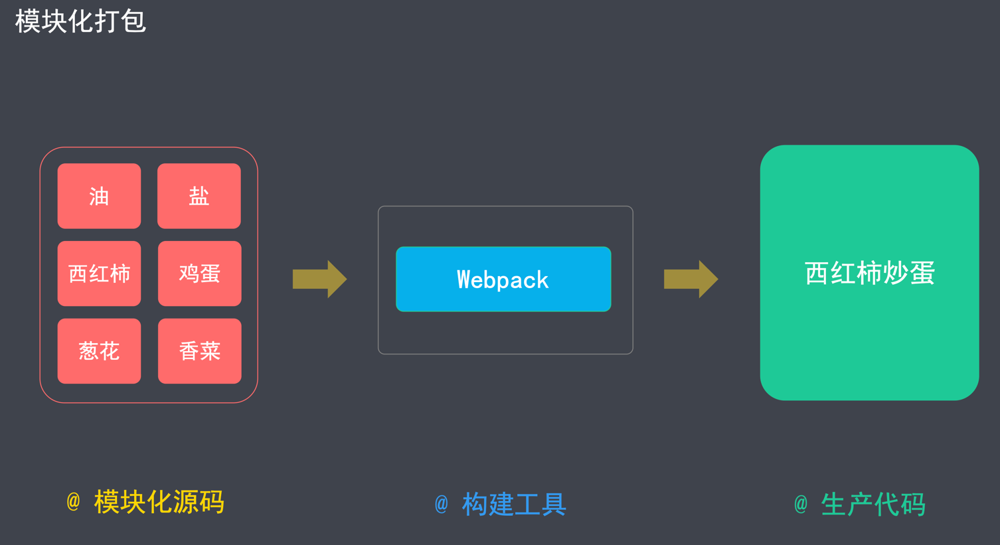
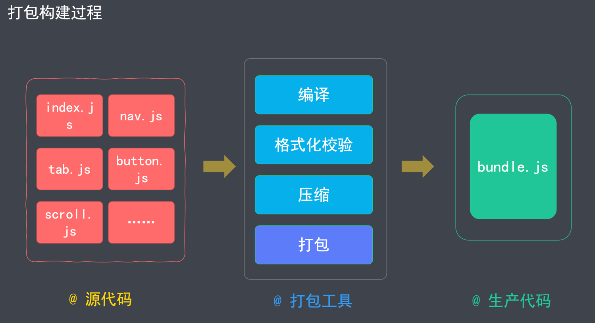
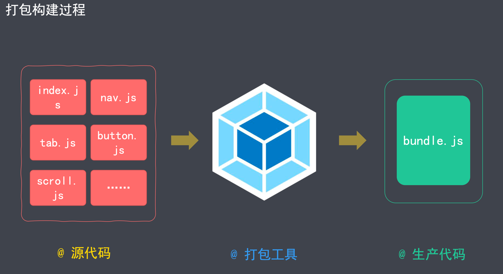
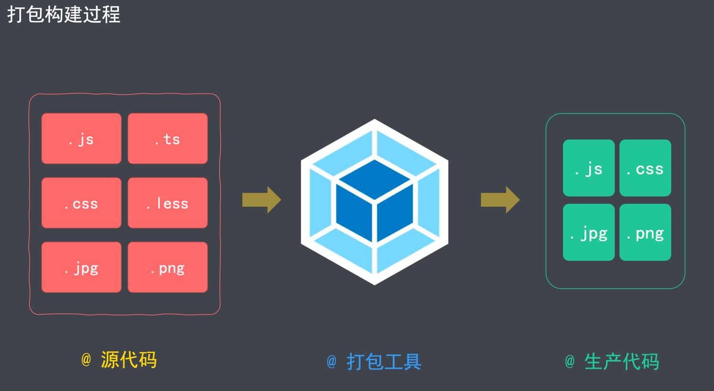
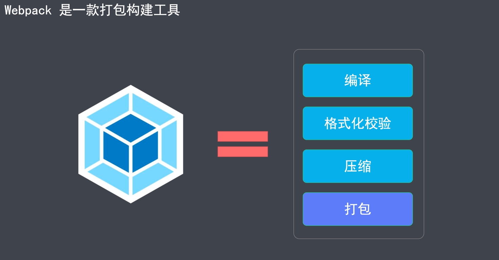
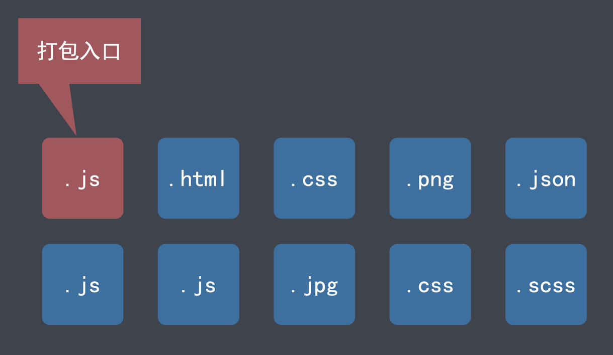
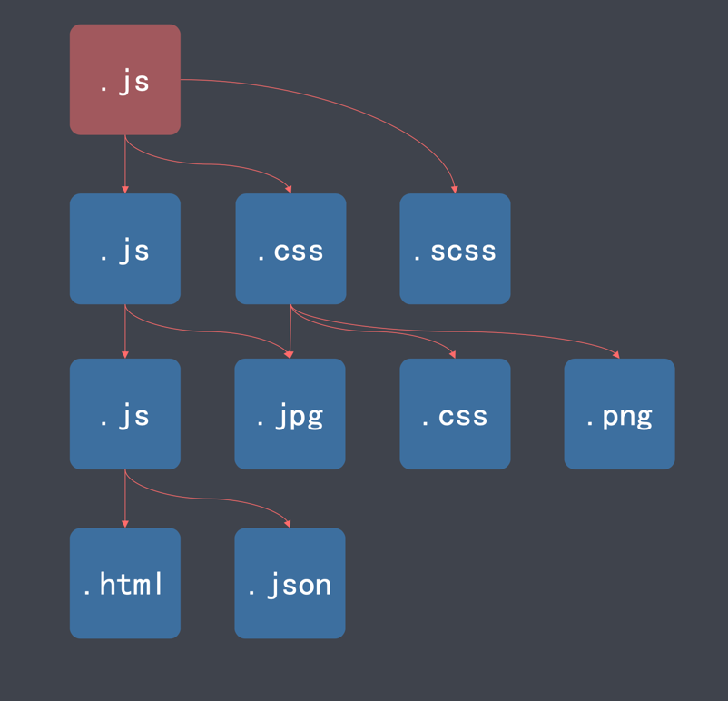
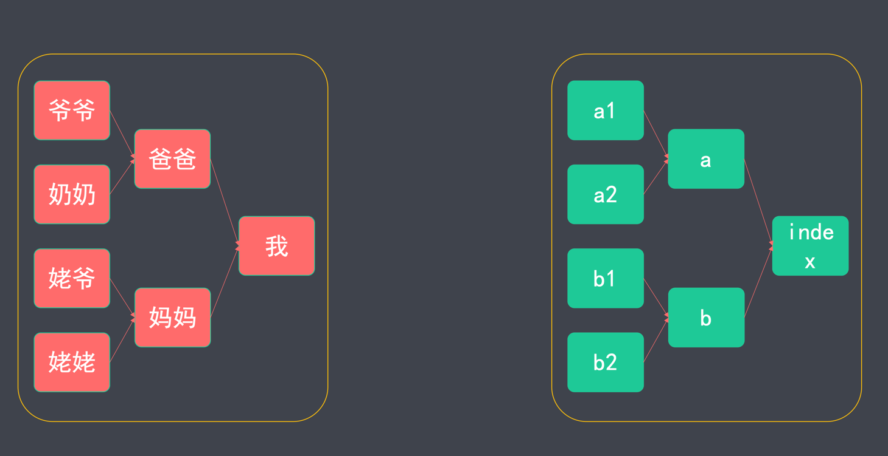
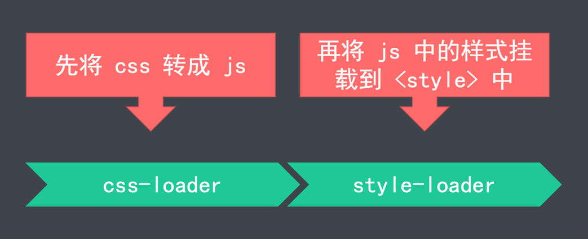
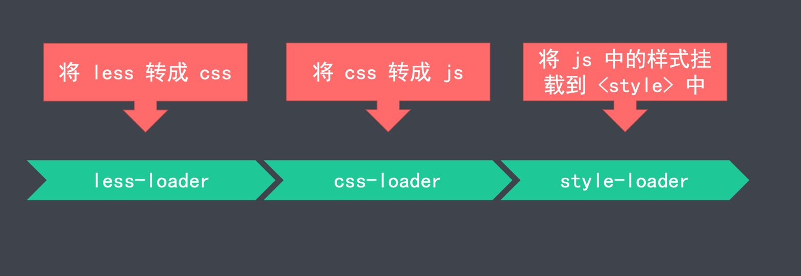

## 1. 概述

### 1.1 简介

> Webpack = Web Package

Webpack 是一个现代 JS 应用程序的*静态模块打包器*(module bundler).

- 模块(模块化开发，可以提高开发效率，避免重复造轮子)
- 打包(将各个模块，按照一定的规则组装起来)

官网: <https://webpack.js.org/>

特点:

- 功能强大(打包、构建、发布 Web 服务) 
- 学习成本高

---

怎么来理解模块化和打包?




构建(转换): 把不支持的代码，转成支持的代码.


打包(合并): 把多个文件合并成一个文件







---

Webpack 的功能



- 将多个文件合并(打包)，减少 HTTP 请求次数，从而提高效率
- 对代码进行编译，确保浏览器兼容性
- 对代码进行压缩，减小文件体积，提高加载速度
- 检测代码格式，确保代码质量
- 提供热更新服务，提高开发效率
- 针对不同环境，提供不同的打包策略

### 1.2 核心概念

####  入口(Entry)

打包时，第一个被访问的源码文件.

默认是 `src/index.js` (可以通过配置文件指定)

Webpack 通过入口，加载整个项目的依赖





####  出口(Output)

打包后，输出的文件名称.

默认是 `dist/main.js` (可以通过配置文件指定)

####  加载器(Loader)

专门用来处理一类文件(非 JS)的工具.

> Webpack 默认只能识别 JS，想要处理其他类型的文件，需要对应的 `loader`.

命名方式: `xxx-loader`(`css-loader`|`html-loader`|`file-loader`)

> 以 `-loader` 为后缀

常用加载器: <https://www.webpackjs.com/loaders/>

####  插件(Plugins)

实现 loader 之外的其他功能

> Plugin 是 Webpack 的支柱，用来实现丰富的功能

命名方式: `xxx-webpack-plugin`(`html-webpack-plugin`)

> 以 `-webpack-plugin` 为后缀

常用插件: <https://www.webpackjs.com/plugins/>

---

**Loader 和 Plugin 本质上都是 npm 包**

####  模式(Mode)

用来区分环境的关键字

> 不同环境的打包逻辑不同，因此，需要区分

三种模式: 

- `development`(自动优化打包速度，添加一些调试过程中的辅助)
- `production`(自动优化打包结果)
- `none`(运行最原始的打包，不做任何额外处理)

####  模块(Module)

Webpack 中，模块的概念比较宽泛(一切皆为模块)

- JS 模块
- 一段 CSS
- 一张图片
- 一个字体文件
- ......

详情: <https://www.webpackjs.com/concepts/modules/>

####  依赖图(Dependency Graph)



### 1.3 最佳实践

```shell
# 初始化项目
mkdir myproject && cd myproject && npm init –y

# 安装 Webpack
npm i -D webpack webpack-cli

# 创建入口文件
# myproject/src/index.js

# 查看 webpack 参数
webpack help
# 如果命令不能成功执行, 则全局安装 webpack
sudo npm i webpack webpack-cli -g

# 执行打包(必须指定 mode)
webpack ./src/index.js --output-path ./dist --mode=development
```

---

Webpack 版本

- Webpack 4 于 2018 年 2 月发布
- Webpack 5 于 2020 年 10 月发布

安装命令需要调整(默认安装 5)

```shell
npm install webpack -D # webpack 5
npm install webpack@4 -D # webpack 4
```

---

webpack 除了能够打包 JS 外, 默认还能打包 JSON.

```js
import data from './data.json'

console.log(data)
```

---

在 webpack 构建好的代码当中, `__webpack_require__` 方法是能够循环加载依赖的关键.

### 1.4 配置文件

配置文件是用来简化命令行选项的

> 配置文件的功能有很多, 这是其中一个功能

```shell
# 配置前
webpack ./src/index.js --output-path ./dist --mode=development
# 配置后
webpack
```

默认的配置文件名称是 `webpack.config.js`(文件位于项目根目录下)

- `webpack.config.js` 是以 CommonJS 规范进行组织的
- **使用 Webpack 的过程，大部分就是跟配置文件打交道的过程**

配置详情: <https://www.webpackjs.com/configuration/>

##### 常用配置项

- mode(模式)
- entry(入口)
- output(出口)
- module(模块配置 – 不同类型文件的配置 – 各种 loader 配置)
- plugins(插件)
- devServer(开发服务器的配置)

```js
const {resolve} = require('path')

module.exports = {
  // 打包模式
  mode: 'production',

  // ⼊⼝⽂件
  entry: './src/index.js',

  // 出⼝配置
  output: {
    // 输出⽬录（输出⽬录必须是绝对路径）
    path: resolve(__dirname, 'output'),
    // 输出⽂件名称
    filename: 'bundle.js'
  },

  // 模块配置
  module: {
    rules: [
      // 指定多个配置规则
    ]
  },

  // 开发服务器
  devServer: {},

  // 插件配置
  plugins: []
}
```

## 2. 基础

### 2.1.打包 CSS

#### 1. 打包逻辑

非 JS 文件打包，需要对应的 loader

- `css-loader` 将 CSS 转化为 JS(将 CSS 输出到打包后的 JS 文件中)
- `style-loader` 把包含 CSS 内容的 JS 代码，挂载到页面的 `<style>` 标签当中

步骤:

1. 引入 CSS(`import "./css/main.css"`)
2. 安装(`npm i css-loader style-loader -D`)
3. 配置 (写在 `module` 中)
    1. 匹配后缀名: `test: /\.css$/i`
    2. 指定加载器: `use: ['style-loader', 'css-loader']` (注意先后顺序, 后写的先执行)

```js
module: {
  rules: [
    // 指定多个配置规则
    {
      test: /.css$/i,
      // use 中 loader 的加载顺序: 先下后上
      use: [
        // 2.将 JS 中的样式挂载到 <style> 标签中
        'style-loader',
        // 1.按照 CommonJS 规范，将样式文件输出到 JS 中
        'css-loader'
      ]
    }
  ]
}
```

---

loader 的执行顺序

```js
use: ['style-loader', 'css-loader']
```



__Loader 执行顺序:先右后左(先下后上).__

> 先下后上, 指的是如果 loader 写了多行的情况.

#### 2. 打包 LESS

1.引入 less (`index.js` 文件中)

```shell
import "./css/main.less"
```

2.安装

```shell
npm i less less-loader -D
```
 
3.配置 (写在 `module` 中)

- 匹配后缀名: `test: /\.less$/i`
- 指定加载器: `use: ['style-loader', 'css-loader', 'less-loader']`

---

打包过程

```js
use: ['style-loader', 'css-loader', 'less-loader']
```



---

完整代码

```js
{
  test: /.less$/i,
  // use 中 loader 的加载顺序: 先下后上
  use: [
    // 3.将 JS 中的样式挂载到 <style> 标签中
    'style-loader',
    // 2.按照 CommonJS 规范，将样式文件输出到 JS 中
    'css-loader',
    // 1. 将 .less 转成普通的 css
    'less-loader'
  ]
}
```

#### 3. 打包成独立的 CSS 文件

安装插件

```shell
npm i mini-css-extract-plugin -D
```

引入插件(`webpack.config.js`)

```js
const MiniCssExtractPlugin = require('mini-css-extract-plugin');
```

替换 `style-loader`

```js
use: [
   // 2. 将 CSS 打包到独立的文件中
   MiniCssExtractPlugin.loader,

   // 1.按照 CommonJS 规范，将样式文件输出到 JS 中
   'css-loader'
]
```

- `style-loader`: 将 CSS 打包到 `<style>` 标签中
- `MiniCssExtractPlugin.loader`: 将 CSS 打包到独立文件中

配置插件

```js
// 插件配置
plugins: [
   new MiniCssExtractPlugin({
      // 打包之后的文件名称
      filename: 'css/[name].css' // 保持原文件名
   })
]
```

#### 4. 添加样式前缀

安装

```shell
npm install postcss-loader autoprefixer -D
```

配置 `webpack.config.js`

```js
use: [
   // 4. 将 CSS 打包到独立的文件中
   MiniCssExtractPlugin.loader,
   // 3.按照 CommonJS 规范，将样式文件输出到 JS 中
   'css-loader',
   // 2.通过 postcss-loader 给样式属性添加浏览器前缀
   'postcss-loader',
   // 1. 将 .less 转成普通的 css
   'less-loader'
]
```

(在项目根目录下)新建 `postcss.config.js`

```js
module.exports = {
   'plugins': [
      require('autoprefixer')
   ]
}
```

配置需要兼容的浏览器

在 `package.json` 中指定 `browserslist`

```json
{
   "browserslist": [
      "last 1 version",
      "> 1%"
   ]
}
```

> 详情参考: <https://www.npmjs.com/package/browserslist>

---

指定兼容规则, 有两种指定⽅式，⼆选⼀即可：

1. 可以在 `package.json` 中指定（推荐）

```json
{
  "browserslist": [
    "last 1 version", // 匹配浏览器的最后的⼀个版本
    "> 1%" // 代表浏览器的全球使⽤率超过 1%, 才做兼容
  ]
}
```

2. 在项⽬根⽬录下创建 `.browserslistrc`

```shell
# Browsers that we support

last 1 version
> 1%
```

#### 5. 格式校验

安装

```shell
npm i stylelint stylelint-config-standard stylelint-webpack-plugin -D
```

引入

```js
const StylelintPlugin = require('stylelint-webpack-plugin');
```

配置插件(写在 `plugins` 中)

```shell
new StylelintPlugin({
  // 指定需要进行格式校验的文件
  files: ['src/css/*.{css,less,sass,scss}']
})
```

指定校验规则

(在 `package.json` 中指定 `stylelint` ) 

```json
{
   "stylelint": {
      "extends": "stylelint-config-standard",
      // 后续为扩展配置（如果不需要⾃定义规则，可以忽略 rules）
      "rules": {
        
      }
   }
}
```

---

[stylelint](https://stylelint.io/)

- 校验规则(如: number-leading-zero, 数字前缀 0 不能省略)

```
line-height: .5;  // 错误
line-height: 0.5; // 正确
```

具体的规则集: [stylelint-config-standard](https://github.com/stylelint/stylelint-config-standard)

允许在 webpack 中对 JS 代码进行格式校验的插件: [stylelint-webpack-plugin](https://webpack.docschina.org/plugins/stylelint-webpack-plugin)

---

指定规则配置有三种⽅式，按照加载的先后顺序，依次是：

1. 在 `package.json` 中的 `stylelint` 属性指定规则
2. 在(项目根目录) `.stylelintrc` 中指定规则
3. 在(项目根目录) `stylelint.config.js` 中指定规则

---

报错: ` Unexpected unknown at-rule "@bg-color:"  at-rule-no-unknown`

解决: 在 `package.json` 中禁用 `at-rule-no-unknown` 规则

```json
{
   "stylelint": {
      "extends": "stylelint-config-standard",
      "rules": {
         "at-rule-no-unknown": false
      }
   }
}
```

#### 6. 压缩 CSS

安装

```shell
npm i optimize-css-assets-webpack-plugin -D
# 如果报错了, 就是用这个
npm i optimize-css-assets-webpack-plugin -D --force
```

引入

```js
const OptimizeCssAssetsPlugin = require('optimize-css-assets-webpack-plugin');
```

配置(`plugins` 模块)

```js
new OptimizeCssAssetsPlugin()
```

### 2.2.打包 HTML


### 2.3.打包JS


### 2.4.打包图片


### 2.5.打包字体


### 2.6.资源模块(Asset Modules)


### 2.7.开发服务器(Dev Server)


## 3. 进阶


## 4. 项目


