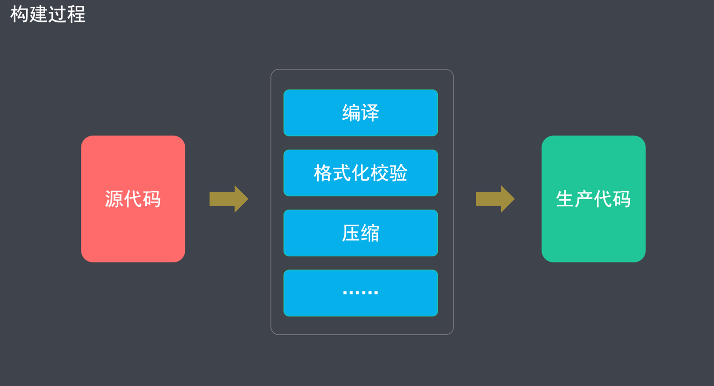
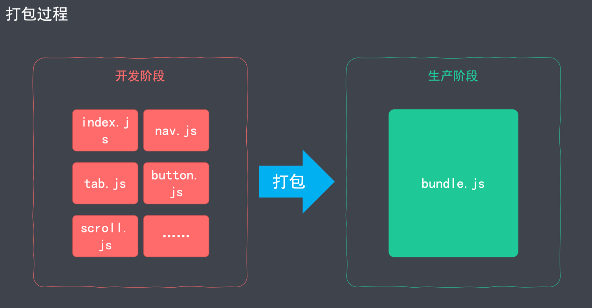

## 1. 概述

### 1.1 简介

> Webpack = Web Package

Webpack 是一个现代 JS 应用程序的*静态模块打包器*(module bundler).

- 模块(模块化开发，可以提高开发效率，避免重复造轮子)
- 打包(将各个模块，按照一定的规则组装起来)

官网: <https://webpack.js.org/>

特点:

- 功能强大(打包、构建、发布 Web 服务) 
- 学习成本高

---

怎么来理解模块化和打包?




构建(转换): 把不支持的代码，转成支持的代码.



打包(合并): 把多个文件合并成一个文件


---

Webpack 的功能


- 将多个文件合并(打包)，减少 HTTP 请求次数，从而提高效率
- 对代码进行编译，确保浏览器兼容性
- 对代码进行压缩，减小文件体积，提高加载速度
- 检测代码格式，确保代码质量
- 提供热更新服务，提高开发效率
- 针对不同环境，提供不同的打包策略

### 1.2 核心概念

####  入口(Entry)

打包时，第一个被访问的源码文件.

默认是 `src/index.js` (可以通过配置文件指定)

Webpack 通过入口，加载整个项目的依赖


####  出口(Output)

打包后，输出的文件名称.

默认是 `dist/main.js` (可以通过配置文件指定)

####  加载器(Loader)

专门用来处理一类文件(非 JS)的工具.

> Webpack 默认只能识别 JS，想要处理其他类型的文件，需要对应的 `loader`.

命名方式: `xxx-loader`(`css-loader`|`html-loader`|`file-loader`)

> 以 `-loader` 为后缀

常用加载器: <https://www.webpackjs.com/loaders/>

####  插件(Plugins)

实现 loader 之外的其他功能

> Plugin 是 Webpack 的支柱，用来实现丰富的功能

命名方式: `xxx-webpack-plugin`(`html-webpack-plugin`)

> 以 `-webpack-plugin` 为后缀

常用插件: <https://www.webpackjs.com/plugins/>

---

**Loader 和 Plugin 本质上都是 npm 包**

####  模式(Mode)

用来区分环境的关键字

> 不同环境的打包逻辑不同，因此，需要区分

三种模式: 

- `development`(自动优化打包速度，添加一些调试过程中的辅助)
- `production`(自动优化打包结果)
- `none`(运行最原始的打包，不做任何额外处理)

####  模块(Module)

Webpack 中，模块的概念比较宽泛(一切皆为模块)

- JS 模块
- 一段 CSS
- 一张图片
- 一个字体文件
- ......

详情: <https://www.webpackjs.com/concepts/modules/>

####  依赖图(Dependency Graph)


### 1.3 最佳实践

```shell
# 初始化项目
mkdir myproject && cd myproject && npm init -y

# 安装 Webpack
npm i -D webpack webpack-cli

# 创建入口文件
# myproject/src/index.js

# 查看 webpack 参数
webpack help
# 如果命令不能成功执行, 则全局安装 webpack
sudo npm i webpack webpack-cli -g

# 执行打包(必须指定 mode)
webpack ./src/index.js --output-path ./dist --mode=development
```

---

Webpack 版本

- Webpack 4 于 2018 年 2 月发布
- Webpack 5 于 2020 年 10 月发布

安装命令需要调整(默认安装 5)

```shell
npm install webpack -D # webpack 5
npm install webpack@4 -D # webpack 4
```

---

webpack 除了能够打包 JS 外, 默认还能打包 JSON.

```js
import data from './data.json'

console.log(data)
```

---

在 webpack 构建好的代码当中, `__webpack_require__` 方法是能够循环加载依赖的关键.

### 1.4 配置文件

配置文件是用来简化命令行选项的

> 配置文件的功能有很多, 这是其中一个功能

```shell
# 配置前
webpack ./src/index.js --output-path ./dist --mode=development
# 配置后
webpack
```

默认的配置文件名称是 `webpack.config.js`(文件位于项目根目录下)

- `webpack.config.js` 是以 CommonJS 规范进行组织的
- **使用 Webpack 的过程，大部分就是跟配置文件打交道的过程**

配置详情: <https://www.webpackjs.com/configuration/>

##### 常用配置项

- mode(模式)
- entry(入口)
- output(出口)
- module(模块配置 – 不同类型文件的配置 – 各种 loader 配置)
- plugins(插件)
- devServer(开发服务器的配置)

```js
const {resolve} = require('path')

module.exports = {
  // 打包模式
  mode: 'production',

  // ⼊⼝⽂件
  entry: './src/index.js',

  // 出⼝配置
  output: {
    // 输出⽬录（输出⽬录必须是绝对路径）
    path: resolve(__dirname, 'output'),
    // 输出⽂件名称
    filename: 'bundle.js'
  },

  // 模块配置
  module: {
    rules: [
      // 指定多个配置规则
    ]
  },

  // 开发服务器
  devServer: {},

  // 插件配置
  plugins: []
}
```

## 2. 基础

### 2.1.打包 CSS

#### 1. 打包逻辑

非 JS 文件打包，需要对应的 loader

- `css-loader` 将 CSS 转化为 JS(将 CSS 输出到打包后的 JS 文件中)
- `style-loader` 把包含 CSS 内容的 JS 代码，挂载到页面的 `<style>` 标签当中

步骤:

1. 引入 CSS(`import "./css/main.css"`)
2. 安装(`npm i css-loader style-loader -D`)
3. 配置 (写在 `module` 中)
    1. 匹配后缀名: `test: /\.css$/i`
    2. 指定加载器: `use: ['style-loader', 'css-loader']` (注意先后顺序, 后写的先执行)

```js
module: {
  rules: [
    // 指定多个配置规则
    {
      test: /.css$/i,
      // use 中 loader 的加载顺序: 先下后上
      use: [
        // 2.将 JS 中的样式挂载到 <style> 标签中
        'style-loader',
        // 1.按照 CommonJS 规范，将样式文件输出到 JS 中
        'css-loader'
      ]
    }
  ]
}
```

---

loader 的执行顺序

```js
use: ['style-loader', 'css-loader']
```


__Loader 执行顺序:先右后左(先下后上).__

> 先下后上, 指的是如果 loader 写了多行的情况.

#### 2. 打包 LESS

1.引入 less (`index.js` 文件中)

```shell
import "./css/main.less"
```

2.安装

```shell
npm i less less-loader -D
```
 
3.配置 (写在 `module` 中)

- 匹配后缀名: `test: /\.less$/i`
- 指定加载器: `use: ['style-loader', 'css-loader', 'less-loader']`

---

打包过程

```js
use: ['style-loader', 'css-loader', 'less-loader']
```


---

完整代码

```js
{
  test: /.less$/i,
  // use 中 loader 的加载顺序: 先下后上
  use: [
    // 3.将 JS 中的样式挂载到 <style> 标签中
    'style-loader',
    // 2.按照 CommonJS 规范，将样式文件输出到 JS 中
    'css-loader',
    // 1. 将 .less 转成普通的 css
    'less-loader'
  ]
}
```

#### 3. 打包成独立的 CSS 文件

安装插件

```shell
npm i mini-css-extract-plugin -D
```

引入插件(`webpack.config.js`)

```js
const MiniCssExtractPlugin = require('mini-css-extract-plugin');
```

替换 `style-loader`

```js
use: [
   // 2. 将 CSS 打包到独立的文件中
   MiniCssExtractPlugin.loader,

   // 1.按照 CommonJS 规范，将样式文件输出到 JS 中
   'css-loader'
]
```

- `style-loader`: 将 CSS 打包到 `<style>` 标签中
- `MiniCssExtractPlugin.loader`: 将 CSS 打包到独立文件中

配置插件

```js
// 插件配置
plugins: [
   new MiniCssExtractPlugin({
      // 打包之后的文件名称
      filename: 'css/[name].css' // 保持原文件名
   })
]
```

#### 4. 添加样式前缀

安装

```shell
npm install postcss-loader autoprefixer -D
```

配置 `webpack.config.js`

```js
use: [
   // 4. 将 CSS 打包到独立的文件中
   MiniCssExtractPlugin.loader,
   // 3.按照 CommonJS 规范，将样式文件输出到 JS 中
   'css-loader',
   // 2.通过 postcss-loader 给样式属性添加浏览器前缀
   'postcss-loader',
   // 1. 将 .less 转成普通的 css
   'less-loader'
]
```

(在项目根目录下)新建 `postcss.config.js`

```js
module.exports = {
   'plugins': [
      require('autoprefixer')
   ]
}
```

配置需要兼容的浏览器

在 `package.json` 中指定 `browserslist`

```json
{
   "browserslist": [
      "last 1 version",
      "> 1%"
   ]
}
```

> 详情参考: <https://www.npmjs.com/package/browserslist>

---

指定兼容规则, 有两种指定⽅式，⼆选⼀即可：

1. 可以在 `package.json` 中指定（推荐）

```json
{
  "browserslist": [
    "last 1 version", // 匹配浏览器的最后的⼀个版本
    "> 1%" // 代表浏览器的全球使⽤率超过 1%, 才做兼容
  ]
}
```

2. 在项⽬根⽬录下创建 `.browserslistrc`

```shell
# Browsers that we support

last 1 version
> 1%
```

#### 5. 格式校验

安装

```shell
npm i stylelint stylelint-config-standard stylelint-webpack-plugin -D
```

引入

```js
const StylelintPlugin = require('stylelint-webpack-plugin');
```

配置插件(写在 `plugins` 中)

```js
new StylelintPlugin({
  // 指定需要进行格式校验的文件
  files: ['src/css/*.{css,less,sass,scss}']
})
```

指定校验规则

(在 `package.json` 中指定 `stylelint` ) 

```json
{
   "stylelint": {
      "extends": "stylelint-config-standard",
      // 后续为扩展配置（如果不需要⾃定义规则，可以忽略 rules）
      "rules": {
        
      }
   }
}
```

---

[stylelint](https://stylelint.io/)

- 校验规则(如: number-leading-zero, 数字前缀 0 不能省略)

```
line-height: .5;  // 错误
line-height: 0.5; // 正确
```

具体的规则集: [stylelint-config-standard](https://github.com/stylelint/stylelint-config-standard)

允许在 webpack 中对 JS 代码进行格式校验的插件: [stylelint-webpack-plugin](https://webpack.docschina.org/plugins/stylelint-webpack-plugin)

---

指定规则配置有三种⽅式，按照加载的先后顺序，依次是：

1. 在 `package.json` 中的 `stylelint` 属性指定规则
2. 在(项目根目录) `.stylelintrc` 中指定规则
3. 在(项目根目录) `stylelint.config.js` 中指定规则

---

报错: ` Unexpected unknown at-rule "@bg-color:"  at-rule-no-unknown`

解决: 在 `package.json` 中禁用 `at-rule-no-unknown` 规则

```json
{
   "stylelint": {
      "extends": "stylelint-config-standard",
      "rules": {
         "at-rule-no-unknown": false
      }
   }
}
```

#### 6. 压缩 CSS

安装

```shell
npm i optimize-css-assets-webpack-plugin -D
# 如果报错了, 就是用这个
npm i optimize-css-assets-webpack-plugin -D --force
```

引入

```js
const OptimizeCssAssetsPlugin = require('optimize-css-assets-webpack-plugin');
```

配置(`plugins` 模块)

```js
new OptimizeCssAssetsPlugin()
```

### 2.2.打包 HTML

html-webpack-plugin

- 生成 HTML 文件(用于服务器访问, 源代码中可以不写 index.html 文件了)，并在 HTML 中加载所有的打包资源(无需手动在页面中通过 script 或者 style 标签引入)
- 指定 HTML 模板、设置 HTML 变量、压缩 HTML

> 指定模板是为了满足"默认自动生成的首页文件不能满足需求"的情况; 模板文件的位置可以通过插件的 template 参数指定;

安装

```shell
npm i html-webpack-plugin -D
```

配置: <https://www.npmjs.com/package/html-webpack-plugin>

---

```js
plugins: [
    // Html 配置
    new HtmlWebpackPlugin({
      // 指定打包后的文件名称
      filename: 'index.html',
      // 用来指定生成 html 的模板
      template: './src/index.html',
      // 指定 HTML 中使用的变量
      title: 'Webpack Demo'
    }),
    // 配置另一个 Html
    new HtmlWebpackPlugin({
      filename: 'about.html',
      template: './src/index.html',
      title: '关于我们',
      // 文件压缩
      minify: {
        collapseWhitespace: true,
        keepClosingSlash: true,
        removeComments: true,
        removeRedundantAttributes: true,
        removeScriptTypeAttributes: true,
        removeStyleLinkTypeAttributes: true,
        useShortDoctype: true
      }
    })
  ]
```

变量使用

```html
<!--注意语法: 此处插件名要使用小驼峰的命名方式-->
<title><%= htmlWebpackPlugin.options.title %></title>
```

> 实际使用中, 可以通过不同的打包模式决定是否压缩文件; 如: dev 环境不压缩, prod 环境压缩.

### 2.3.打包JS

#### Webpack 编译 JS

目的: 将 ES6+ 转成 ES5，从而保证，JS 在低版本浏览器的兼容性

安装

```shell
npm i babel-loader @babel/core @babel/preset-env -D --force
```

配置: <https://www.npmjs.com/package/babel-loader>

> 转换规则: 参考 Gulp

> 备注: 此处实测并不能转换箭头函数, 回退到教程相同版本的插件也不行. 可能是因为底层的包版本更新了, 也许是默认规则集变了, 不纠结.

---

- `@babel/preset-env` 只能转译基本语法(Promise 就不能转换)
- `@babel/polyfill` (转译所有 JS 新语法)

```shell
npm i @babel/polyfill -D --force
```

```js
// 入口文件中引入
import '@babel/polyfill'
```

> 注意: 要在入口文件中引入, 如果在入口文件中不引入, 不能实现.

---

`ployfill` 插件虽然能够转译新的语法, 但是转换了所有的新语法, 很多没有用到的新特性也会转译, 这样造成了 bundle.js 文件的膨胀和性能的浪费.

- `core-js` (按需转译 JS 新语法)

```shell
# 安装
npm i core-js -D --force
```

配置

- 按需加载 `useBuiltIns: 'usage'`
- 指定版本 `corejs: 3`

```js
presets: [
   ['@babel/preset-env',
      {
         // 按需加载
         useBuiltIns: 'usage',
         // corejs 的版本
         corejs: 3,
         // targets 后面可以指定浏览器兼容的版本
         targets: {
            chrome: '58',
            ie: '9',
            firefox: '60',
            safari: '10',
            edge: '17'
         }
      }
   ]
]
```

> 注意: 此时打包时, 要去掉在入口文件引入的 `import '@babel/polyfill'` 代码, 才能实现按需加载.

#### Webpack 校验 JS 代码格式

安装

```shell
npm i eslint eslint-config-airbnb-base eslint-webpack-plugin eslint-plugin-import -D --force
```

- `eslint` (校验 JS 代码格式的工具); [官网](https://eslint.org/)
- `eslint-config-airbnb-base` (最流行的 JS 代码格式规范); [npmjs地址](https://www.npmjs.com/package/eslint-config-airbnb-base); [GitHub地址](https://github.com/airbnb/javascript)
- `eslint-webpack-plugin` (Webpack 的 eslint 插件); [npmjs地址](https://www.npmjs.com/package/eslint-webpack-plugin)
- `eslint-plugin-import` 用于在 `package.json` 中读取 `eslintConfig` 配置项

配置:

- `eslint-webpack-plugin`

```js
const ESLintPlugin = require("eslint-webpack-plugin")

plugins: [
    new ESLintPlugin(options)
]
```

- `eslintConfig` (package.json)

```json
{
   "eslintConfig": {
      "extends": "airbnb-base"
   }
}
```

> 备注: 两个文件都需要添加.

---

自动修复常规报错:

```js
new EsLintPlugin({
   // 自动解决常规的代码格式报错
   fix: true
})
```

在代码中局部禁用 ESLint 检查

```js
// eslint-disable-next-line
window.showMsg = showMsg;
```

### 2.4.打包图片

#### `file-loader`

将用到的图片复制到输出目录，过滤掉不用的图片

```shell
npm i file-loader -D
```

<https://www.npmjs.com/package/file-loader>

---

实践

```js
// index.js
// 以模块的方式引入图片
import boy from './image/xph.gif'

const img = new Image();
img.src = boy;
document.body.append(img);
```

配置 (webpack.conf.js > module.rules)

```js
// 处理图片
{
  test: /\.(png|gif|jpe?g)$/i,
  use: {
    loader: 'file-loader'
  }
}
```

在 css 中引入图片

> 注意： 此处实验时一定要保证 `css-loader` 插件的版本是 `^5.2.4`

```less
// main.less
body {
  background: url('../image/bg.jpg');
}
```

> 测试其实不改 `MiniCssExtractPlugin.loader` 的选项，背景图片也可以正常展示，可能是 html-loader 插件更新了吧，不纠结

#### `url-loader`

- 是 `file-loader` 的升级版，如果图片小于配置大小，会转成 base64 字符串
- 转成 base64 字符串后，图片会跟 js 一起加载(减少图片的请求次数)

```shell
npm i url-loader -D
```

> 注意：添加了 url-loader 之后，不能删除 file-loader

<https://www.npmjs.com/package/url-loader>

实践

使用：

```js
// index.js
// 引入首页图片
import homeIcon from './image/icon/home-blue.png'
// eslint-disable-next-line
const img1 = new Image();
img1.src = homeIcon;

// eslint-disable-next-line
document.body.append(img1);
```

配置：

```js
// module.rules > 处理图片的规则
use: {
  loader: 'url-loader', // 注意：此处要改成 url-loader ！！！！
  options: {
    // 指定图片大小，小于这个值的图片会被转为 Base64; 单位：byte
    limit: 8 * 1024 // 8 kb
  }
}
```

---

扩展：Base64

Base 64 格式：


图片示例：


---

处理 CSS 中的图片路径(例如:背景图片加载失败)

```js
use: [
   // MiniCssExtractPlugin 将 CSS 打包到独立的文件中
   {
      loader: MiniCssExtractPlugin.loader,
      options: {
          publicPath: '../' // 为背景图片指定路径
      }
   },
   'css-loader',
   'postcss-loader',
   'less-loader'
]
```

> 这个修改在 `module.rule` 中，对 less 和 css 的配置都要添加。

#### html-loader

前面引入图片都是通过在入口文件 index.js 中使用 `import` 的方式导入，如果直接在 index.html 中添加 `` 标签引入图片，并不能正常引入。
如何解决呢？ 只需要使用 `html-loader` 插件就可以了。

基本功能：

- 将 HTML 导出为字符串(负责引入 img，从而能被 url-loader 进行处理) 
- <https://www.npmjs.com/package/html-loader>

安装

```shell
npm i -D html-loader 
```

安装完成后还需要在 webpack.config.js 中的 `module.rule` 添加配置

```js
{
  test: /\.(htm|html)$/i,
  use: {
    loader: 'html-loader'
  }
}
```

使用 `webpack` 命令构建后，index.html 的 `` 标签内容变为如下：

```html

```

但是，查看这个图片却是有问题的。因为 url-loader 默认采用 ES Modules 规范进行解析，但是 html-loader 引入图片使用的是 CommonJS 规范。

解决：关闭 url-loader 默认的 ES Modules 规范，强制 url-loader 使用 CommonJS 规范进行打包。

> 前面"在 css 中引入图片"部分，之所以要回退版本，也是这个原因导致的。

配置修改：

```js
rules: [
   // 处理图片
   {
      test: /\.(png|gif|jpe?g)$/i,
      use: {
         loader: 'url-loader',
         options: {
            limit: 8 * 1024,
            name: "image/[name].[ext]",
            // 强制使用 CommonJS 规范
            esModule: false
         }
      }
   },
   {
      test: /\.(htm|html)$/i,
      use: {
         loader: 'html-loader',
         options: {
            // 如果是 webpack 4 的话，只需要在 url-loader 中配置 esModule: false; 此处可以不添加
            // webpack 5 中，此处必须也添加 esModule: false
            esModule: false
         }
      }
   },
]
```

再次打包，可以发现构建后的 index.html 的 `` 标签中的 src 已经变成了 Base64 的内容：

```html

```

此时图片能够正常展示，但是我们前面使用的模板语法(`<title><%= htmlWebpackPlugin.options.title %></title>`) 又不能正常展示了。
这是因为 html-loader 与 html-webpack-plugin 的冲突 导致的。

#### html-loader 与 html-webpack-plugin 的冲突

- 原因: htmlWebpackPlugin 会检查目标文件是否已经有 loader 处理，如果有其他 loader 处理，htmlWebpackPlugin 不再使用 `lodash.template` 去处理 ejs 语法
- 解决: 将 webpack.config.js 文件中的 `plugins` 中的 htmlWebpackPlugin 中，模板文件的后缀名改成 `.ejs` (非 .html)

> 配置当中的 `index` 文件的后缀名改了，真实的模板文件的后缀名也要改。

改完之后重新构建后发现，`title` 倒是成功了，`` 文件导入又回去了：``。

---

那么到底应该怎么处理呢？

终极方案：

我们可以在 `index.ejs` 文件中修改图片引入方式，使用 ejs 的语法引入图片

```html
" alt="">
```

再次打包可以发现 title 和 img 都正常生效了。

> 此时，相当于我们配置的 `html-loader` 的规则就失效了。

---

最佳实践：

- 如果是纯静态的模板(就是没有使用 ejs 语法)，可以使用 `'html-loader` 的方式解决 HTML 模板中图片加载的问题。
- 如果是使用了 ejs 语法的模板，使用 htmlWebpackPlugin 插件配置和 ejs 语法引入图片的方式，解决模板中图片加载的问题。

### 2.5.打包字体

- 字体文件: <https://www.iconfont.cn/>
- file-loader 打包字体文件 `test: /\.(eot|svg|ttf|woff|woff2)$/i`

```js
// webpack.config.js
module: {
   rules: [
      // 匹配字体文件
      {
         test: /\.(eot|svg|ttf|woff|woff2)$/i,
         use: {
            loader: 'file-loader',
            options: {
               // 打包构建后的字体文件名和路径
               name: 'fonts/[name].[ext]'
            }
         }
      },
   ]
}
```

> 完事后并看不出来有什么不一样。

---

其他常用工具：

- `copy-webpack-plugin` 不需要处理的其他文件，可以直接复制到输出目录(<https://www.npmjs.com/package/copy-webpack-plugin>)
- `clean-webpack-plugin` 每次打包之前，先删除历史文件 (<https://www.npmjs.com/package/clean-webpack-plugin>)

安装：

```shell
npm i -D copy-webpack-plugin
```

配置：

```js
const CopyWebpackPlugin = require('copy-webpack-plugin')

plugins: [
   // 直接将 src 下不需要特殊处理的文件，直接复制到输出目录中
   new CopyWebpackPlugin({
      patterns: [
         {
            from: "src/public",
            to: "public"
         }
      ]
   })
]
```

在 `index.ejs` 中使用

```html
<link rel="shortcut icon" href="public/favicon.ico" type="image/x-icon">
```

重新打包构建后，查看效果。

---

构建前先清理历史文件

```shell
npm i -D clean-webpack-plugin
```

引入插件时必须使用解构的方式引入

```js
// webpack.config.js
const { CleanWebpackPlugin } = require('clean-webpack-plugin')

plugins: [
   // 打包之前先清除历史文件
   new CleanWebpackPlugin()
]
```

> 插件不知道为什么不生效。

### 2.6.资源模块(Asset Modules)

#### 功能

- 资源模块是一种模块类型，它允许使用**资源文件**，而无需配置额外 `loader`
- 资源文件: 字体、图片、图标、HTML......
- 不用 `file-loader`、`url-loader` 也能加载图片和字体

详情: <https://webpack.docschina.org/guides/asset-modules/>

#### Webpack 4

- raw-loader(将文件导入为字符串)
- file-loader(将文件发送到输出目录)
- url-loader(将文件发送到输出目录，或转为 Data URI 内联到 bundle 中)

#### Webpack 5

- `asset/resource` 发送一个单独的文件并导出 URL(之前通过使用 file-loader 实现)
- `asset/inline` 导出一个资源的 data URI(之前通过使用 url-loader 实现)
- `asset/source` 导出资源的源代码(之前通过使用 raw-loader 实现)
- `asset` 在导出一个 data URI 和发送一个单独的文件之间自动选择

> data URI 就是前面的转 Base64

```js
// webpack.config.js
module: {
   rules: [
      // 处理图片
      {
         test: /\.(png|gif|jpe?g)$/i,
         // 使用资源模块处理图片
         type: 'asset',
         parser: {
            dataUrlCondition: {
               maxSize: 8 * 1024 // 使用 inline (Base64转换)的方式进行处理的阈值
            }
         },
         generator: {
            filename: 'image/[name][ext]' // 打包后的路径和文件名; 后缀名已经包含了 . 符号，如：.jpg
         }
      },
      // 匹配字体文件
      {
         test: /\.(eot|svg|ttf|woff|woff2)$/i,
         type: 'asset', // asset 可以在 asset/resource 和 asset/inline 之间进行选择; 如果文件 < 8kb, 则使用 inline 进行处理, 否则使用 resource 进行处理; 这个默认大小可以配置
         parser: {
            dataUrlCondition: {
               maxSize: 8 * 1024 // 使用 inline (Base64转换)的方式进行处理的阈值
            }
         },
         generator: {
            filename: 'fonts/[name][ext]' // 打包后的路径和文件名
         }
      }
   ]
}
```

### 2.7.开发服务器(Dev Server)

作用: 发布 web 服务，提高开发效率

详情:

- <https://www.npmjs.com/package/webpack-dev-server>
- <https://webpack.docschina.org/configuration/dev-server> 

使用: 

```shell
# 安装
npm i -D webpack-dev-server
```

配置

```js
// webpack.config.js
devServer: {
   // 指定发布内容的路径
   // contentBase: resolve(__dirname, 'dist'), // 必须是绝对路径 // 新版本的 webpack-server 已经没有这个参数了，使用 static
   static: {
      directory: resolve(__dirname, 'dist'),
   },
   // 启用 gzip 压缩
   compress: true,
   // 指定发布端口号
   port: 9200
}
```

```shell
# Webpack 4 启动
webpack-dev-server ... 

# Webpack 5 启动
webpack serve ...
```

---

热更新

Webpack 4

`hot: true`

Webpack 5

- `liveReload: true` (禁用 hot)
- `target: "web"` (热更新只适用于 web 相关的 `targets`) 【注意: `target` 的配置是与 `devServer` 平级的】

> 因为 webpack 任务，只在 NodeJS 中运行的程序，不需要热更新。

> 注意：要想正常执行热更新，一定要保证过程中没有 ESLint，StyleLint 等的报错和警告。

webpack-dev-server 使用的是内存中的数据，所以项目中不会生成 dist 目录，更加不会读取 dist 目录中的数据了。

---

proxy 配置接口代理

解决 `webpack-dev-server` 下，访问接口的跨域问题.


```js
// webpack.config.js

// 开发服务器
devServer: {
  // 指定发布内容的路径
  // contentBase: resolve(__dirname, 'dist'), // 必须是绝对路径 // 新版本的 webpack-server 已经没有这个参数了，使用 static
  static: {
     directory: resolve(__dirname, 'dist'),
  },
  // 启用 gzip 压缩
  compress: true,
  // 指定发布端口号
  port: 9200,
  // 启用自动更新（需要禁用 hot）
  liveReload: true,
  // 配置代理，解决接口跨域问题
  proxy: {
    // http://localhost:9200/api
    '/api': {
      // 当访问 http://localhost:9200/api/users 时，实际访问 https://api.github.com/api/users
      target: 'https://api.github.com',
        // 当访问 http://localhost:9200/api/users 时，实际访问 https://api.github.com/users
        pathRewrite: {
          '^/api': ""
        },
       // 不能使用 localhost:9200 作为 github 的主机名;
       changeOrigin: true
    }
  }
}
```

---

开始下一阶段前，将插件版本号改为与教程一致。

删除 package-lock.json 后，使用 yarn 安装，成功。

使用 `npm install --package-lock-only` 命令也可以重新生成 package-lock.json 文件。