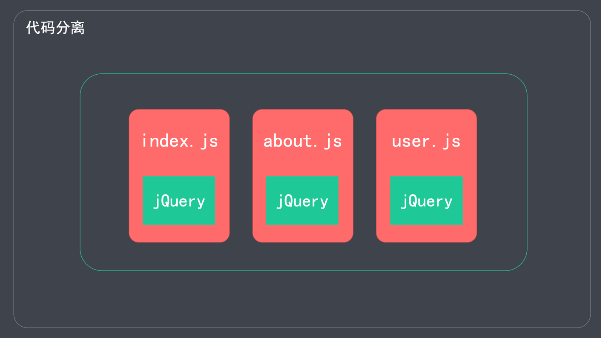

## 3. 进阶

### 3.1.区分打包环境

#### 3.1.1.Webpack 区分环境打包

##### 1. 通过环境变量区分

步骤：

1. 在命令中添加如下内容

```shell
webpack --env.production
```

2. 就可以在 webpack.config.js 中判断 env。示例代码如下：

```js
// webpack.config.js
module.exports = (env, argv) => {
  if (env.production) {
    // 生产环境的配置
  }
  // 开发环境的配置
}
```

##### 2. 通过配置文件区分

针对不同的环境，声明不同的配置文件。如：

- webpack.dev.conf.js (开发环境)
- webpack.prod.conf.js (生产环境)

执行打包时，指定配置文件

```shell
# dev 环境构建
webpack --config webpack.dev.conf.js
# prod 环境构建
webpack --config webpack.prod.conf.js
```

#### 3.1.2.通过环境变量区分

命令行中设置环境变量

```shell
# Webpack 4
webpack --env.production 
# Webpack 5
webpack --env production
```

webpack.config.js

- 读取环境变量 env.production
- 根据环境变量指定不同的配置

详情：<https://www.webpackjs.com/guides/environment-variables/>

> 注意：之前配置文件导出的是一个对象，现在导出的是一个函数。

```js
// webpack.config.js
module.exports = (env, argv) => {
  // 开发环境配置
  const config = {
    mode: 'development',
    // 更多配置...
  }

  if (env.production) {
    // 生产环境的配置
    config.mode = 'production'
    // 更多配置...
  }

  return config;
}
```

#### 3.1.3.通过配置文件区分

通过配置文件区分环境

- webpack.dev.conf.js(mode: development) 
- webpack.prod.conf.js(mode: production)
- webpack.base.conf.js(公共配置)

`webpack-merge` 插件：

- 将多个配置合并在一起
- <https://www.npmjs.com/package/webpack-merge>


---

实践：

在项目根目录创建三个配置文件：webpack.base.conf.js, webpack.dev.conf.js, webpack.prod.conf.js

```shell
# 安装 webpack-merge 插件
yarn add webpack-merge@5.7.3 -D
```

编写配置文件

```js
// webpack.dev.conf.js
// 开发配置文件

const { merge } = require('webpack-merge')
const baseWebpackConfig = require('./webpack.base.conf')

const devWebpackConfig = merge(baseWebpackConfig, {
  // 这里是开发环境对应的配置

})

module.exports = devWebpackConfig;
```

> 生产环境的配置与此类似。

```js
// webpack.base.conf.js

// 可以将 Style 部分公共的提取出来
const commonStyleLoader = [

  // 3. 将 CSS 打包到独立的文件中
  // MiniCssExtractPlugin.loader,
  {
    loader: MiniCssExtractPlugin.loader,
    options: {
      publicPath: '../'
    }
  },

  // 2.按照 CommonJS 规范，将样式文件输出到 JS 中
  'css-loader',

  // 1.通过 postcss-loader 给样式属性添加浏览器前缀
  'postcss-loader'
]

module.exports = {
  // 入口文件
  entry: './src/index.js',

  // 出口配置
  output: {
    // ...
  },

  // 模块配置
  module: {
    rules: [
      {
        test: /.css$/i,
        use: commonStyleLoader
      },
      {
        test: /.less$/i,
        use: [
          ...commonStyleLoader,
          // 1. 将 .less 转成普通的 css
          'less-loader'
        ]
      },
      // ...
    ]
  },

  // 开发服务器
  devServer: {
    // ...
  },

  // 配置目标
  target: "web",

  // 插件配置
  plugins: [
    new MiniCssExtractPlugin({
      // 打包之后的文件名称
      filename: 'css/[name].css' // 保持原文件名
    }),
    // ESLint
    new EsLintPlugin({
      // 自动解决常规的代码格式报错
      fix: true
    }),
    // 直接将 src 下不需要特殊处理的文件，直接复制到输出目录中
    new CopyWebpackPlugin({
      patterns: [
        {
          from: "src/public",
          to: "public"
        }
      ]
    }),
    // 打包之前先清除历史文件
    new CleanWebpackPlugin()
  ]
}
```

打包时指定配置文件

```shell
# 开发环境
webpack --config ./webpack.dev.conf.js
# 生产环境
webpack --config ./webpack.prod.conf.js
```

---

可以将这三个文件都放到一个文件夹中，如项目根目录的 `/config` 文件夹中，此时需要注意命令中配置文件的路径：

```shell
webpack --config ./config/webpack.dev.conf.js
```

同时还需要注意修改 `webpack.base.conf.js` 中的输出目录的配置 `exports.output.path: resolve(__dirname, '../dist')`

---

如果打包的时候命令太过复杂，可以通过使用 npm script 的方式简化命令。

在 package.json 中添加如下 npm script

```json
{
  "scripts": {
    "build:dev": "webpack --config config/webpack.dev.conf.js",
    "build:prod": "webpack --config config/webpack.prod.conf.js"
  }
}
```

此时，打包只需要执行如下命令即可

```shell
# 开发环境打包
npm run build:dev
# 生产环境打包
npm run build:prod
```

还可以将 DevServer 的命令也进一个简化

```json
{
  "scripts": {
    "test": "echo \"Error: no test specified\" && exit 1",
    "build:dev": "webpack --config config/webpack.dev.conf.js",
    "build:prod": "webpack --config config/webpack.prod.conf.js",
    "dev": "webpack serve --config config/webpack.dev.conf.js",
    "start": "webpack serve --config config/webpack.prod.conf.js"
  }
}
```

此时可以使用 `npm run dev` 开始调试了。

此外，在配置环境中还有一个常用的功能：DefinePlugin.

#### 3.1.4.Webpack DefinePlugin

作用：为配置注入全局变量。

比如：在开发环境和生产环境的接口地址不同，可以在开发环境和生产环境注入不同的接口地址。

示例代码如下：

```js
// webpack.config.js
const webpack = require('webpack')

module.exports = {
  // ...
  plugins: [
    new webpack.DefinePlugin({
      // 变量后面的值，是一个代码片段 (程序不会把他当成一个字符串)
      // API_BASE_URL: 'http://apidev.example.com', // 如果要最后输出为字符串，需要用如下形式：
      API_BASE_URL: JSON.stringify('http://apidev.example.com')
    })
  ]
}
```

在 index.js 中使用

```js
console.log('接口地址:', API_BASE_URL)
```

### 3.2.自定义 plugin

webpack 是基于插件机制的。

#### 3.2.1.自定义 plugin

Webpack 插件是一个具有 `apply` 方法的 JavaScript 对象。 
`apply` 方法会被 webpack `compiler` 调用，并且在整个编译生命周期都可以访问 `compiler` 对象。

原理: 通过在生命周期的钩子中挂载函数，来实现功能扩展

详情: <https://webpack.docschina.org/concepts/plugins/>

#### 3.2.2.生命周期与钩子

##### 生命周期

生命周期就是整个生命过程中的关键节点

- 人: 出生 -> 入学 -> 毕业 -> 结婚 -> 生子 -> 死亡
- 程序: 初始化 -> 挂载 -> 渲染 -> 展示 -> 销毁

> 生命周期就是指程序运行中的一些关键节点。

##### 钩子

- 钩子是提前在可能增加功能的地方，埋好(预设)一个函数
- 生命周期中的函数

> 钩子本质就是函数; 具体来讲就是程序运行关键节点的一些函数。

---

举例来讲：钩子是站点，在钩子中，可以挂载一些功能。


#### 3.2.3.Webpack 常用钩子

> [参考文档](https://www.webpackjs.com/api/compiler-hooks/)

| 钩子            | 描述              | 类型                |
|---------------|-----------------|-------------------|
| `environment` | 环境准备好           | `SyncHook`        |
| `compile`     | 编译开始            | `SyncHook`        |
| `compilation` | 编译结束            | `SyncHook`        |
| `emit`        | 打包资源到 output 之前 | `AsyncSeriesHook` |
| `afterEmit`   | 打包资源到 output 之后 | `AsyncSeriesHook` |
| `done`        | 打包完成            | `SyncHook`        |

> 其实可以发现：钩子就是一些标签函数，标记我们当前处在程序运行过程中的什么位置。

#### 2.3.4.插件与钩子


#### 2.3.5.自定义 plugin 的语法

```js
// 自定义插件
class MyPlugin {
  constructor(options) {
    console.log('插件选项：', options)
  }

  // 必须带有 apply 方法
  apply(compiler) {
    compiler.hooks.emit.tap('插件名称', (compilation) => {
      console.log('webpack 构建过程开始！', compilation);
    });
  }
}

module.exports = MyPlugin;
```

使用：

```js
const MyPlugin = require('./plugin/my-plugin')

module.exports = {
  // 插件配置
  plugins: [
    new MyPlugin({
      // 插件选项
    })
  ]
}
```

---

案例：自定义插件删除代码中的注释

```js
// 声明自定义插件
class MyPlugin {
  constructor(options) {
    console.log('插件配置选项:', options)
    this.userOptions = options || {}
  }

  // 必须声明 apply 方法
  apply(compiler) {
    // 在钩子上挂载功能
    // 以删除注释为例
    compiler.hooks.emit.tap('MyPlugin', compilation => {
      // compilation 是此次打包的上下文，可以通过他访问打包过程中的一些变量
      for (const name in compilation.assets) {
        console.log('asset name => ', name);
        // 针对 css 文件进行相关操作
        if (name.endsWith(this.userOptions.target)) {
          // 首先获取处理之前的内容
          const contents = compilation.assets[name].source()
          // 将原来的内容，通过正则表达式，删除注释
          const noComments = contents.replace(/\/\*[\s\S]*?\*\//g, '')
          // 将处理后的结果替换掉
          compilation.assets[name] = {
            source: () => noComments,
            size: () => noComments.length
          }
        }
      }

    })
  }
}

module.exports = MyPlugin;
```

使用

```js
new MyPlugin({target: '.css'})
```

### 3.3.自定义 loader

Loader 本质上就是一个 ESM 模块，它导出一个函数，在函数中对打包资源进行转换。

案例：声明一个读取 markdown(`.md`)文件内容的 loader

需要借助第三方的包：

1. `marked`(将 markdown 语法转成 html)
2. `loader-utils` (接受 loader 的配置项)

软件包安装

```shell
yarn add -D marked@2.0.5
yarn add -D loader-utils@2.0.0
```

#### 3.3.1.自定义 loader 的语法

```js
const marked = require('marked')
const { getOptions } = require('loader-utils')

// 自定义 loader
module.exports = function(source) { // source 就是要处理的文件内容
  
  // 获取 loader 的配置项
  const options = getOptions(this)
  
  // 对输入内容进行处理
  const html = marked(source)
  
  // 交给下一个 loader 进行处理
  return html
}
```

---

测试案例

```js
// loader/markdowk-loader.js
const marked = require('marked')
// loader 本质上导出的是一个函数
module.exports = source => {
  // return 'my loader' // 此处不能返回一个字符串，必须是一个 js 的代码
  // return 'console.log("my loader")'

  const html = marked(source) // 返回结果是字符串
  // return `module.exports = "${html}"` // 返回的必须是 JS 代码 // => "<h1 id="关于">关于</h1><p>我是张三</p>" // 引号冲突了
  return `module.exports = ${JSON.stringify(html)}` // 此时能够正常执行了。
}
```

```js
// webpack.config.js
// 模块配置
module: {
  rules: [
    // markdown 处理
    {
      test: /\.md/i,
      use: './loader/markdown-loader' // 引入本地自定义的 loader 需要使用写相对路径名；如果发布到 npmjs 了的包，可以直接使用 loader 名字
    }
  ]
}
```

在 index.js 中使用

```js
// 引入 markdown
import about from './about.md';

// eslint-disable-next-line
console.log(about);
```

#### 3.3.2.loader 机制


在实际使用过程中，我们可能实际上对同一个 source 配置了多个 loader，
我们只需要保证最后一个 loader (本例中的 Loader C) 返回的是 JS 代码就可以了。


---

测试多个 loader

```js
// loader/markdown-loader.js
const marked = require('marked')
module.exports = source => {
  const html = marked(source) // 返回结果是字符串
  // 如果当前的 loader 不是最后一个 loader，可以直接返回 html 交给下一个 loader 进行处理。
  // 只需要保证最后一个 loader 的返回值是 JS 代码就可以了。
  return html; // 返回的 html 将交由下一个 loader 继续进行处理
}
```

使用

```js
// webpack.config.js
// 模块配置
module: {
  rules: [
    // markdown 处理
    {
      test: /\.md/i,
      use: [ // 多个 loader. 注意 loader 的声明顺序，后声明的 loader 先执行
        // 2.将 html 导出为字符串
        'html-loader',
        // 1.将 .md 文件转换为 html 代码
        './loader/markdown-loader'
      ]
    }
  ]
}
```

再次打包，可以在 bundle.js 中查看打包后的信息。

---

在 loader 中获取配置项数据

使用

```js
// webpack.config.js
// 模块配置
module: {
  rules: [
    // markdown 处理
    {
      test: /\.md/i,
      use: [
        'html-loader',
        {
          loader: './loader/markdown-loader',
          options: { // loader 添加参数
            size: 20
          }
        }  
      ]
    }
  ]
}
```

loader 声明中使用

```js
// loader/markdown-loader.js
const marked = require('marked')
const { getOptions } = require('loader-utils')
module.exports = function(source) { // 注意：如果想要获取参数的话，必须使用普通函数，不能使用箭头函数！！！
  // 获取 loader 的配置项
  const options = getOptions(this)
  console.log('my loader options => ',options)

  const html = marked(source)
  return html;
}
```

再次使用 `webpack` 命令打包，能够在控制台看到输出：`my loader options =>  { size: 20 }`

> 注意：因为 this 的指向问题，要想在 loader 中获取参数的话，在声明的时候必须使用普通函数声明，不能使用箭头函数声明。

> 建议：在自定义 loader 中使用普通函数！！！

### 3.4.代码分离(Code Splitting)

为什么？

- 如果把所有代码都打包到一起，可能最终的代码非常大。从而影响加载时间.
- 而且，很多代码是初始加载时，不需要的。因此，我们可以根据代码使用的紧急程度，将代码分割打包后，按需加载.


---

怎么分离？

- 多入口打包: 配置 `entry` 加载多个入口文件
- 提取公用模块: `optimization.splitChunks.chunks: all`
- 动态导入:按需加载 | 预加载

#### 3.4.1.多入口打包

1. `entry`(后面写成对象), 如：`{ index: './src/index.js', about: './src/about.js' }`
2. `output.filename`(不能写成固定名称，否则报错), 如: `[name].bundle.js`
3. `HtmlWebpackPlugin`(不同页面加载各自的 `bundle`), 如: `chunks: ['index'], chunks: ['about']`

- index.html 加载 index.bundle.js
- about.html 加载 about.bundle.js

---

实践

在 src 下创建 about.js 文件，作为新的入口

```js
// webpack.config.js
module.exports = (env, argv) =>{
  const config =   {
    // 多入口打包
    entry: {
      'index': './src/index.js',
      'about': './src/about.js'
    },
    // 出口配置
    output: {
      path: resolve(__dirname, 'dist'),
      // 输出文件名使用动态
      filename: '[name].bundle.js'
    },
    
    // 插件配置
    plugins: [
      new HtmlWebpackPlugin({
        filename: 'index.html',
        template: './src/index.ejs',
        title: 'Webpack Demo',
        // 指定要加载的打包文件 (如: index.bundle.js, index.css 等)
        chunks: ['index']
      }),
      new HtmlWebpackPlugin({
        filename: 'about.html',
        template: './src/index.ejs',
        title: '关于我们',
        // 指定要加载的打包文件 (如: about.bundle.js, about.css 等)
        chunks: ['about']
      }),
    ]
  }

  return config;

}
```

#### 3.4.2.提取公共模块

如果多个页面都用到了一个公共文件(例如:jQuery)，每个页面都将公共文件打包一次是不合理的。更好的办法是将公共文件提取出来。

例如: 京东的商品页超过 1000000 个，如果打包的 1000000 个文件都包含 jQuery，打包文件会超过 80G(88KB * 1000000)

`optimization.splitChunks.chunks: 'all'`： 将公共文件提取出来，单独打包




---

实践

出于测试需要，生产安装一个 jQuery 依赖

```shell
yarn add jquery@3.6.0
```

在 index.js 和 about.js 中都使用一下 jQuery

```js
import $ from 'jquery'
// 给 body 添加一个 页脚(包含备案号)
$('body').append('<h3>备案号：XXXXXXXX</h3>')
```

再次打包，发现两个 js 文件都变成了 300kb+ (因为他们俩现在都包含了 jQuery 的代码)

```js
// webpack.config.js
module.exports = (env, argv) =>{
  const config =   {
    // 优化策略
    optimization: {
      splitChunks: {
        chunks: 'all' // 将所有的公共文件，单独提取出来
      }
    }
  }
  return config;
}
```

再次打包，发现多了两个 js 文件，他们里面包含了公共的内容；index.bundle.js 和 about.bundle.js 体积又恢复到 10kb-

#### 3.4.3.动态导入

懒加载

- 默认不加载，事件触发后才加载
- `webpackChunkName: '加载名称'`

预加载

- 先等待其他资源加载，浏览器空闲时，再加载
- `webpackPrefetch: true`
- 缺点:在移动端有兼容性问题

> 懒加载就是默认不加载；预加载默认是要加载，只不过加载顺序靠后。先加载要紧的内容，等浏览器闲下来了，再去加载"预加载"指定的内容。

---

实践

按需加载环境准备

在 index.ejs 中添加一个按钮

```html
<button id="btn">什么是Webpack？</button>
```

在 src 下创建 wp.js 文件

```js
// 判断模块是否加载
console.log('模块加载了。')

export function desc() {
  return 'Webpack 是一款前端打包工具'
}
```

在 index.js 中添加如下代码

```js
// 验证按需加载
document.getElementById('btn').onclick = function () {
  import(/* webpackChunkName: 'desc' */'./wp') // 使用注释指定打包后的文件名 => desc.bundle.js
    .then(({ desc }) => alert(desc()))
}
```

此时刷新页面，既不会执行 wp.js 中的 log 函数，查看浏览器 Network 也没有加载 desc.bundle.js 文件。
只有当点击页面上的按钮时，才会加载 wp.js 中的内容。

---

预加载测试

只需要在代码的注释中添加一个配置项就可以了

```js
// index.js
document.getElementById('btn').onclick = function () {
  // import 启动懒加载
  // webpackChunkName: 'desc' => 指定懒加载的名称
  // webpackPrefetch: true => 启动预加载
  import(/* webpackChunkName: 'desc', webpackPrefetch: true */'./wp')
      .then(({ desc }) => alert(desc()))
}
```

此时刷新页面，虽然不会马上执行 wp.js 中的 log 函数，查看浏览器 Network 可以看到已经加载了 desc.bundle.js 文件。
当点击页面上的按钮时，会马上执行 wp.js 中的 log 函数和按钮的点击事件函数。

### 3.5.源码映射(Source Map)


### 3.6.删除冗余代码(Tree Shaking)


### 3.7.缓存


### 3.8.模块解析(resolve)


### 3.9.排除依赖(externals)


### 3.10.模块联邦


## 4.项目

### 4.1.常规操作(项目部署)


### 4.2.Webpack 中使用 Bootstrap


### 4.3.Webpack 在 Vue 中的应用


### 4. Webpack 在 React 中的应用


