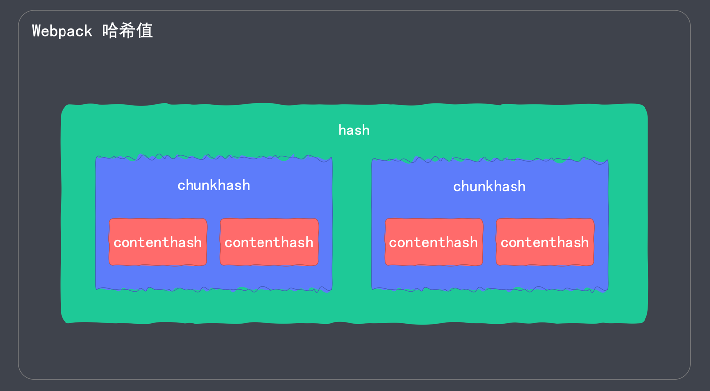

## 3. 进阶

### 3.1.区分打包环境

#### 3.1.1.Webpack 区分环境打包

##### 1. 通过环境变量区分

步骤：

1. 在命令中添加如下内容

```shell
webpack --env.production
```

2. 就可以在 webpack.config.js 中判断 env。示例代码如下：

```js
// webpack.config.js
module.exports = (env, argv) => {
  if (env.production) {
    // 生产环境的配置
  }
  // 开发环境的配置
}
```

##### 2. 通过配置文件区分

针对不同的环境，声明不同的配置文件。如：

- webpack.dev.conf.js (开发环境)
- webpack.prod.conf.js (生产环境)

执行打包时，指定配置文件

```shell
# dev 环境构建
webpack --config webpack.dev.conf.js
# prod 环境构建
webpack --config webpack.prod.conf.js
```

#### 3.1.2.通过环境变量区分

命令行中设置环境变量

```shell
# Webpack 4
webpack --env.production 
# Webpack 5
webpack --env production
```

webpack.config.js

- 读取环境变量 env.production
- 根据环境变量指定不同的配置

详情：<https://www.webpackjs.com/guides/environment-variables/>

> 注意：之前配置文件导出的是一个对象，现在导出的是一个函数。

```js
// webpack.config.js
module.exports = (env, argv) => {
  // 开发环境配置
  const config = {
    mode: 'development',
    // 更多配置...
  }

  if (env.production) {
    // 生产环境的配置
    config.mode = 'production'
    // 更多配置...
  }

  return config;
}
```

#### 3.1.3.通过配置文件区分

通过配置文件区分环境

- webpack.dev.conf.js(mode: development) 
- webpack.prod.conf.js(mode: production)
- webpack.base.conf.js(公共配置)

`webpack-merge` 插件：

- 将多个配置合并在一起
- <https://www.npmjs.com/package/webpack-merge>


---

实践：

在项目根目录创建三个配置文件：webpack.base.conf.js, webpack.dev.conf.js, webpack.prod.conf.js

```shell
# 安装 webpack-merge 插件
yarn add webpack-merge@5.7.3 -D
```

编写配置文件

```js
// webpack.dev.conf.js
// 开发配置文件

const { merge } = require('webpack-merge')
const baseWebpackConfig = require('./webpack.base.conf')

const devWebpackConfig = merge(baseWebpackConfig, {
  // 这里是开发环境对应的配置

})

module.exports = devWebpackConfig;
```

> 生产环境的配置与此类似。

```js
// webpack.base.conf.js

// 可以将 Style 部分公共的提取出来
const commonStyleLoader = [

  // 3. 将 CSS 打包到独立的文件中
  // MiniCssExtractPlugin.loader,
  {
    loader: MiniCssExtractPlugin.loader,
    options: {
      publicPath: '../'
    }
  },

  // 2.按照 CommonJS 规范，将样式文件输出到 JS 中
  'css-loader',

  // 1.通过 postcss-loader 给样式属性添加浏览器前缀
  'postcss-loader'
]

module.exports = {
  // 入口文件
  entry: './src/index.js',

  // 出口配置
  output: {
    // ...
  },

  // 模块配置
  module: {
    rules: [
      {
        test: /.css$/i,
        use: commonStyleLoader
      },
      {
        test: /.less$/i,
        use: [
          ...commonStyleLoader,
          // 1. 将 .less 转成普通的 css
          'less-loader'
        ]
      },
      // ...
    ]
  },

  // 开发服务器
  devServer: {
    // ...
  },

  // 配置目标
  target: "web",

  // 插件配置
  plugins: [
    new MiniCssExtractPlugin({
      // 打包之后的文件名称
      filename: 'css/[name].css' // 保持原文件名
    }),
    // ESLint
    new EsLintPlugin({
      // 自动解决常规的代码格式报错
      fix: true
    }),
    // 直接将 src 下不需要特殊处理的文件，直接复制到输出目录中
    new CopyWebpackPlugin({
      patterns: [
        {
          from: "src/public",
          to: "public"
        }
      ]
    }),
    // 打包之前先清除历史文件
    new CleanWebpackPlugin()
  ]
}
```

打包时指定配置文件

```shell
# 开发环境
webpack --config ./webpack.dev.conf.js
# 生产环境
webpack --config ./webpack.prod.conf.js
```

---

可以将这三个文件都放到一个文件夹中，如项目根目录的 `/config` 文件夹中，此时需要注意命令中配置文件的路径：

```shell
webpack --config ./config/webpack.dev.conf.js
```

同时还需要注意修改 `webpack.base.conf.js` 中的输出目录的配置 `exports.output.path: resolve(__dirname, '../dist')`

---

如果打包的时候命令太过复杂，可以通过使用 npm script 的方式简化命令。

在 package.json 中添加如下 npm script

```json
{
  "scripts": {
    "build:dev": "webpack --config config/webpack.dev.conf.js",
    "build:prod": "webpack --config config/webpack.prod.conf.js"
  }
}
```

此时，打包只需要执行如下命令即可

```shell
# 开发环境打包
npm run build:dev
# 生产环境打包
npm run build:prod
```

还可以将 DevServer 的命令也进一个简化

```json
{
  "scripts": {
    "test": "echo \"Error: no test specified\" && exit 1",
    "build:dev": "webpack --config config/webpack.dev.conf.js",
    "build:prod": "webpack --config config/webpack.prod.conf.js",
    "dev": "webpack serve --config config/webpack.dev.conf.js",
    "start": "webpack serve --config config/webpack.prod.conf.js"
  }
}
```

此时可以使用 `npm run dev` 开始调试了。

此外，在配置环境中还有一个常用的功能：DefinePlugin.

#### 3.1.4.Webpack DefinePlugin

作用：为配置注入全局变量。

比如：在开发环境和生产环境的接口地址不同，可以在开发环境和生产环境注入不同的接口地址。

示例代码如下：

```js
// webpack.config.js
const webpack = require('webpack')

module.exports = {
  // ...
  plugins: [
    new webpack.DefinePlugin({
      // 变量后面的值，是一个代码片段 (程序不会把他当成一个字符串)
      // API_BASE_URL: 'http://apidev.example.com', // 如果要最后输出为字符串，需要用如下形式：
      API_BASE_URL: JSON.stringify('http://apidev.example.com')
    })
  ]
}
```

在 index.js 中使用

```js
console.log('接口地址:', API_BASE_URL)
```

### 3.2.自定义 plugin

webpack 是基于插件机制的。

#### 3.2.1.自定义 plugin

Webpack 插件是一个具有 `apply` 方法的 JavaScript 对象。 
`apply` 方法会被 webpack `compiler` 调用，并且在整个编译生命周期都可以访问 `compiler` 对象。

原理: 通过在生命周期的钩子中挂载函数，来实现功能扩展

详情: <https://webpack.docschina.org/concepts/plugins/>

#### 3.2.2.生命周期与钩子

##### 生命周期

生命周期就是整个生命过程中的关键节点

- 人: 出生 -> 入学 -> 毕业 -> 结婚 -> 生子 -> 死亡
- 程序: 初始化 -> 挂载 -> 渲染 -> 展示 -> 销毁

> 生命周期就是指程序运行中的一些关键节点。

##### 钩子

- 钩子是提前在可能增加功能的地方，埋好(预设)一个函数
- 生命周期中的函数

> 钩子本质就是函数; 具体来讲就是程序运行关键节点的一些函数。

---

举例来讲：钩子是站点，在钩子中，可以挂载一些功能。


#### 3.2.3.Webpack 常用钩子

> [参考文档](https://www.webpackjs.com/api/compiler-hooks/)

| 钩子            | 描述              | 类型                |
|---------------|-----------------|-------------------|
| `environment` | 环境准备好           | `SyncHook`        |
| `compile`     | 编译开始            | `SyncHook`        |
| `compilation` | 编译结束            | `SyncHook`        |
| `emit`        | 打包资源到 output 之前 | `AsyncSeriesHook` |
| `afterEmit`   | 打包资源到 output 之后 | `AsyncSeriesHook` |
| `done`        | 打包完成            | `SyncHook`        |

> 其实可以发现：钩子就是一些标签函数，标记我们当前处在程序运行过程中的什么位置。

#### 2.3.4.插件与钩子


#### 2.3.5.自定义 plugin 的语法

```js
// 自定义插件
class MyPlugin {
  constructor(options) {
    console.log('插件选项：', options)
  }

  // 必须带有 apply 方法
  apply(compiler) {
    compiler.hooks.emit.tap('插件名称', (compilation) => {
      console.log('webpack 构建过程开始！', compilation);
    });
  }
}

module.exports = MyPlugin;
```

使用：

```js
const MyPlugin = require('./plugin/my-plugin')

module.exports = {
  // 插件配置
  plugins: [
    new MyPlugin({
      // 插件选项
    })
  ]
}
```

---

案例：自定义插件删除代码中的注释

```js
// 声明自定义插件
class MyPlugin {
  constructor(options) {
    console.log('插件配置选项:', options)
    this.userOptions = options || {}
  }

  // 必须声明 apply 方法
  apply(compiler) {
    // 在钩子上挂载功能
    // 以删除注释为例
    compiler.hooks.emit.tap('MyPlugin', compilation => {
      // compilation 是此次打包的上下文，可以通过他访问打包过程中的一些变量
      for (const name in compilation.assets) {
        console.log('asset name => ', name);
        // 针对 css 文件进行相关操作
        if (name.endsWith(this.userOptions.target)) {
          // 首先获取处理之前的内容
          const contents = compilation.assets[name].source()
          // 将原来的内容，通过正则表达式，删除注释
          const noComments = contents.replace(/\/\*[\s\S]*?\*\//g, '')
          // 将处理后的结果替换掉
          compilation.assets[name] = {
            source: () => noComments,
            size: () => noComments.length
          }
        }
      }

    })
  }
}

module.exports = MyPlugin;
```

使用

```js
new MyPlugin({target: '.css'})
```

### 3.3.自定义 loader

Loader 本质上就是一个 ESM 模块，它导出一个函数，在函数中对打包资源进行转换。

案例：声明一个读取 markdown(`.md`)文件内容的 loader

需要借助第三方的包：

1. `marked`(将 markdown 语法转成 html)
2. `loader-utils` (接受 loader 的配置项)

软件包安装

```shell
yarn add -D marked@2.0.5
yarn add -D loader-utils@2.0.0
```

#### 3.3.1.自定义 loader 的语法

```js
const marked = require('marked')
const { getOptions } = require('loader-utils')

// 自定义 loader
module.exports = function(source) { // source 就是要处理的文件内容
  
  // 获取 loader 的配置项
  const options = getOptions(this)
  
  // 对输入内容进行处理
  const html = marked(source)
  
  // 交给下一个 loader 进行处理
  return html
}
```

---

测试案例

```js
// loader/markdowk-loader.js
const marked = require('marked')
// loader 本质上导出的是一个函数
module.exports = source => {
  // return 'my loader' // 此处不能返回一个字符串，必须是一个 js 的代码
  // return 'console.log("my loader")'

  const html = marked(source) // 返回结果是字符串
  // return `module.exports = "${html}"` // 返回的必须是 JS 代码 // => "<h1 id="关于">关于</h1><p>我是张三</p>" // 引号冲突了
  return `module.exports = ${JSON.stringify(html)}` // 此时能够正常执行了。
}
```

```js
// webpack.config.js
// 模块配置
module: {
  rules: [
    // markdown 处理
    {
      test: /\.md/i,
      use: './loader/markdown-loader' // 引入本地自定义的 loader 需要使用写相对路径名；如果发布到 npmjs 了的包，可以直接使用 loader 名字
    }
  ]
}
```

在 index.js 中使用

```js
// 引入 markdown
import about from './about.md';

// eslint-disable-next-line
console.log(about);
```

#### 3.3.2.loader 机制


在实际使用过程中，我们可能实际上对同一个 source 配置了多个 loader，
我们只需要保证最后一个 loader (本例中的 Loader C) 返回的是 JS 代码就可以了。


---

测试多个 loader

```js
// loader/markdown-loader.js
const marked = require('marked')
module.exports = source => {
  const html = marked(source) // 返回结果是字符串
  // 如果当前的 loader 不是最后一个 loader，可以直接返回 html 交给下一个 loader 进行处理。
  // 只需要保证最后一个 loader 的返回值是 JS 代码就可以了。
  return html; // 返回的 html 将交由下一个 loader 继续进行处理
}
```

使用

```js
// webpack.config.js
// 模块配置
module: {
  rules: [
    // markdown 处理
    {
      test: /\.md/i,
      use: [ // 多个 loader. 注意 loader 的声明顺序，后声明的 loader 先执行
        // 2.将 html 导出为字符串
        'html-loader',
        // 1.将 .md 文件转换为 html 代码
        './loader/markdown-loader'
      ]
    }
  ]
}
```

再次打包，可以在 bundle.js 中查看打包后的信息。

---

在 loader 中获取配置项数据

使用

```js
// webpack.config.js
// 模块配置
module: {
  rules: [
    // markdown 处理
    {
      test: /\.md/i,
      use: [
        'html-loader',
        {
          loader: './loader/markdown-loader',
          options: { // loader 添加参数
            size: 20
          }
        }  
      ]
    }
  ]
}
```

loader 声明中使用

```js
// loader/markdown-loader.js
const marked = require('marked')
const { getOptions } = require('loader-utils')
module.exports = function(source) { // 注意：如果想要获取参数的话，必须使用普通函数，不能使用箭头函数！！！
  // 获取 loader 的配置项
  const options = getOptions(this)
  console.log('my loader options => ',options)

  const html = marked(source)
  return html;
}
```

再次使用 `webpack` 命令打包，能够在控制台看到输出：`my loader options =>  { size: 20 }`

> 注意：因为 this 的指向问题，要想在 loader 中获取参数的话，在声明的时候必须使用普通函数声明，不能使用箭头函数声明。

> 建议：在自定义 loader 中使用普通函数！！！

### 3.4.代码分离(Code Splitting)

为什么？

- 如果把所有代码都打包到一起，可能最终的代码非常大。从而影响加载时间.
- 而且，很多代码是初始加载时，不需要的。因此，我们可以根据代码使用的紧急程度，将代码分割打包后，按需加载.


---

怎么分离？

- 多入口打包: 配置 `entry` 加载多个入口文件
- 提取公用模块: `optimization.splitChunks.chunks: all`
- 动态导入:按需加载 | 预加载

#### 3.4.1.多入口打包

1. `entry`(后面写成对象), 如：`{ index: './src/index.js', about: './src/about.js' }`
2. `output.filename`(不能写成固定名称，否则报错), 如: `[name].bundle.js`
3. `HtmlWebpackPlugin`(不同页面加载各自的 `bundle`), 如: `chunks: ['index'], chunks: ['about']`

- index.html 加载 index.bundle.js
- about.html 加载 about.bundle.js

---

实践

在 src 下创建 about.js 文件，作为新的入口

```js
// webpack.config.js
module.exports = (env, argv) =>{
  const config =   {
    // 多入口打包
    entry: {
      'index': './src/index.js',
      'about': './src/about.js'
    },
    // 出口配置
    output: {
      path: resolve(__dirname, 'dist'),
      // 输出文件名使用动态
      filename: '[name].bundle.js'
    },
    
    // 插件配置
    plugins: [
      new HtmlWebpackPlugin({
        filename: 'index.html',
        template: './src/index.ejs',
        title: 'Webpack Demo',
        // 指定要加载的打包文件 (如: index.bundle.js, index.css 等)
        chunks: ['index']
      }),
      new HtmlWebpackPlugin({
        filename: 'about.html',
        template: './src/index.ejs',
        title: '关于我们',
        // 指定要加载的打包文件 (如: about.bundle.js, about.css 等)
        chunks: ['about']
      }),
    ]
  }

  return config;

}
```

#### 3.4.2.提取公共模块

如果多个页面都用到了一个公共文件(例如:jQuery)，每个页面都将公共文件打包一次是不合理的。更好的办法是将公共文件提取出来。

例如: 京东的商品页超过 1000000 个，如果打包的 1000000 个文件都包含 jQuery，打包文件会超过 80G(88KB * 1000000)

`optimization.splitChunks.chunks: 'all'`： 将公共文件提取出来，单独打包


---

实践

出于测试需要，生产安装一个 jQuery 依赖

```shell
yarn add jquery@3.6.0
```

在 index.js 和 about.js 中都使用一下 jQuery

```js
import $ from 'jquery'
// 给 body 添加一个 页脚(包含备案号)
$('body').append('<h3>备案号：XXXXXXXX</h3>')
```

再次打包，发现两个 js 文件都变成了 300kb+ (因为他们俩现在都包含了 jQuery 的代码)

```js
// webpack.config.js
module.exports = (env, argv) =>{
  const config =   {
    // 优化策略
    optimization: {
      splitChunks: {
        chunks: 'all' // 将所有的公共文件，单独提取出来
      }
    }
  }
  return config;
}
```

再次打包，发现多了两个 js 文件，他们里面包含了公共的内容；index.bundle.js 和 about.bundle.js 体积又恢复到 10kb-

#### 3.4.3.动态导入

懒加载

- 默认不加载，事件触发后才加载
- `webpackChunkName: '加载名称'`

预加载

- 先等待其他资源加载，浏览器空闲时，再加载
- `webpackPrefetch: true`
- 缺点:在移动端有兼容性问题

> 懒加载就是默认不加载；预加载默认是要加载，只不过加载顺序靠后。先加载要紧的内容，等浏览器闲下来了，再去加载"预加载"指定的内容。

---

实践

按需加载环境准备

在 index.ejs 中添加一个按钮

```html
<button id="btn">什么是Webpack？</button>
```

在 src 下创建 wp.js 文件

```js
// 判断模块是否加载
console.log('模块加载了。')

export function desc() {
  return 'Webpack 是一款前端打包工具'
}
```

在 index.js 中添加如下代码

```js
// 验证按需加载
document.getElementById('btn').onclick = function () {
  import(/* webpackChunkName: 'desc' */'./wp') // 使用注释指定打包后的文件名 => desc.bundle.js
    .then(({ desc }) => alert(desc()))
}
```

此时刷新页面，既不会执行 wp.js 中的 log 函数，查看浏览器 Network 也没有加载 desc.bundle.js 文件。
只有当点击页面上的按钮时，才会加载 wp.js 中的内容。

---

预加载测试

只需要在代码的注释中添加一个配置项就可以了

```js
// index.js
document.getElementById('btn').onclick = function () {
  // import 启动懒加载
  // webpackChunkName: 'desc' => 指定懒加载的名称
  // webpackPrefetch: true => 启动预加载
  import(/* webpackChunkName: 'desc', webpackPrefetch: true */'./wp')
      .then(({ desc }) => alert(desc()))
}
```

此时刷新页面，虽然不会马上执行 wp.js 中的 log 函数，查看浏览器 Network 可以看到已经加载了 desc.bundle.js 文件。
当点击页面上的按钮时，会马上执行 wp.js 中的 log 函数和按钮的点击事件函数。

### 3.5.源码映射(Source Map)

什么是 Source Map ？

Source Map 是一种源代码与构建后代码之间的映射技术。具体来说就是通过 `.map` 文件，将构建后的代码与源代码之间，建立映射关系。

为什么要用 Source Map ？

- 问题: 构建后代码出了问题之后不好定位
- 方案: 有了 Source Map 后，可以快速定位问题代码

如何生成 Source Map ？ 

只需要添加一个如下所示的配置项：

```js
devtool: '映射模式'
```

---

实践

在 index.js 中改错一行代码，然后通过生产模式运行(生产模式会压缩代码)

```shell
webpack serve --env production
```

打开控制台，会发现代码有报错，同时发现错误定位到了 index.bundle.js 中，而这个文件所有代码都被压缩到一行代码当中了。那这时候怎么定位问题呢？

可以通过 Source Map 的方式解决。

```js
// webpack.config.js
if (env.production) {
  // 启用 source map 定位问题
  config.devtool = 'source-map'
}
```

重启项目后刷新页面，会发现问题已经能够正常定位到源代码的位置了。

> 之所以能够实现，是因为浏览器开启了 Source Map 的支持。
> 
> 开启 SourceMap 支持：Setting > Preferences > Sources > Enable JavaScript source maps, Enable CSS source maps

---

Source Map 的底层支持

我们执行一下生产环境的打包，查看文件

```shell
webpack --env production
```

可以看到，在生成的文件中对 `*.bundle.js` 文件都生成了 `*.bundle.js.map` 文件，以 `desc.bundle.js.map` 文件为例：

```json
{"version":3,"file":"desc.bundle.js","mappings":"+GAGO,SAASA,IACd,MAAO,mBACR,C,2BAJDC,QAAQC,IAAI,S","sources":["webpack://11_source_map/./src/wp.js"],"sourcesContent":["// 判断模块是否加载\nconsole.log('模块加载了。')\n\nexport function desc() {\n  return 'Webpack 是一款前端打包工具'\n}"],"names":["desc","console","log"],"sourceRoot":""}
```

可以看到，其实本质上他就是一个 JSON。

- `version`: Source Map 的版本，当前的 Source Map 的版本就是 3.
- `sources`: 后面是一个数组，他包含的是转换前的文件的名称。当前例子中：转换前的文件名叫 wp.js, 转换后叫 desc.bundle.js。

> `desc` 这个名字是通过懒加载的 `import()` 方法的 `webpackChunkName` 参数指定的。

> `sources` 数组中的这个名字是转换前文件的全路径名; 其中 `11_source_map` 是 package.json 中指定的项目名;

> `sources` 的数据类型是数组，那就表示可以是多个源文件，也就是说可以将多个源文件打包成一个文件。比如 `about.bundle.js.map` 中可以看出，有多个源文件。

- `names`: 所有转换之前的变量、函数名等。
- `mappings`: 重要。是一个字符串，在字符串中包含了映射关系。【这是关联源码和构建之后的代码的字符串】
- `file`: 文件的名称。就是说当前 map 文件是哪一个文件的 map。比如当前文件就是 desc.bundle.js 文件的 map 文件。
- `sourcesContent`: 就是源码内容。
- `sourceRoot`: 一般为空。

映射是如何完成的呢？

构建后的代码在结尾都有一行注释，如下所示：

```js
// desc.bundle.js
"use strict";(self.webpackChunk_11_source_map=self.webpackChunk_11_source_map||[]).push([[612],{9838:(e,c,s)=>{function u(){return"Webpack 是一款前端打包工具"}s.r(c),s.d(c,{desc:()=>u}),console.log("模块加载了。")}}]);
//# sourceMappingURL=desc.bundle.js.map
```

`sourceMappingURL=desc.bundle.js.map` 表明：当前这个 js 文件是通过 sourceMappingURL 这个文件完成映射。

---

还有一个小问题：我们发现构建后的所有的 .js 文件都有一个 .js.map 的文件。这实际上跟我们刚刚的配置有关，
我们使用的 `devtool` 是 `'source-map'`，如果启用其他的映射模式，这里单独的 .map 文件可能会消失，会把映射内容放到 *.bundle.js 当中。
下一节我们仔细研究 `devtool` 中的各种映射模式。

#### 3.5.1.映射模式

> 映射模式就是指 `devtool` 可选的值。

- 不同映射模式的定位效果和执行速度不同
- Webpack 4 中，一共有 13 种不同的映射模式
- Webpack 5 中，一共有 26 种不同的映射模式

Webpack 5 中的命名也更加严格

`cheap-module-eval-source-map`(Webpack4) => `eval-cheap-module-source-map`(Webpack5)

Webpack5 的统一语法格式：`^(inline-|hidden-|eval-)?(nosources-)?(cheap-(module-)?)?source-map$`

---

关键字详解：

- `source-map`: 功能最全，也最慢。报错时，可以定位到具体的行和列。
- `cheap`: 相对于不 cheap 的少了一些信息，具体来说就是少了报错的"列"信息。
- `hidden`: 本意是隐藏，我们可以通过 `hidden` 模式生成 `.map` 文件，但是在 `.js` 的尾部没有关联这个 `.map` 文件。需要手动查看报错的时候，才去关联。
- `inline`: 不生成 `.map` 文件，映射相关的内容会以 Base64-VLQs 的形式添加到 .js 文件的后面。
- `eval`: 不生成 `.map` 文件，映射信息追加到 `eval` 函数的最后
- `module`: 不但映射工程师自己写的代码，还支持对 loader 和第三方模块的映射
- `nosources`: 就是没有源代码，生成的 `.map` 中不包含 `sourcesContent`, 定位错误时看不到源码，更加安全。

##### source-map


##### cheap-source-map


相较于 source-map 少了 `names`, 因为 `names` 中保存了函数和变量名，所以也就丢失了定位列的能力。

> 他定位列就是通过变量和函数名来实现的。

通过对比打包后的文件发现，cheap 的少了 `names` 属性，同时 `mappings` 属性的内容也相对少了很多，因为他只能定位到报错的行，不能定位到报错的列。cheap 的 .map 文件体积也会小很多。

##### cheap-module-source-map


带了 `module` 因此会包含一些 loader 和第三方模块的映射。

同时他也不包含 `names` 和 `sourcesContent`

##### nosources-source-map


去掉了源码内容，也是不包含 `sourcesContent` 了。

##### hidden-source-map


`.js` 文件尾巴上没有那一行关联的注释，因此不会关联上 `.map`, 只有收到报错时才会去关联。

少了这个关联，在一定程度上提高了构建效率。

##### inline-source-map


不会生成独立的 `.map` 文件，直接将信息添加到 `.js` 文件结尾的关联的注释后面。

##### inline-cheap-source-map


##### inline-cheap-module-source-map


##### eval


代码映射放到了每个 `eval` 函数的最后。

只能定位到文件，不能定位到行列。

映射信息最少，执行速度最快。

##### eval-source-map


报错时增加了定位的行列信息。

##### eval-cheap-source-map


报错时只有行的定位信息。

##### eval-cheap-module-source-map


报错时包含了行列信息，而且还包含了第三方模块的映射。

#### 3.5.2.映射模式选择

前面的这些模式都是 Webpack4 中就已经有的，Webpack5 又新增了一些排列组合。Webpack 5 中新增了模式不一定都能生效，要使用时需要先验证。

> 如：`inline-nosources-source-map`, 现在测试其实是成功的。

如何选取合适的映射模式 (个人建议 - 不绝对)

- 开发环境(`cheap-module-eval-source-map`)
- 生产环境(`none` | `nosources-source-map`)

### 3.6.删除冗余代码(Tree Shaking)

Tree Shaking(摇树)

Tree Shaking 的作用是删除未引用代码(dead code)

- return 后面的代码
- 只声明，而未使用的函数
- 只引入了库，未使用库的代码


为什么叫"摇树"呢？因为 Webpack 中各个模块的依赖，结构像树一样。这些依赖当中，有些模块可能没有用，如图中的 A 和 D，在打包的时候就去掉。

#### 3.6.1.使用

前提: 使用 ES Modules 规范的模块，才能执行 TreeShaking

> 因为 TreeShaking 依赖于 ES Modules 的静态语法分析。

如何使用？

- 生产模式: Tree shaking 会自动开启
- 开发模式:
  - `usedExports`
  - `sideEffects`

#### 3.6.2.`usedExports` 实现

在 webpack.config.js 文件中指定 `optimization.usedExports` 选项。(标记没用的代码)

> usedExports, 字面意思是：使用的导出。可以标记模块的哪些导出被使用了。能够知道哪些导出内容被使用了，当然也能知道哪些被导出的内容没有被使用。
> 没有被使用的代码，就应该被删掉。

在打包完成之后，没有用到的代码前面会加如下注释：

```js
/* unused harmony export xxxxx */
```

这行注释就是用来标记没有用的代码的。

删除代码的功能由 `terser-webpack-plugin` 实现。

`terser-webpack-plugin` 的功能就是：删除 `unused harmony export xxxxx` 标记的代码。

----

这种方式总共分两步：1、标记没有用的代码；2、删除标记的代码。

---

`terser-webpack-plugin`:

- `optimization.minimize: true` ( 删除 `unused harmony export xxxxx` 标记的代码 )
- Webpack 4 需要单独安装(Webpack 5 无需安装)
- <https://www.npmjs.com/package/terser-webpack-plugin>

**Tree Shaking 与 Source Map 存在兼容性问题**

- 要使用 TreeShaking, 映射模式只能是这四者之一：`devtool: source-map|inline-source-map|hidden-source-map|nosources-source-map`。
- `eval` 模式，将 JS 输出为字符串(不是 ES Modules 规范)，导致 TreeShaking 失效。

---

实践

在 src 下创建一个 math.js 文件

```js
export function add(x, y) {
  return x + y;

  console.log('加法运算');
}

export function minus(x, y) {
  return x - y;

  console.log('减法运算');
}
```

在 index.js 中使用它

```js
import { add } from './math.js'
console.log('2 + 4 = ',add(2, 4))
```

此时，只引入了其中一个方法。然后执行一个线上打包：

```shell
webpack --env production
```

查看构建后的 index.bundle.js 中 `console.log("2 + 4 = ",6)` 后面并没有 `console.log('加法运算');`，说明 TreeShaking 是生效的。

现在在开发环境下验证：

首先添加 `optimization.usedExports: true`, 然后使用 `webpack` 命令执行开发环境下的打包。
查看打包后的 index.bundle.js 文件, 可以看到未使用的代码 `minus` 方法和 `add` 方法上面的 `unused xx` 的注释。

添加配置 `optimization.minimize: true`, 再次查看 index.bundle.js 可以看到 math.js 中没用的都已经删除了。

> 如果这段构建出来的 index.bundle.js 和教程中的结果一样，检查一下是否在 webpack.config.js 中的开发环境默认配置中添加了 `devtool: 'source-map'`。

```js
const TerserPlugin = require('terser-webpack-plugin');

module.exports = (env, argv) =>{
  const config =   {
    optimization: {
      // 标记未被使用的代码
      usedExports: true,
      // 最小化输出(删除没有用的)
      minimize: true,
      // 指定最小化插件
      minimizer: [new TerserPlugin()]
    }
  }
  return config;
}
```

#### 3.6.2.`sideEffects` 实现

`sideEffects`的字面意思就是：副作用。

- 无副作用: 如果一个模块单纯的导入导出变量，那它就无副作用
- 有副作用: 如果一个模块除了实现自身基本功能外，还修改了其他模块或者全局的一些东西，就有副作用。

如：修改全局变量，在原型上扩展方法，CSS 的引入等。

比如：jQuery 中使用的 `$` 是挂载在 window 对象下面的，如果我们在代码中 `window.$ = 123`, 那么此时我们的代码就有副作用，因为他修改了全局对象 window 下面的内容。

---

`sideEffects` 的作用: 把未使用但无副作用的模块一并删除。

> 对于没有副作用的模块，未使用代码不会被打包(相当于压缩了输出内容)


TreeSharking 的时候有副作用的函数不会被删除，无副作用的函数会被删除。

---

1. 开启副作用(webpack.config.js)

```js
optimization.sideEffects: true
```

2. 标识代码是否有副作用(package.json)

`sideEffects`

- `false`: 所有当前模块的代码都没有副作用(告诉 webpack 可以安全地删除未用的 `exports`)
- `true`: 所有代码都有副作用 (不常用)
- 数组: 告诉 webpack 哪些模块有副作用，不删除, 如：`['./src/wp.js', '*.css']`; 数组中的内容可以是相对路径、绝对路径、正则表达式。

---

实践：src 下创建一个有副作用的模块 extend.js

```js
// 为 Number 的原型添加一个扩展方法
Number.prototype.pad = function (size) {
  let res = this + "";
  while (res.length < size) {
    res = '0' + res;
  }
  return res;
}
```

如果我们引入了这个模块，那么以后我们所有对数字掉操作，都会受到影响。这就是有副作用。

通过前面两步开启副作用检测(webpack.config.js)和标记当前模块没有副作用(package.json 中 sideEffects 设置为 false), 再次打包后查看 index.bundle.js 文件可以发现，
使用的前面的引入(`import './extend'`)没有了。

> 如果这段构建出来的 index.bundle.js 和教程中的结果一样，检查一下是否在 webpack.config.js 中的开发环境默认配置中添加了 `devtool: 'source-map'`。

通过 `webpack serve` 命令启动服务，可以发现 css 也丢失了, `pad` 方法也报错没有这个方法。因为 `import './extend'` 就是前面说的"只引入没有导出"的代码。

> 只是引入了 `'./extend'` 模块，但是没有导出"模块导出的内容". 正常的情况应该是：`import { xx } from './extend'`。

如何回复正常？只需要将 package.json 中的配置改为如下即可：

```json
{
  "sideEffects": [
    "./src/extend.js",
    "./src/css/**"
  ]
}
```

### 3.7.缓存

#### 3.7.1.Babel 缓存

启用 Babel 缓存，只需要在 Babel 的 Options 配置中添加 `cacheDirectory: true` 即可。第二次构建时，会读取之前的缓存。


初次构建，会对所有的 .js 文件进行 ES 的转译；后续构建时，只会转译修改过的 .js 文件，其他的部分就是用缓存中的内容。

#### 3.7.2.文件资源缓存

还可以对文件资源进行缓存。

- 问题: 如果代码在缓存期内，代码更新后看不到实时效果。
- 方案: 将代码文件名称，设置为哈希名称，名称发生变化时，就加载最新的内容。


客户端请求 a.js，服务端收到请求后，就返回 a.js.(这个过程也可以称为：响应)。

存在问题：如果请求量比较大的话，比如一天 10000000 次，就会把大量的精力放在请求和响应上，造成资源的浪费。

为了应对高并发，可以采取措施：可以将文件缓存到客户端一份。


当客户端中有缓存了，后面再需要 a.js 就不需要请求服务器了，直接使用本地的 a.js 就可以了。

缓存虽然解决了高并发的问题，但是如果 a.js 发生了变更，我们还是使用本地的旧的 a.js，页面上就不能实时的显示最新的结果。 


可以在每一次文件修改后，都改一下文件的名称，比如改为 b.js。此时再需要使用 js 就需要按照正常的方式去请求 b.js 了。


此时，a.js 就不再需要了。我们可以在客户端将 b.js 再缓存一份。

此处修改名字的方式处于简单起见直接使用 a.js 表示旧的，b.js 表示新的。但是实际使用时，如果手动改名字的话，新的名字很容易和以前的名字重复，
我们要确保名字永远不会和旧的文件名重复，Webpack 为此提供了一个方案：Webpack 的哈希值。

#### 3.7.3.Webpack 哈希值

> 哈希值每次都是唯一的，永远不会重复。

Webpack 的哈希值有三种类型：

##### 1. `[hash]`

(每次 Webpack 打包生成新的 hash 值)

只要有一个文件修改了，所有打包后的文件(js, css)都会文件都会生成新的哈希。

##### 2. `[chunkhash]`

不同 chunk 的 hash 值不同 – 同一次打包可能生成不同的 chunk

只会更改一路：如更新了 a.js 的内容, 只会更新 a.js 和 a.css 的文件名字；b.js 和 b.css 的名字不会变。

##### 3. `[contenthash]`

不同内容的 hash 值不同 - 同一个 chunk 中可能有不同的内容

只会变更对应内容的文件名称：如更新了 a.css 的内容，只会更新 a.css 的文件名称；a.js, b.css, b.js 文件名都不会发生变更。

三种类型的关系如图所示：



`hash` 影响所有；`chunkhash` 只影响一路；`contenthash` 只影响修改了的文件。

---

实践

```js
module.exports = (env, argv) =>{
  const config =   {
    module: {
      rules: [
        {
          test: /\.m?js$/,
          exclude: /node_modules/,
          use: {
            loader: 'babel-loader',
            options: {
              // 第二次构建的时候，会读取之前的缓存
              cacheDirectory: true,
            }
          }
        }
      ]
    }
  }

  return config;
}
```

测试关闭 `cacheDirectory` 打包耗时 828 ms, 开启后耗时缩短为 634 ms。

此时虽然能够缓存，但是因为文件名没有更新，不能及时更新新的内容。将输出文件名改为：

```js
filename: '[name].[hash].js'
```

> 同时还要注意 `MiniCssExtractPlugin` 中配置的 css 的输出文件，也要改为使用 hash `filename: 'css/[name].[hash].css'`

此时会发现打包后的文件名会带有 hash. 随便修改一个文件后，再次进行打包，会发现所有文件名后的 hash 值都变了。

使用 `chunkhash`, 会发现 `index.**` 的文件的 hash 值是一样的。这就是所谓的"一路"。改一下 about.js 的内容，再次打包，发现只有 about.xx 的 hash 值变了。

再使用 `contenthash` 会发现 index.js 和 index.css 的 hash 值都不一样了。

---

hash 的默认长度是 20，可以通过 `[name].[hash:8].js` 的方式，将 hash 的长度限制到 8 位。

### 3.8.模块解析(resolve)

观察如下一段代码：

```js
import 'bootstrap';
```

可能会有疑问：这是在哪里引入的 boostrap ? 引入的是哪种类型的文件 ？是 .js 还是 .css ?

这就涉及"模块解析"中的规则。配置好模块解析规则后，代码会更加简洁。

---

`resolve` 配置项

作用：配置模块解析的规则

`resolve` 中有两个常用的配置项：

1. `alias`: 配置模块加载的路径别名.

```js
alias: `{'@': resolve('src’)}` // 后续再引入 src 目录下的内容时，可以直接使用 @/ 的方式
```

2. `extensions`: 引入模块时，可以省略哪些后缀名.

```js
extensions: `['.js', '.json']` // 默认只识别 .js 和 .css 这两类文件。一旦这里显式的指定了扩展名之后，默认的规则就失效了。
```

> 如果我同时有 a.js, a.json, a.css, 那么我写 `import 'a'` 的时候到底引入谁呢？答案是这个数组中，谁先声明就引入谁。

其他配置项详情：<https://www.webpackjs.com/configuration/resolve/>

---

实践

修改配置文件 webpack.config.js

```js
module.exports = (env, argv) => {
  const config = {
    // 模块解析规则
    resolve: {
      alias: {
        // 指定路径的别名
        '@': resolve('src')
      },
      // 指定引入文件的后缀名。指定后，在引入文件时，后缀名可以省略。
      extensions: ['.js', '.json', '.less'],
      // 指定模块默认加载的路径
      modules: [resolve(__dirname, './node_modules'), 'node_modules'] // 当前两个配置项都是从当前项目的根目录下的 node_modules 中加载；如果位置有变的话，第一个可以改为 ../node_modules
    }
  }
  return config;
}
```

然后在 index.js 中使用的时候

```js
import { add } from '@/math'
console.log('2 + 4 = ',add(2, 4))
```

运行程序 `webpack serve`，在浏览器看到能够正常执行。OK~，其他的模块也可以这样引入了。

### 3.9.排除依赖(externals)

`externals` 配置项

功能：排除打包依赖项(防止对某个依赖项进行打包)

一般来说，一些成熟的第三方库，是不需要打包的。例如:jquery，我们可以直接使用 CDN 中的压缩版，没必要打包。

`externals` 详细信息：<https://www.webpackjs.com/configuration/externals/>

---

实践

```js
// webpack.config.js
module.exports = (env, argv) => {
  const config = {
    // 排除打包依赖项
    externals: {
      'jquery': 'jQuery' // 前面是 库 的名字，后面是 包 的名字
    }
  }
  return config;
}
```

排除之后，可以在使用的地方直接引入。如 index.ejs 中

```html
<script src="https://cdn.bootcdn.net/ajax/libs/jquery/3.6.0/jquery.min.js"></script>
```

程序也可以正常执行。

> 后续如果使用了一些第三方的库，而且这些库也比较大，就可以使用 `extrenals` 将他们排除在打包之外。

### 3.10.模块联邦

多个应用，可以共享一个模块(本地可以调用远程的模块)

模块提供方(远程)

- `name`: 当前应用名称(供调用方使用)
- `filename`: 打包后的文件名称(供调用方使用)
- `exposes`: 暴露模块(相当于 `export` 导出)，暴露模块时可以指定：`模块名称: 模块文件路径`

模块使用方(本地)

- `remote`: 导入模块(相当于 `import`)
- 导入语法：`导入后的别名: "远程应用名称@远程地址/远程导出的文件名"`
- 使用语法：`import("导入后的别名/模块名称").then( //... )`


可以在应用 B 中使用模块 D。

模块联邦: <https://webpack.js.org/concepts/module-federation/>

---

实践

创建两个项目 app1 和 app2

```shell
mkdir app1 app2

cd app1
npm init -y
yarn add -D webpack@^5.38.1 webpack-cli@^4.7.0 html-webpack-plugin@^5.3.1 webpack-dev-server@^3.11.2

cd ../app2
npm init -y
yarn add -D webpack@^5.38.1 webpack-cli@^4.7.0 html-webpack-plugin@^5.3.1 webpack-dev-server@^3.11.2
```

```js
// app1/webpack.config.js
// 引入模块联邦插件
const Mfp = require('webpack').container.ModuleFederationPlugin

module.exports = {
  plugins: [
    // 模块提供方
    new Mfp({
      // 应用名称 (供调用方使用)
      name: 'app1',
      // 导出文件的名称(调用方引入的文件名称)
      filename: 'app1.js',
      // 暴露模块
      exposes: {
        // 模块名称：模块对应的代码路径
        './sitename': './src/sitename.js'
      }
    })
  ]
}
```

```js
// app2/webpack.config.js
// 引入模块联邦插件
const Mfp = require('webpack').container.ModuleFederationPlugin

module.exports = {
  plugins: [
    // 模块使用方
    new Mfp({
      // 导入模块
      remotes: {
        // 导入别名："远程应用名称@远程应用地址/远程导出文件的名称"
        appone: "app1@http://localhost:3001/app1.js"
      }
    })
  ]
}
```

```js
// app2/index.js
// 调用 app1 中的模块
import('appone/sitename').then(res => {
  // res.default() // 调用默认返回的函数
  const title = res.default('应用B')
  document.body.append(title)
})
```

> 模块联邦也是微前端的解决方案。

## 4.项目

### 4.1.常规操作(项目部署)

```shell
# 初始化项目
npm init -y
# 常规操作
npm i -D webpack webpack-cli html-webpack-plugin webpack-dev-server copy-webpack-plugin clean-webpack-plugin mini-css-extract-plugin css-loader style-loader postcss-loader autoprefixer babel-loader @babel/core @babel/preset-env
```

- webpack.config.js
- src/index.js
- src/index.ejs

### 4.2.Webpack 中使用 Bootstrap

<https://getbootstrap.com/docs/5.0/getting-started/webpack/>

```shell
# 安装 Bootstrap
npm i bootstrap @popperjs/core
# 样式
npm i -D sass sass-loader
```

- 配置 sass 文件
- 验证效果(导航菜单，轮播图)

### 4.3.Webpack 在 Vue 中的应用

```shell
# 安装脚手架工具
sudo npm i -g @vue/cli
sudo npm i -g @vue/cli-init
# 初始化 vue 项目
vue init webpack projectname
# 运行 vue 项目
cd projectname
npm run dev
```

如果安装依赖的时候报错，执行：`npm install --ignore-scripts` 安装

命令行中指定的端口号，优于配置文件中指定的端口号。

### 4. Webpack 在 React 中的应用

```shell
# 安装脚手架工具
sudo npm install -g create-react-app
# 初始化 React 项目
create-react-app projectname
# 运行 React 项目
cd projectname
npm start
# 弹出 webpack 配置 (默认隐藏 webpack 的配置，需要执行这个命令才会显示; 执行之前注意要 Git 提交，否则会报错)
npm run eject
```
