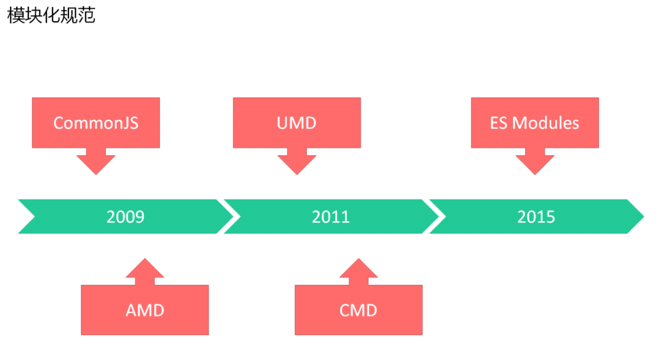
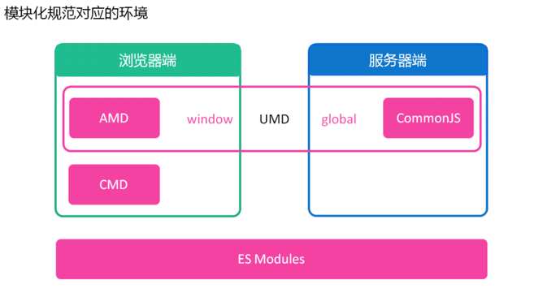
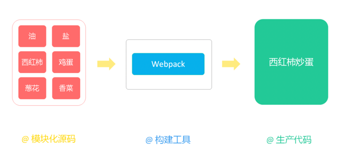
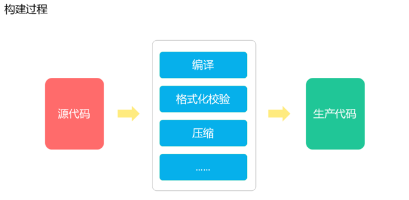
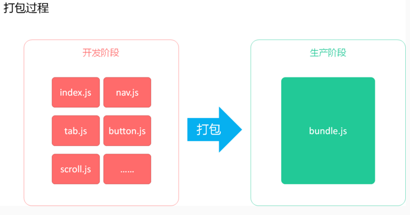
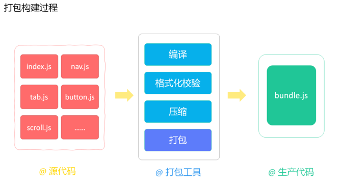
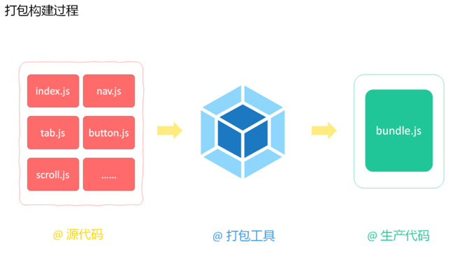
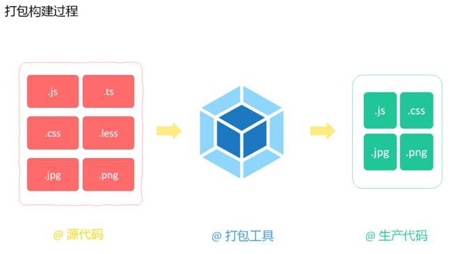
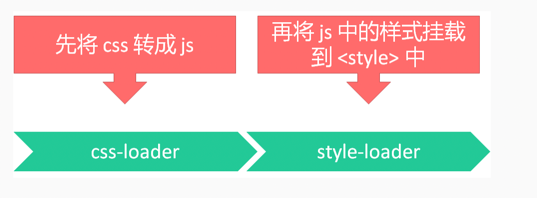
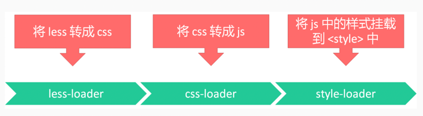

## 模块化

JavaScript 的模块化编程

### 模块化演变

#### ⽂件划分⽅式(1999)

具体做法就是将每个功能，各⾃单独放到不同的⽂件中，约定每个⽂件就是⼀个独⽴的模块，使⽤某个模块就是将这个⽂件引⼊到⻚⾯中，然后直接调⽤⽂件中的成员(变量/函数)。

这种⽅式的缺点⾮常明显，所有模块都在全局⼯作，没有私有空间，所有成员，都可以在模块外被访问和修改：

- 污染全局变量
- 命名冲突问题
- 依赖关系不好管理

#### 命名空间⽅式(2002)

虽然命名空间解决了命名冲突问题，但是，仍然有其⾃身的缺点：

- ⼤型项⽬还是不好维护
- 没有解决模块间依赖问题

#### IIFE(2004)

IIFE: Immediately Invoked Function Expression，意为⽴即调⽤的函数表达式。也就是说，声明函数的同时⽴即调⽤这个函数。
我看可以通过⾃执⾏函数实现数据的私有化隔离(函数上下⽂)。

IIFE 不污染全局环境，提供闭包环境，有了私有成员的概念，私有成员只能在模块成员内通过闭包的形式访问。

IIFE 除了提供闭包环境外，还解决了模块依赖管理的问题

例如：通过 IIFE 参数，可以传递依赖模块的内容

#### 模块化(2009)

2009 年，随着 Node.js 的发布，JS 才真正的迎来了模块化时代。

### 模块化规范

模块化规范产⽣的时间表



模块化规范对应的环境



#### CommonJS

- 简介: CommonJS 规范是 Node.js ⽀持的模块规范。
- 代表产品: ⼩程序
- 语法:
  - `module` 表示当前模块
  - `module.exports` 是 module 的⼀个属性，⽤来导出模块内容(未导出部分是私有内容)
  - `require` ⽤来加载 `exports` 属性导出的内容

#### AMD

- 简介: Asynchronous Module Definition(异步模块规范), 专为浏览器⽽设计。⽤异步加载技术来定义模块和依赖，为了不造成⽹络阻塞。只有当依赖的模块加载完毕，才会执⾏回调。
- 代表产品: Require.js
- 语法:
  - `define` 来定义模块
  - `require` 来加载模块

```js
define(function () {
    return '值'
});

require(['模块名称'], function ('模块变量引⽤') {
    // 代码 
});
```

#### UMD

- 简介: Universal Module Definition。从名字就可以看出来 UMD 做的是⼤⼀统的⼯作，把前后端加载糅合在了⼀起，提供了⼀个前后端统⼀的解决⽅案。⽀持 AMD 和 CommonJS 模式。
- 代表产品: jQuery
- 语法:
  - 先判断是否⽀持 Node.js 模块格式(`exports` 是否存在), 存在则使⽤ CommonJS
  - 再判断是否⽀持 AMD (define 是否存在), 存在则使⽤ AMD ⽅式加载模块
  - 前两个都不存在，则将模块公开到全局(window 或 global)

```js
(function (root, factory) {
    if (typeof define === 'function' && define.amd) {
        // AMD
        define(['jquery'], factory);
    } else if (typeof exports === 'object') {
        // Node, CommonJS之类的
        module.exports = factory(require('jquery'));
    } else {
        // 浏览器全局变量(root 即 window)
        root.returnExports = factory(root.jQuery);
    }
}(this, function ($) {
    // ⽅法
    function myFunc() {
    };
    // 暴露公共⽅法
    return myFunc;
}));
```

#### CMD

- 简介: Common Module Definition 的缩写，也是⼀种异步模块定义规范。
- 代表产品: Sea.js
- 语法: `define` 来定义模块, `require` 来加载模块

```js
define(function () {
  return '值'
});

define(function (require, exports, module) {
});
```

#### ES Modules

- 简介: ES Modules 是 2015 年推出的，语⾔层⾯的模块化规范. (与环境⽆关 - 服务器、浏览器中都能使⽤)
- 代表产品: 现代框架(Vue、React)
- 语法: `export` 导出, `import` 引⼊
- 特点:
  - ESM ⾃动采⽤严格模式，忽略 'use strict'
  - 每个 ES Module 都是运⾏在单独的私有作⽤域中
  - ESM 是通过 CORS 的⽅式请求外部 JS 模块的
  - ESM 的 script 标签会延迟执⾏脚本

示例代码:

```js
// 定义⼀个模块(greeting.js)
const helloInLang = {
  en: 'Hello world!',
  es: '你好世界!'
};

const sayHello = function (lang) {
  return helloInLang[lang];
}

// 对外输出
export const greeting = {
  sayHello
};
```

```js
// 引⼊⼀个模块(index.js)
import {greeting} from "./greeting.js";

const res = greeting.sayHello("zh");

console.log(res);
```

使⽤模块时，分两种环境:

浏览器端

```html
<!-- 必须声明 type="module" -->
<script type="module" src="index.js"></script>
```

服务器端(必须在 package.json 中声明 `"type": "module"`)

```json
{
  "type": "module"
}
```

#### 常⻅问题

ES Modules 与 CommonJS 的异同

- ES Modules 中可以导⼊ CommonJS 模块
- CommonJS 中不能导⼊ ES Modules 模块
- CommonJS 始终只会导出⼀个默认成员
- 注意 `import` 不是解构导出对象

AMD 和 CMD 的主要区别

- AMD: 依赖前置, 下载完后, 执⾏加载，所有模块加载完毕进⼊回调. 
- CMD: 就近依赖, 下载完后，并不执⾏加载，回调函数中遇到 `require` 才执⾏加载

### 模块化打包工具

常⻅的前端打包⼯具有三个：Webpack, Parcel, Rollup

#### Webpack

<https://webpack.js.org/>

Webpack ⾃⼰实现了⼀套模块机制，⽆论是 CommonJS 模块的 `require` 语法，还是 ES6 模块的 `import` 语法，都能够被解析，并转换成指定环境的可运⾏代码。
随着 webpack 打包⼯具的流⾏，ES6 语法⼴泛使⽤，后来的开发者对于 AMD CMD 的感知越来越少。

#### Parcel

<https://parceljs.org/>

#### Rollup

<https://rollupjs.org/guide/en/>

## 概述

### 简介

#### 什么是 Webpack

Webpack = Web Package

webpack 是⼀个模块打包器(Module bundler)。它的主要⽬标是将 JS ⽂件打包在⼀起，打包后的⽂件⽤于在浏览器中使⽤。
同时，它也能够转换 (transform)、打包 (bundle) 或包裹 (package) 任何资源。

#### 资源⽹站

官⽹：<https://webpack.js.org/>

Github：<https://github.com/webpack/webpack>

#### 打包原理

打包⽐喻



**构建过程**就是将源代码转换成⽣产代码的过程



**打包过程**就是将多个⽂件合并成⼀个⽂件的过程



Webpack 既可以打包，也可以构建.







#### Webpack 的功能

- 将多个⽂件合并(打包)，减少 HTTP 请求次数，从⽽提⾼效率
- 对代码进⾏编译，确保浏览器兼容性
- 对代码进⾏压缩，减⼩⽂件体积，提⾼加载速度
- 检测代码格式，确保代码质量
- 提供热更新服务，提⾼开发效率
- 针对不同环境，提供不同的打包策略

#### Webpack 的发展历史

- 2012 年 3 ⽉ 10 ⽇，Webpack 诞⽣
- 2014 年 2 ⽉ ，Webpack 1
- 2016 年 12 ⽉，Webpack 2
- 2017 年 6 ⽉，Webpack 3
- 2018 年 2 ⽉，Webpack 4
- 2020 年 10 ⽉，Webpack 5 (Node.js 10.13+)

### 核心概念

Webpack 中，主要的核⼼概念有：

- ⼊⼝(Entry)
- 出⼝(Output)
- 加载器(Loader)
- 插件(Plugins)
- 模式(Mode)
- 模块(Module)
- 依赖图(Dependency Graph)

#### ⼊⼝(Entry)

打包时，第⼀个被访问的源码⽂件。默认是 `src/index.js` （可以通过配置⽂件指定）

Webpack 通过⼊⼝，加载整个项⽬的依赖。

#### 出⼝(Output)

打包后，输出的⽂件名称，默认是 `dist/main.js`（可以通过配置⽂件指定）。

#### 加载器(Loader)

专⻔⽤来处理⼀类⽂件（⾮ JS）的⼯具

> Webpack 默认只能识别 JS，想要处理其他类型的⽂件，需要对应的 loader

命名⽅式：xxx-loader（css-loader|html-loader|file-loader）

> 加载器是以 `-loader` 为后缀的 npm 包

常⽤加载器：<https://www.webpackjs.com/loaders/>

#### 插件(Plugins)

实现 `loader` 之外的其他功能，Plugin 是 Webpack 的⽀柱，⽤来实现丰富的功能.

命名⽅式：`xxx-webpack-plugin`（`html-webpack-plugin`）

> 插件是以 `-webpack-plugin` 为后缀的 npm 包

常⽤插件：<https://www.webpackjs.com/plugins/>

#### 模式(Mode)

Mode 是⽤来区分环境的关键字

> 不同环境的打包逻辑不同，因此，需要区分.

三种模式（名称固定，不能改）

- development（开发环境：⾃动优化打包速度，添加⼀些调试过程中的辅助）
- production（⽣产环境：⾃动优化打包结果）
- none（运⾏最原始的打包，不做任何额外处理）

#### 模块(Module)

Webpack 中，模块的概念⽐较宽泛（⼀切皆为模块）

- JS 模块
- ⼀段 CSS
- ⼀张图⽚
- ⼀个字体⽂件
- ……

模块详情：<https://www.webpackjs.com/concepts/modules/>

#### 依赖图(Dependency Graph)

依赖就是必须要加载的内容。

例如：使⽤ Bootstrap 之前必须先引⼊ jQuery

### 最佳实践

最佳实践就是通过最少量的代码，快速上⼿ Webpack。

1. 初始化项⽬

```shell
mkdir myproject
cd myproject
npm init -y
```

2. 安装 Webpack

```shell
npm install -D webpack webpack-cli
```

3. 创建⼊⼝⽂件（myproject/src/index.js）

```js
/**
 * Webpack 打包⼊⼝⽂件
 */
console.log('Hello Webpack')
```

4. 执⾏打包（必须指定 mode）

```shell
webpack ./src/index.js --output-path ./dist --mode=development
```

### 配置文件

配置⽂件是⽤来简化命令⾏选项的

- 配置前：`webpack ./src/index.js --output-path ./dist --mode=development`
- 配置后：`webpack`

默认的配置⽂件名称是 `webpack.config.js`

> `webpack.config.js` 是以 CommonJS规范进⾏组织的

使⽤ Webpack 的过程，⼤部分就是跟配置⽂件打交道的过程

配置详情: <https://www.webpackjs.com/configuration/>

#### 常⽤配置

```js
 /**
 * Webpack 的配置⽂件
 */
const {resolve} = require('path')

module.exports = {
  // 打包模式
  mode: 'production',

  // ⼊⼝⽂件
  entry: './src/index.js',

  // 出⼝配置
  output: {
    // 输出⽬录（输出⽬录必须是绝对路径）
    path: resolve(__dirname, 'output'),
    // 输出⽂件名称
    filename: 'bundle.js'
  },

  // 模块配置
  module: {
    rules: [
      // 指定多个配置规则
    ]
  },

  // 开发服务器
  devServer: {},

  // 插件配置
  plugins: []
}
```

## Webpack 基础

### 打包 CSS

#### 转换 CSS

例如，我们现在如果需要对 CSS ⽂件进⾏打包。我们就需要 CSS 对应的 loader（打包器）。
⼀般来说有两个 loader:

- css-loader 负责遍历 CSS ⽂件，将 CSS 转化为 CommonJS（将 CSS 输出到打包后的 JS ⽂件中）
- style-loader 负责把包含 CSS 内容的 JS 代码，挂载到⻚⾯的 style 标签当中。

如果想要使⽤上述 loader，⾸先，需要安装

```shell
npm i css-loader style-loader -D
```

CSS 打包逻辑



声明 CSS

```css
html, body {
  margin: 0;
  padding: 0;
}

body {
  /* background-color: #dbf; */
  background: url('../images/1.jpg') no-repeat;
}
```

在⼊⼝⽂件中，以模块的⽅式，引⼊ CSS

```js
require('./header')
import data from './data.json'

import './css/main.css' // 引⼊ CSS

console.log('Hello Webpack', data)
```

然后在 Webpack 的配置⽂件当中，添加 `.css` ⽂件的规则配置

```js
const path = require('path')

module.exports = {
  // 模式
  mode: 'none',

  // ⼊⼝
  entry: './src/index.js',

  // 出⼝
  output: {
    filename: 'bundle.js',
    path: path.join(__dirname, 'dist')
  },

  // loader 配置
  module: {
    // 配置⽂件类型规则，不同的规则使⽤不同的 loader 进⾏处理
    rules: [
      {
        // test 后跟随正则表达式，匹配⽂件类型
        test: /\.css$/,
        // use 表示使⽤什么 loader 来处理上述类型的⽂件
        use: [
          // 2. 将 JS 中的样式⽂件，嵌⼊到⻚⾯的 style 标签中
          'style-loader',

          // 1. css-loader 将样式⽂件转成 CommonJS 模块，加载到 JS 中
          'css-loader'
        ]
      }
    ]
  }
}
```

注意: 在处理 CSS ⽂件时，各个 `loader` 的使⽤，有先后顺序。

例如，我们先使⽤ `css-loader` 将 CSS 代码转成 JS 代码，然后，再由 `style-loader` 将 JS 代码中的样式挂载到⻚⾯中。
因此，需要先使⽤ `css-loader`，然后再使⽤ `style-loader`。

这⾥需要强调的是：`use` 数组中，`loader` 的加载顺序是从下往上（从右向左），即最后⼀个 `loader` 最先执⾏。因此，`css-loader` 在后，`style-loader` 在前。

> ??? 最后一句话是不是反了?

#### 转换 LESS

如果项⽬中除了 `.css` ⽂件之外，还有 `.less` ⽂件。我们还需要对 `.less` ⽂件进⾏打包。

这⾥的打包顺序是：先将 `.less` ⽂件转成 `.css` ⽂件，然后再打包 `.css` ⽂件。

打包 `.less` ⽂件我们需要安装 `less` 和 `less-loader`

```shell
npm i less less-loader -D
```

less 打包逻辑



声明 less ⽂件

```less
@body-bg: #dfb;
@body-color: blue;


body {
  margin: 0 auto;
  padding: 20px;
  background: @body-bg;
  color: @body-color;
}

p {
  padding: 20px;
  background: rgb(248, 200, 173);
}

.code {
  user-select: none;
}
```

引⼊ less ⽂件

```js
require('./header')
import data from './data.json'

import './css/main.css' // 引⼊ CSS
import './css/main.less' // 引⼊ less

console.log('Hello Webpack', data)
```

然后在 `webpack.config.js` 中添加对应的 less 配置

```js
const path = require('path')

module.exports = {
  mode: 'none',
  entry: './src/index.js',
  output: {
    filename: 'bundle.js',
    path: path.join(__dirname, 'dist')
  },
  module: {
    rules: [
      {
        test: /\.css$/,
        use: [
          'style-loader',
          'css-loader'
        ]
      },
      {
        test: /\.less$/,
        use: [
          'style-loader',
          'css-loader',
          'less-loader'
        ]
      }
    ]
  }
}
```

⾸先，我们在 `rules` 数组中，在添加 `.less` ⽂件的规则匹配。
然后，我们需要的执⾏顺序是 `less-loader > css-loader > style-loader` 所以，`less-loader` 放在 `use` 数组的最后。

#### 将 CSS 打包成独⽴⽂件

此时我们需要 `mini-css-extract-plugin` 插件

> 详情查看：<https://www.npmjs.com/package/mini-css-extract-plugin>

安装

```shell
npm install mini-css-extract-plugin -D
```

使⽤

```js
const path = require('path')
const MiniCssExtractPlugin = require('mini-css-extract-plugin');

module.exports = {
  mode: 'none',
  entry: './src/index.js',
  output: {
    filename: 'bundle.js',
    path: path.join(__dirname, 'dist')
  },
  module: {
    rules: [
      {
        test: /\.css$/,
        use: [
          // 'style-loader', // 将 CSS 嵌⼊到 HTML 中（现在，不再需要 CSS 嵌⼊到 HTML 中）
          MiniCssExtractPlugin.loader // 将 CSS 打包到独⽴⽂件中
          'css-loader'
        ]
      },
      {
        test: /\.less$/,
        use: [
          // 'style-loader',
          MiniCssExtractPlugin.loader
          'css-loader',
          'less-loader'
        ]
      }
    ]
  },
  plugins: [
    new MiniCssExtractPlugin({
      // 指定输⼊位置和⽂件名称
      filename: 'css/[name].css',
    }),
  ],
}
```

#### 解决 CSS 中的图⽚引⼊问题

问题：将 CSS 单独打包到独⽴⽂件时，往往会发⽣路径的变更。此时，CSS 中的背景图⽚地址可能需要更改。

解决：为 MiniCssExtractPlugin.loader 指定公共路径

```js
{
  test: /\.css$/,
  use: [
    // 'style-loader', // 将 CSS 嵌⼊到 HTML 中（现在，不再需要 CSS 嵌⼊到 HTML 中）
    // MiniCssExtractPlugin.loader // 将 CSS 打包到独⽴⽂件中
    {
      loader: MiniCssExtractPlugin.loader,
      options: {
        publicPath: '../' // 为背景图⽚指定路径
      }
    },
    'css-loader'
  ]
}
```

#### 添加前缀

此时需要两个包

- `postcss-loader`
- `autoprefixer`

安装

```shell
npm install postcss-loader autoprefixer -D
```

使⽤

```js
module: {
  rules: [
    {
      test: /\.css$/,
      use: [
        MiniCssExtractPlugin.loader,
        'css-loader',
        'postcss-loader' // 添加这⼀⾏，注意添加的顺序
      ]
    },
  ]
}
```

此时运⾏ webpack 会报错：`'No PostCSS Config found'`，原因是 PostCSS 需要⼀个配置，⽤来设置 `autoprefixer` 的设置标准（即需要指定兼容哪些浏览器）

解决：添加 PostCSS 的配置 - 在项⽬根⽬录下添加 `postcss.config.js`

```js
module.exports = {
  plugins: [
    require('autoprefixer')
  ]
}
```

指定兼容规则

有两种指定⽅式，⼆选⼀即可：

> 详情查看：`https://www.npmjs.com/package/browserslist`

1. 可以在 `package.json` 中指定（推荐）

```json
{
  "browserslist": [
    "last 1 version", // 最后的⼀个版本
    "> 1%" // 代表全球超过 1% 使⽤的浏览器
  ]
}
```

2. 在项⽬根⽬录下创建 `.browserslistrc`

```shell
# Browsers that we support

last 1 version
> 1%
```

#### 格式校验

每个程序员都有⾃⼰的编码习惯，最常⻅的莫过于：

- 有的⼈代码结尾必须加分号 `;`，有的⼈觉得不加分号 `;` 更好看；
- 有的⼈写字符串时，喜欢⽤双引号，⽽有的⼈喜欢⽤单引号；
- 有的⼈代码缩进喜欢⽤ 4 个空格，有的⼈喜欢⽤ 2 个空格；

诸如此类，但是项⽬开发⼀般是多⼈协作，所以不同的⼯程师，写的代码⻛格不同。
⼀般你写⾃⼰的代码怎么折腾都没关系，但整个项⽬需要有⼀个统⼀的编码规范。这样别⼈看源码就能够看得懂。

##### StyleLint

在前端开发中，我们使⽤ StyleLint 来检测 CSS 代码。

StyleLint 是检测 CSS 代码格式的插件。

官⽹：<https://stylelint.io/>

StyleLint 初体验

> 代码⻛格标准：<https://github.com/stylelint/stylelint-config-standard>

安装插件

```shell
# stylelint 是运⾏⼯具，stylelint-config-standard 是 stylelint 的推荐配置
npm i -g stylelint stylelint-config-standard
```

在项⽬的根⽬录下，创建 `.stylelintrc.json` ⽂件，添加如下配置

```json
{
  "extends": "stylelint-config-standard",
  "rules": {
    // 除了使⽤ stylelint-config-standard，我们还可以在 rules 字段中⾃定义校验规则
    "block-no-empty": true // 代码块不能为空
  }
}
```

运⾏ stylelint，检测 CSS 代码格式

```shell
# 注意：路径是写在双引号中的
# 检测⼀个⽂件
stylelint ⽂件路径/⽂件名.css

# 检测整个项⽬下，所有的 CSS ⽂件
stylelint **/*.css
```

##### Webpack 中使⽤ StyleLint

安装

```shell
npm i stylelint stylelint-config-standard stylelint-webpack-plugin -D
```

> - `stylelint` 校验样式⽂件的命令
> - `stylelint-config-standard` 校验样式⽂件的规则
> - `stylelint-webpack-plugin` 在 Webpack 中使⽤ `stylelint` 的插件

在 `webpack.config.js` 中配置 `stylelint-webpack-plugin`

```js
const StylelintPlugin = require('stylelint-webpack-plugin');

module.exports = {
  // ...
  plugins: [
    // new StylelintPlugin(), // 使⽤默认值
    new StylelintPlugin({
      files: ['src/css/*.{css,less,sass,scss}'], // 匹配需要进⾏格式 的⽂件
      fix: true // 是否尽可能多地解决错误
    })
  ],
  // ...
};
```

> 配置详情：<https://www.npmjs.com/package/stylelint-webpack-plugin>

在 `package.json` 中配置 `stylelint-config-standard`

> 使⽤ stylelint-config-standard 规则来检测代码

```json
{
  "stylelint": {
    "extends": "stylelint-config-standard",
    // 后续为扩展配置（如果不需要⾃定义规则，可以忽略 rules）
    "rules": {
      "at-rule-no-unknown": [
        true,
        {
          "ignoreAtRules": [
            "extends",
            "ignores"
          ]
        }
      ],
      "indentation": "tab",
      "number-leading-zero": "never",
      "unit-whitelist": [
        "em",
        "rem",
        "s"
      ]
    }
  }
}
```

指定规则配置有三种⽅式，按照加载的先后顺序，依次是：

1. 在 `package.json` 中的 `stylelint` 属性指定规则
2. 在 `.stylelintrc` 中指定规则
3. 在 `stylelint.config.js` 中指定规则

#### 压缩 CSS

压缩 CSS 我们可以使⽤ `optimize-css-assets-webpack-plugin` 进⾏

> 详情查看：<https://www.npmjs.com/package/optimize-css-assets-webpack-plugin>

安装

```shell
npm install optimize-css-assets-webpack-plugin -D
```

使⽤

```js
const path = require('path')
var OptimizeCssAssetsPlugin = require('optimize-css-assets-webpack-plugin');

module.exports = {
  mode: 'none',
  entry: './src/index.js',
  output: {
    filename: 'bundle.js',
    path: path.join(__dirname, 'dist')
  },
  module: {
    rules: [
      {
        test: /\.css$/,
        use: [
          'style-loader',
          'css-loader'
        ]
      },
      {
        test: /\.less$/,
        use: [
          'style-loader',
          'css-loader',
          'less-loader'
        ]
      }
    ]
  },
  plugins: [
    new OptimizeCssAssetsPlugin()
  ]
}
```

### 打包 HTML


### 打包 JS


### 打包图片


### 打包字体


### 资源模块 (Asset Modules)


### 开发服务器 (Dev Server)


## 进阶


## 项目实战

