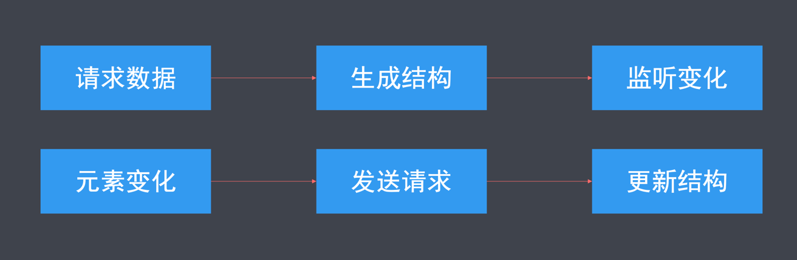
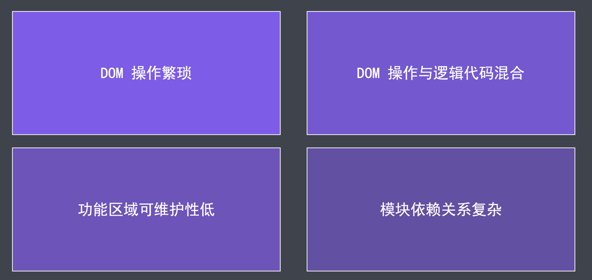

## Vue.js 简介

传统网页开发步骤



- DOM 操作频繁，代码繁杂
- DOM 操作与逻辑代码混合，可维护性差
- 不同功能区域书写在一起，可维护性低
- 模块之间的依赖关系复杂

需要解决的问题



### Vue.js 是什么?

前端流行框架

## Vue.js 核心特性

### 数据驱动视图

数据变化会自动更新到对应元素中，无需手动操作 DOM，这种行为称作单向数据绑定。

对于输入框等可输入元素，可设置双向数据绑定。

> 双向数据绑定是在数据绑定基础上，可自动将元素输入内容更新给数据，实现**数据**与**元素内容**的双向绑定。

---

Vue.js 的数据驱动视图是基于 MVVM 模型实现的。

MVVM (Model – View – ViewModel )是一种软件开发思想

- Model 层，代表数据
- View 层，代表视图模板
- ViewModel 层，代表业务逻辑处理代码

---

- 基于MVVM 模型实现的数据驱动视图解放了DOM操作
- View 与 Model 处理分离，降低代码耦合度
- 但双向绑定时的 Bug 调试难度增大
- 大型项目的 View 与 Model 过多，维护成本高

### 组件化开发

组件化开发，允许我们将网页功能封装为自定义 HTML 标签，复用时书写自定义标签名即可。

组件不仅可以封装结构，还可以封装样式与逻辑代码，大大提交了开发效率与可维护性。

## Vue.js 安装

### 本地引入

- 开发版本: <https://cn.vuejs.org/js/vue.js>
- 生产版本: <https://cn.vuejs.org/js/vue.min.js>

### cdn 引入

- 最新稳定版: <https://cdn.jsdelivr.net/npm/vue>
- 指定版本: <https://cdn.jsdelivr.net/npm/vue@2.6.12/dist/vue.js>

### npm 安装

```shell
# 最新稳定版:
npm install vue
# 指定版本
npm install vue@2.6.12
```
