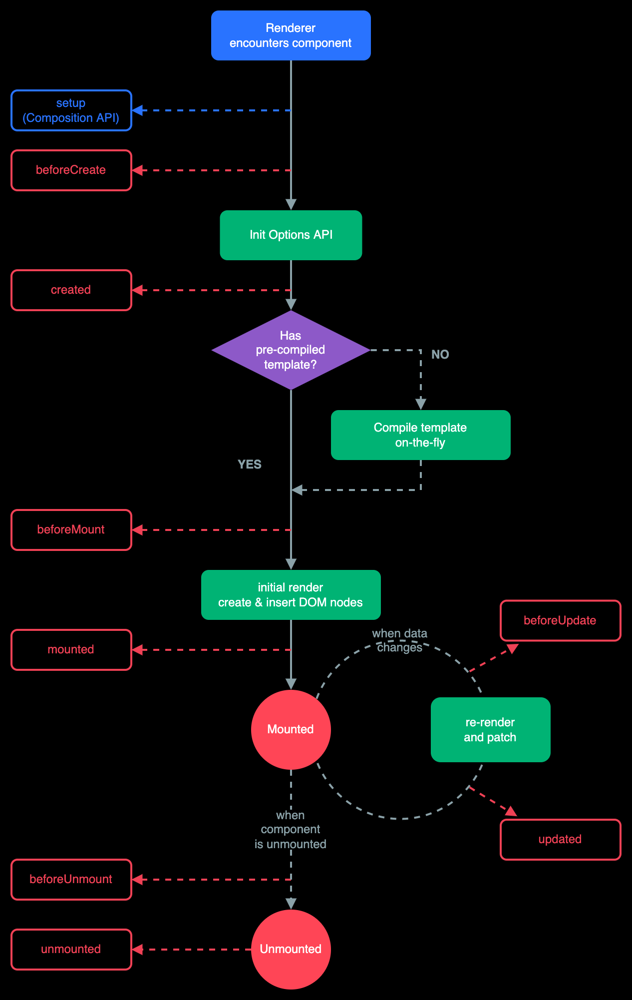

# Vue 进阶语法

## 自定义指令

指令用于简化 DOM 操作，相当于对基础 DOM 操作的一种封装。

当我们希望使用一些内置指令不具备的 DOM 功能时，可以进行自定义指令设置。

### 自定义全局指令

"全局指令"指的是可以被任意 Vue 实例或组件使用的指令。

```js
Vue.directive('focus', {
  inserted(el) { // 在形参中可以直接获取 添加了当前指令的元素
    el.focus();
  }
});
```

```html
<div id="app">
  <input type="text" v-focus>
</div>
```

---

在 `inserted` 函数中，还可以使用 `binding` 参数接收指令的修饰符和值等信息。

```html
<input type="text" v-focus.a.b="100 + 1">
```

```js
// 自定义全局指令
Vue.directive('focus', {
  inserted(el, binding) {
    console.log(binding);
    el.focus();
  }
});
```

```json
{
  "name": "focus",
  "rawName": "v-focus.a.b",
  "value": 101, // 指令值的最终计算结果
  "expression": "100 + 1", // 指令值的表达式
  "modifiers": {
    "a": true, // 修饰符信息
    "b": true
  },
  "def": {}
}
```

### 自定义局部指令

局部指令指的是可以在当前 Vue 实例或组件内使用的指令。

```js
new Vue({
  el: '#app',
  data: {},
  directives: {
    focus: {
      inserted(el) { // 同样可以通过 el 获取使用当前指令的元素。
        el.focus();
      }
    }
  }
});
```

```html
<div id="app">
  <input type="text" v-focus>
</div>
```

> 全局指定挂载在 Vue 构造函数上；局部指定挂载在 Vue 选项对象的 `directives` 属性上。 

> 注意：全局自定义指令是单数 `directive` 方法; 局部自定义指令是复数 `directives` 属性。

自定义指令更多信息：<https://cn.vuejs.org/guide/reusability/custom-directives.html#directive-hooks>

## 过滤器

过滤器的作用：过滤器用于对文本内容进行格式化处理。

过滤器可以在插值表达式和 `v-bind` 中使用。

### 全局过滤器

> "全局" 指的是过滤器的生效范围。

全局过滤器可以在任意 Vue 实例中使用。

```js
Vue.filter('过滤器名称', function (value) { // value 是使用过滤器时，传入的数据 (通常来讲就是过滤器前面的那个值，或者前面那个 filter 的返回结果)
  // 逻辑代码
  return '处理结果'; // 最终在页面视图中展示的结果
});
```

#### 使用过滤器

过滤器能在插值表达式和 `v-bind` 中使用，通过管道符 `|` 连接数据。

```html
<div id="app">
  <!-- 在 v-bind 中使用 -->
  <div v-bind:id="id | filterId"></div>
  <!-- 在插值表达式中使用 -->
  <div>{{ content | filterContent }}</div>
</div>
```

测试案例：

```html
<body>
<div id="app">
  <p v-bind:title="value | filterA">这是标签</p>
  <p>{{ value2 | filterA }}</p>
</div>
<script>

  // 设置全局过滤器
  Vue.filter('filterA', value => {
    // 移除字符串中的横线
    return value.split('-').join('');
  });

  new Vue({
    el: '#app',
    data: {
      value: 'a-b-c',
      value2: 'x-y-z'
    }
  });
</script>
</body>
```

#### 注意事项

可以将一个数据传入到多个过滤器中进行处理。

```html
<div id="app">
  <div>{{ content | filterA | filterB }}</div>
</div>
```

> 处理过程 `content` -> `filterA` -> `filterB`; 所以 `filterB` 处理的是 `filterA` 的返回值。

```html
<p>{{ value | filterA | filterB }}</p>
```

```js
Vue.filter('filterA', value => {
  console.log(value); // a-b-c
  return value.split('-').join('');
});

Vue.filter('filterB', value => {
  console.log(value); // abc
  return value[0].toUpperCase() + value.slice(1);
});

new Vue({
  el: '#app',
  data: {
    value: 'a-b-c'
  }
});
```

---

一个过滤器可以传入多个参数。

```html
<div id="app">
  <div>{{ content | filterContent(par1, par2) }}</div>
</div>
```

示例：

```js
Vue.filter('filterC', function (par1, par2, par3) {
  console.log(par1, par2, par3); // a-b-c undefined undefined // a-b-c 100 200
});
```

如果使用过滤器的时候什么参数也不传

```html
<p>{{ value | filterC }}</p>
```

`filter` 中输出：`a-b-c undefined undefined`

如果使用过滤器的时候传入参数，第一个参数永远都是标签中 filter 前面的 value：

```html
<p>{{ value | filterC(100, 200) }}</p>
```

`filter` 中输出：`a-b-c 100 200`

> 总之，声明的参数中，传入的第一个实参永远都是 value, 形参的第二个开始才会接收过滤器调用时传入的参数。(实在不知道怎么描述...)

### 局部过滤器

局部过滤器只能在当前 Vue 实例中使用。

```js
new Vue({
  // ... 省略其他代码
  filters: {
    过滤器名称: function (value) {
      // 代码逻辑
      return '处理结果';
    }
  }
});
```

> `filters` 和 `directives` 属性类似，都是 Vue 实例对象的配置对象的根属性。

```js
new Vue({
  el: '#app',
  data: {
    content: 'a-b-c',
    content2: 'x-y-z'
  },
  filters: {
    filterA: function (value) { // 声明局部过滤器的时候，这两种语法都可以
      return value.split('-').join('');
    },

    filterB(value) { // 声明局部过滤器的时候，这两种语法都可以
      return value[0].toUpperCase() + value.slice(1);
    }
  }
});
```

---

如果全局过滤器和局部过滤器都存在，并且重名的时候，会出现什么情况呢？

答案是：局部过滤器的优先级高于同名的全局过滤器。

```js
// 全局过滤器设置翻转字符串功能
Vue.filter('filterA', function (value) {
  return value.split('').reverse().join('');
});

new Vue({
  el: '#app',
  data: {
    content: 'a-b-c-d-e-f'
  },
  // 局部过滤器，设置去除 '-' 的功能
  filters: {
    filterA(value) {
      return value.split('-').join('');
    }
  }
});
```

```html
<p>{{ content | filterA }}</p>
<!-- 最终只会去除横杠，而不会翻转顺序 -->
```

## 计算属性

Vue.js 的视图不建议书写复杂逻辑，这样不利于维护。

> 视图的主要功能是用于展现结构，供数据绑定。

比如：需要对数组进行求最大值的操作, 可以这样写：

```html
<div>{{ Math.max.apply(null, arr) }}</div>
```

如果有多个的时候：

```html
<div id="app">
  <div>{{ Math.max.apply(null, arr) }}</div>
  <div>{{ Math.max.apply(null, arr) }}</div>
  <div>{{ Math.max.apply(null, arr) }}</div>
</div>
```

这时候，视图中大部分都是逻辑代码了；如果后期功能有修改，就需要到视图中去找逻辑代码，进行修改，这样非常不方便。
有什么方式处理呢？

封装函数是很好的方式，但有时重复的计算会消耗不必要的性能。

```js
var vm = new Vue({
  el: '#app',
  data: {
    arr: [1,2,3,4,5]
  },
  methods: {
    getSum() {
      var sum = 0;
      for (var i = 0; i < this.arr.length; i++) {
        sum += this.arr[i];
      }
      return sum;
    }
  }
});
```

```html
<div id="app">
  <div>{{ getSum() }}</div>
  <div>{{ getSum() }}</div>
  <div>{{ getSum() }}</div>
</div>
```

如果操作的数组没有变化，每次调用 `getSum()` 方法返回的结果应该是相同的，所以其实只有第一次调用的时候的计算是有必要的，
后期每一次调用直接返回第一次的计算结果就好了，但是这种封装函数的方式每一次都会重新计算一下数组的内容，这就造成了不必要的性能消耗。

如何提高执行效率?

可以通过"计算属性"提高效率。

### 计算属性使用

计算属性声明的时候是方法的形式，使用时是作为属性的形式(就是不要加`()`)；在视图中访问计算属性时会自动执行对应函数。

```js
var vm = new Vue({
  el: '#app',
  data: {
    arr: [1,2,3,4,5]
  },
  computed: {
    result () { // 方法名就是计算属性的名称
      var sum = 0;
      for (var i = 0; i < this.arr.length; i++) {
        sum += this.arr[i];
      }
      return sum;
    }
  }
});
```

> 计算属性定义好后，通过属性的方式在视图中进行访问；在第一次调用的时候，会执行函数的内容，然后会临时存储执行的结果，供后续调用函数的时候使用；
> 如果数组的内容发生了变化，就会再次执行函数内容(只执行一次)，然后再次临时存储计算结果。

> 计算属性就是通过减少函数执行次数的方式，提高计算操作的执行效率。

```html
<div id="app">
  <div>{{ result }}</div>
  <div>{{ result }}</div>
  <div>{{ result }}</div>
</div>
```

#### methods 与 computed 区别

- `computed` 具有缓存型，会在每次执行完函数之后对执行结果进行缓存，以供后续使用，`methods` 没有。
- `computed` 通过属性名访问，`methods` 需要调用。
- `computed` 仅适用于计算操作。普通的操作还是使用 `methods`。

#### computed 练习演示

准备一个数组，根据数组数据创建列表。

要求: 当数据大于 10 时创建 `li`，否则不创建。

思考以下三种实现方式:

- `v-if` 与 `v-for` 结合

```html
<ul>
  <!-- 不推荐 v-if 与 v-for 同时应用与同一个元素 -->
  <li v-if="item > 10" v-for="item in arr">{{item}}</li>
</ul>
```

> 之前说如果需要将 `v-if` 和 `v-for` 应用于同一个标签的时候，推荐将 `v-if` 放在 `v-for` 的父级；
> 但是此时如果将 `v-if` 放在父级，又达不到需求。所以这种方式不行！

- `v-for` 与 `methods` 结合 

> 通过封装函数，将最终要渲染的结果(大于10的数组)交给 `v-for` 处理就好

```js
const vm = new Vue({
  el: '#app',
  data: {
    arr: [1, 11, 2, 22, 3, 33, 4, 44, 5, 55]
  },
  methods: {
    fn() {
      // 对当前数组进行筛选
      return this.arr.filter(item => item > 10);
    }
  }
});
```

```html
<ul>
  <li v-for="item in fn()">{{ item }}</li>
</ul>
```

此时，如果使用多次 `<li>` 标签就会对 `fn()` 函数执行多次。

- `v-for` 与 计算属性结合

```js
const vm = new Vue({
  el: '#app',
  data: {
    arr: [1, 11, 2, 22, 3, 33, 4, 44, 5, 55]
  },
  computed: {
    result() {
      console.log('executing ...')
      return this.arr.filter(item => item > 10);
    }
  }
});
```

```html
<ul>
  <li v-for="item in result">{{ item }}</li>
  <li v-for="item in result">{{ item }}</li>
  <li v-for="item in result">{{ item }}</li>
</ul>
```

此时，即便有多个 `<li>` 也只会执行一次 `result()` 函数。

### 计算属性的 setter

计算属性默认只有 `getter`，Vue.js 也允许给计算属性设置 `setter` 。

```js
var vm = new Vue({
  computed: {
    getResult: {
      // getter
      get: function () {
        // 逻辑代码
      },
      // setter
      set: function (newValue) {
        // 逻辑代码
      }
    }
  }
});
```

```js
  const vm = new Vue({
    el: '#app',
    data: {
      firstName: 'John',
      lastName: ' Will'
    },
    computed: {
      // 分开书写 getter 和 setter
      fullName: {
        get() {
          return this.firstName + this.lastName;
        },
        set(newVal) {
          const nameArr = newVal.split(' ');
          this.firstName = nameArr[0];
          this.lastName = nameArr[1];
        }
      }
    }

  });
```

```js
// 可以通过给属性赋值的方式调用 setter 方法
vm.fullName = 'John Snow'
```

## 侦听器

侦听器用于监听数据变化并执行指定操作。

```js
new Vue({
  el: '#app',
  data: {
    value: ''
  },
  watch: {
    value (newValue, oldValue) {
      // 逻辑代码
    }
  }
});
```

> `watch` 中的 `value` 的名字要跟 `data` 里面的属性名保持一致，
> 意为：监听 `data` 中 `value` 的变化，如果发生变化就执行 `watch` 中的 `value` 方法。

```html
<body>
<div id="app">
  <input type="text" v-model="value">
</div>
<script src="lib/vue.js"></script>
<script>
  var vm = new Vue({
    el: '#app',
    data: {
      value: ''
    },
    watch: {
      value() {
        console.log('侦听器执行了');
      }
    }
  })
</script>
</body>
```

此时不论是在视图页面的 `input` 中输入元素，还是直接在 JS 代码中修改 `value` 的值(`vm.value = '123'`)都会触发 `value()` 方法。

### 侦听复杂内容

为了监听对象内部值的变化，需要将 `watch` 书写为对象，并设置选项 `deep: true`，这时通过 `handler` 设置处理函数。

```js
new Vue({
  el: '#app',
  data: {
    obj: {
      content1: '内容1',
      content2: '内容2'
    }
  },
  watch: {
    obj: {
      deep: true, // 深入的对当前值的变化进行监控，监听内部属性的变化
      handler(val, oldVal) {
        console.log(val, oldVal);
      }
    }
  }
});
```

---

```js
var vm = new Vue({
  el: '#app',
  data: {
    title: '这是内容',
    obj: {
      content1: '内容1',
      content2: '内容2'
    }
  },
  watch: {
    title(val, oldVal) {
      console.log('title changing... ', val, oldVal)
    },
    obj(val, oldVal) {
      console.log('obj changing... ', val, oldVal)
    }
  }
});
```

```
vm.title = 100;
title changing...  100 这是内容

vm.obj = 100;
obj changing...  100 {__ob__: Observer}
```

可见，如果将 `obj` 直接改为基本数据类型，使用 `obj()` 的方式依然是能够正常侦听的，但是我们通常不会将一个基本数据类型的数据赋值给一个对象。
最多的操作还是去操作对象内部的属性，

```
vm.obj.content1 = '新内容'
```

执行后并不会执行 `watch` 中的 `obj()` 侦听函数，说明属性的修改无法触发 `obj()` 侦听器。

```js
var vm = new Vue({
  el: '#app',
  data: {
    obj: {
      content1: '内容1',
      content2: '内容2'
    }
  },
  watch: {
    obj: {
      deep: true, // 只是对象需要使用 deep 属性，侦听数组元素的时候不需要 deep 属性；
      handler(val, oldVal) {
        console.log('obj 被修改... ', val, oldVal);
        console.log(val === oldVal); // 如果是修改对象内部的属性时，这个值是 true
      }
    }
  }
});
```

此时不仅能够侦听对象本身的变化，还能侦听对象内部属性的变化。

----

- 注意: 当更改(非替换)数组或对象(内部的元素或属性)时，回调函数中的新值与旧值相同，因为它们的引用都指向同一个数组、对象。

> 所以在侦听对象内部的属性或者数组中的元素变化时，`handler` 的形参上面接收一个就行了。

- 注意: 数组操作不要使用索引与 `length`，无法触发侦听器函数。

## Vue DevTools

Vue DevTools 是 Vue.js 官方提供的用来调试 Vue 应用的工具。

注意事项:

- 网页必须应用了 Vue.js 功能才能看到 Vue DevTools
- 网页必须使用 Vue.js 而不是 Vue.min.js
- 网页需要在 `http` 协议下打开，而不是使用 `file` 协议本地打开。

## Vue.js 生命周期

> 生命周期指的是事物从诞生到消亡的过程。

Vue.js 生命周期指的是 Vue 实例的生命周期。

Vue 实例的生命周期，指的是实例从创建到运行，再到销毁的过程。

Vue 声明周期图示：



### Vue.js 生命周期函数

通过设置生命周期函数，可以在生命周期的特定阶段执行功能。

> Vue 实例运行到了相应的阶段，就会自动调用对应的生命周期函数。

生命周期函数也称为生命周期钩子。

#### 创建阶段

- `beforeCreate`: 实例初始化之前调用。
- `created`: 实例创建后调用。
- `beforeMount`: 实例挂载之前调用。
- `mounted`: 实例挂载完毕。

特点: 每个实例只能执行一次。

#### 运行阶段

- `beforeUpdate`: 数据更新后，视图更新前调用。
- `updated`: 视图更新后调用。

特点: 按需调用。

#### 销毁阶段

- `beforeDestroy`: 实例销毁之前调用。
- `destroyed`: 实例销毁后调用。

> 在最新的版本中，销毁阶段的这两个生命周期函数已经不存在了，取而代之的是如下两个函数：

- `beforeUnmount`: 在一个组件实例被卸载之前调用。
- `unmounted`: 在一个组件实例被卸载之后调用。

特点: 每个实例只能执行一次。

