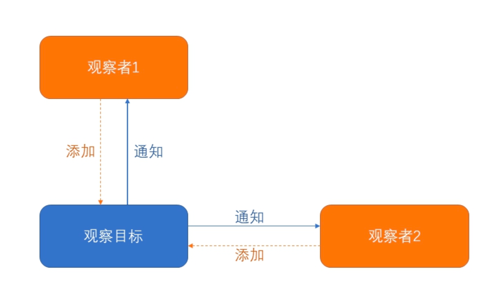
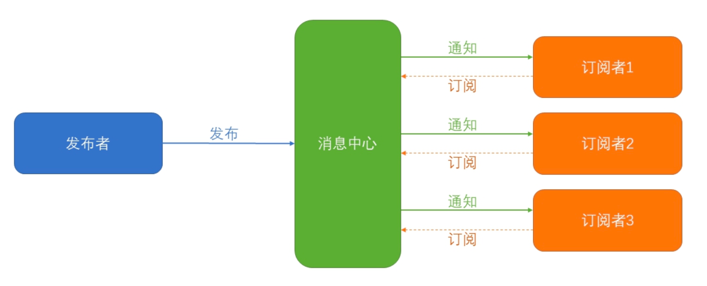
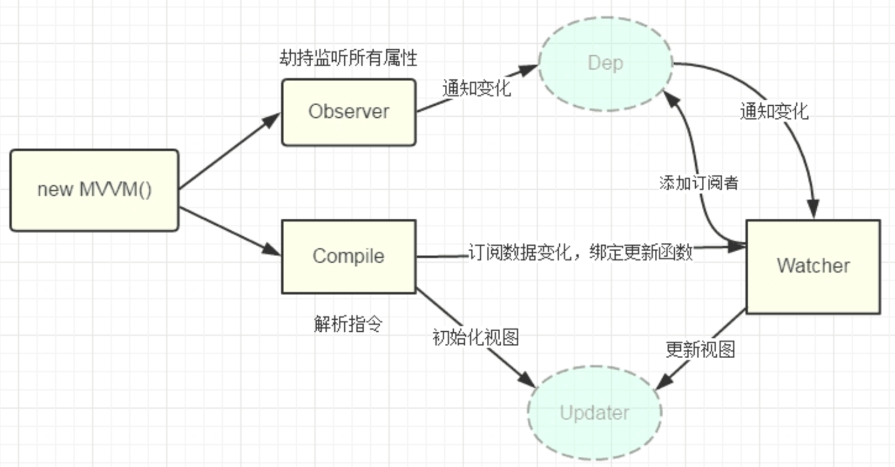
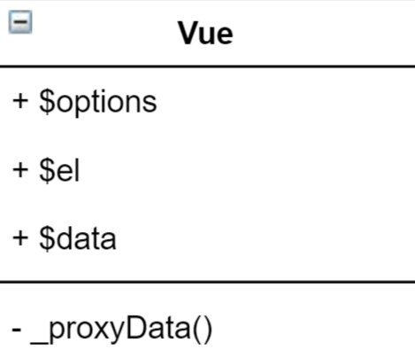
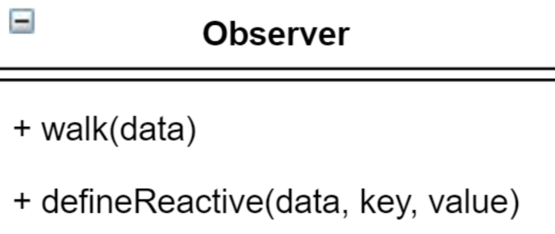
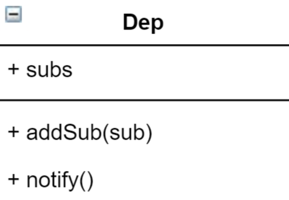
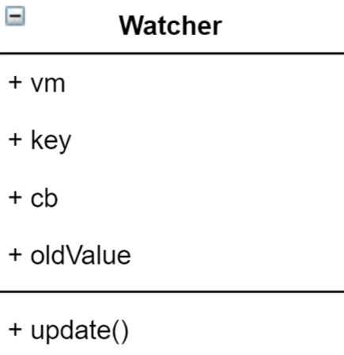
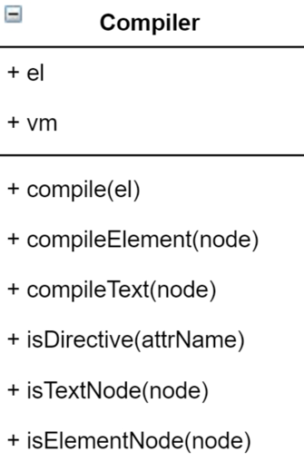
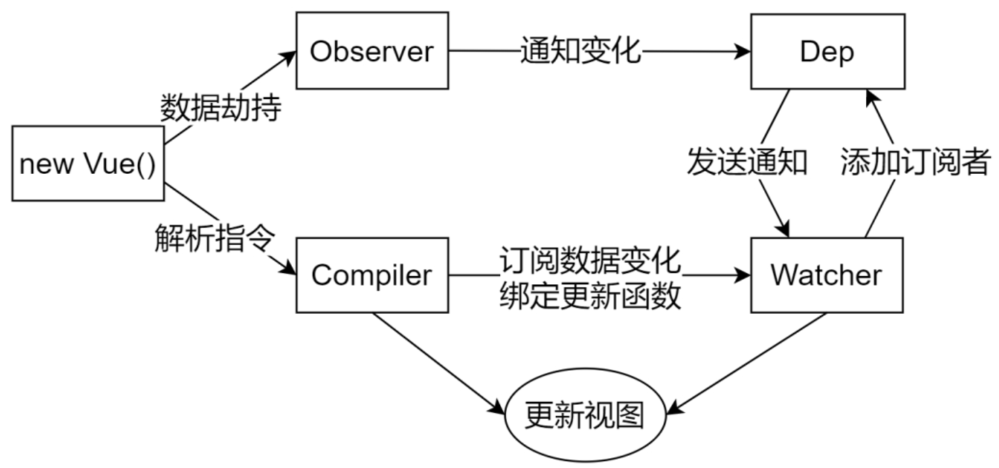

# Vue.js 响应式原理

## 准备工作

### 数据驱动

在学习 Vue.js 的过程中，我们经常看到三个概念:

- 数据驱动
- 数据响应式
- 双向数据绑定

### 响应式的核心原理

Vue 2.x 版本与 Vue 3.x 版本的响应式实现有所不同，我们将分别讲解。

- Vue 2.x 响应式基于 ES5 的 `Object.defineProperty` 实现。
- Vue 3.x 响应式基于 ES6 的 `Proxy` 实现。

#### Vue 2 响应式原理

Vue 2.x 的数据响应式通过 `Object.defineProperty()` 实现的.

设置 `data` 后，遍历所有属性，转换为 `Getter、Setter`，从而在数据变化时进行视图更新等操作。

---

下面我们来通过一段代码实现数据绑定的基础效果

- 数据变化，自动更新到视图

---

#### 改进

上述版本只是雏形，问题如下:

- 操作中只监听了一个属性，多个属性无法处理
- 无法监听数组变化(Vue 中同样存在)
- 无法处理属性也为对象的情况

下面我们来进行改进

#### Proxy 回顾

#### Vue 3 响应式原理

Vue 3.x 与 Vue 2.x 的区别为数据响应式是通过 `Proxy` 实现的， 其他相同，下面我们来进行原理演示。

### 相关设计模式

设计模式(design pattern)是针对软件设计中普遍存在的各种问题所提出的解决方案。

- 观察者模式
- 发布-订阅模式

#### 观察者模式

观察者模式(Observer pattern)指的是在对象间定义一个*一对多*(被观察者与多个观察者)的关联，当一个对象改变了状态， 所有其他相关的对象会被通知并且自动刷新。

核心概念:

- 观察者 Observer
- 被观察者(观察目标)Subject

#### 发布-订阅模式

发布-订阅模式(Publish-subscribe pattern)可认为是为观察者模式解耦的进阶版本，
特点: 在发布者与订阅者之间添加消息中心，所有的消息均通过消息中心管理， 而发布者与订阅者不会直接联系，实现了两者的解耦。

核心概念:

- 消息中心 Dep
- 订阅者 Subscriber
- 发布者 Publisher

#### 设计模式小结

观察者模式是由观察者与观察目标组成的，适合组件内操作。

特性: 特殊事件发生后，观察目标统一通知所有观察者。

发布/订阅模式是由发布者与订阅者以及消息中心组成，更加适合消息类型复杂的情况。

特性: 特殊事件发生，消息中心接到发布指令后，会根据事件类型给对 应的订阅者发送信息。

## Vue 响应式原理模拟

### 整体分析

要模拟 Vue 实现响应式数据，首先我们观察一下 Vue 实例的结构，分析要实现哪些属性与功能。

- `Vue` 目标: 将 `data` 数据注入到 Vue 实例，便于方法内操作。
- `Observer`(发布者)目标: 数据劫持，监听数据变化，并在变化时通知 Dep
- `Dep`(消息中心)目标: 存储订阅者以及管理消息的发送
- `Watcher`(订阅者)目标: 订阅数据变化，进行视图更新
- `Compiler` 目标: 解析模板中的指令与插值表达式，并替换成相应的数据

### Vue 类

功能:

- 接收配置信息
- 将 `data` 的属性转换成 Getter、Setter，并注入到 Vue 实例中。
- 监听 `data` 中所有属性的变化，设置成响应式数据
- 调用解析功能(解析模板内的插值表达式、指令等)

### Observer 类

功能:

- 通过数据劫持方式监视 `data` 中的属性变化，变化时通知消息中心 `Dep`。
- 需要考虑 `data` 的属性也可能为对象，也要转换成响应式数据.

### Dep 类

Dep 是 Dependency 的简写，含义为“依赖”，指的是 Dep 用于 收集与管理订阅者与发布者之间的依赖关系。

功能:

- 为每个数据收集对应的依赖，存储依赖。
- 添加并存储订阅者。
- 数据变化时，通知所有观察者

### Watcher 类

功能:

- 实例化 `Watch` 时，往 dep 对象中添加自己
- 当数据变化触发 `dep`， `dep` 通知所有对应的 `Watcher` 实例更新视图。

### Compiler 类

功能:

- 进行编译模板，并解析内部指令与插值表达式。
- 进行页面的首次渲染
- 数据变化后，重新渲染视图

### 功能回顾与总结

####  Vue 类

- 把 `data` 的属性注入到 Vue 实例
- 调用 `Observer` 实现数据响应式处理
- 调用 `Compiler` 编译模板

#### Observer

- 将 `data` 的属性转换成 Getter/Setter
- 为 `Dep` 添加订阅者 `Watcher`
- 数据变化发送时通知 `Dep`

#### Dep

- 收集依赖，添加订阅者(`watcher`)
- 通知订阅者

#### Watcher

- 编译模板时创建订阅者，订阅数据变化
- 接到 `Dep` 通知时，调用 `Compiler` 中的模板功能更新视图

#### Compiler

- 编译模板，解析指令与插值表达式
- 负责页面首次渲染与数据变化后重新渲染

