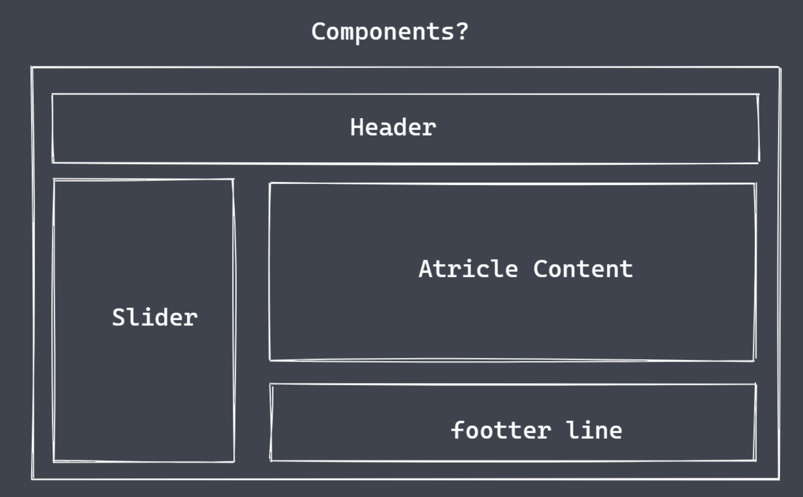

# React 基础

## React 介绍

### React 是什么?

- React 是 facebook 推出的用于构建用户界面的前端 javascript 框 架
- <https://reactjs.org/>
- React 使用*组件*构建用户界面

### 组件是什么?



一块区域，包含了 HTML CSS 及 JavaScript

### 组件开发的优势

- 将一个庞大复杂的应用程序拆分成多个独立单元
- 组件之间互相独立，有利于应用程序的维护
- 组件可以重用，一次编写多地复用

## React 开发环境搭建

安装脚手架

```shell
npx create-react-app reactproject
```


